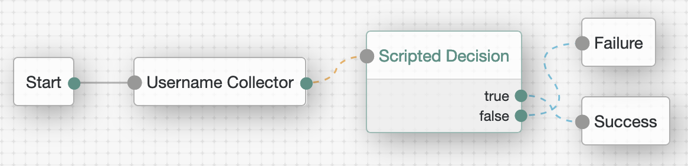
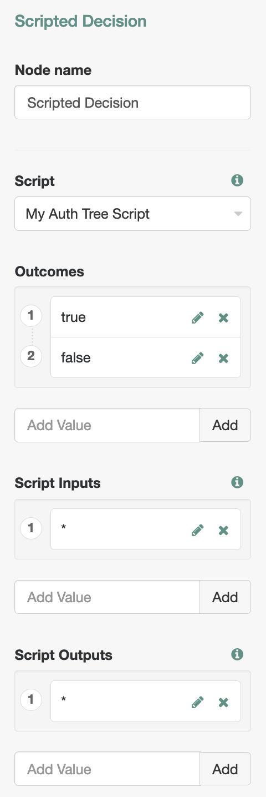
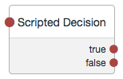

# <a id="top" name="top"></a>Notes on Scripting in ForgeRock Access Management (AM) 7.0

Scripting in AM extends its authentication, authorization, and federation capabilities. But, it also allows for rapid development for the purpose of demonstration and testing without the need to change and recompile AM's core.

This article aims to complement the currently available and ever-improving [official docs](https://backstage.forgerock.com/docs/am/7), and provide additional insights into evaluating and debugging scripts at runtime.

> While developing scripts, also check for solutions in the constantly growing [ForgeRock Knowledge Base](https://backstage.forgerock.com/knowledge/search?q=am%20scripting).

## <a id="contents" name="contents"></a>Contents

This article is structured as an overview of scripting environment in AM. It starts with common components and gets into specifics when the script language, script type, or runtime conditions introduce them.

The [Scripting API Functionality](https://backstage.forgerock.com/docs/am/7/scripting-guide/scripting-functionality.html) available for a server-side script will depend on its application and context.

All scripts in AM have access to [Debug Logging](https://backstage.forgerock.com/docs/am/7/scripting-guide/scripting-api-global-logger.html) and [Accessing HTTP Services](https://backstage.forgerock.com/docs/am/7/scripting-guide/scripting-api-global-http-client.html).

When you create a script under Realms > _Realm Name_ > Scripts, however, you make choices that will have some additional effect on the functionality available from the script.

Futhermore, the environment in which AM is deployed may affect the configuration and debugging options during script development.

* [Bindings](#script-bindings)
* [Debug Logging](#script-debug-logging)
* [Accessing HTTP Services](#script-accessing-http-services)
* [Language](#script-language)
    * [Scripting Java](#script-language-java-import)
    * [Allowed Java Classes](#script-language-java-allow)
    * [About Rhino](#script-language-javascript)
        * [String Concatenation](#script-language-javascript-string-concatenation)
        * [String Comparison](#script-language-javascript-string-comparison)
* [Script Type](#script-type)
    * [Decision node script for authentication trees](#script-type-scripted-decision-node) (Scripted Decision Node)
        * [Configuration](#script-type-scripted-decision-node-configuration)
        * [Outcome](#script-type-scripted-decision-node-outcome)
        * [Bindings](#script-type-scripted-decision-node-bindings)
            * [logger](#script-type-scripted-decision-node-bindings-logger)
            * [sharedState](#script-type-scripted-decision-node-bindings-sharedstate)
            * [transientState](#script-type-scripted-decision-node-bindings-transientstate)
            * [callbacks](#script-type-scripted-decision-node-bindings-callbacks)
            * [httpClient](#script-type-scripted-decision-node-bindings-httpclient)
            * [idRepository](#script-type-scripted-decision-node-bindings-idrepository)
            * [realm](#script-type-scripted-decision-node-bindings-realm)
            * [requestHeaders](#script-type-scripted-decision-node-bindings-requestheaders)
            * [requestParameters](#script-type-scripted-decision-node-bindings-requestparameters)
            * [existingSession](#script-type-scripted-decision-node-bindings-existingsession)
* [ForgeRock Identity Cloud](#fidc-environment)
    * [Debug Logging](#fidc-script-debug-logging)
    * [Allowed Java Classes](#fidc-script-java-allow)
    * [Accessing Profile Data](#fidc-script-type-scripted-decision-node-bindings-idrepository)
    * [Extended Functionality](#fidc-script-extended)
* [Conclusion](#conclusion)

## <a id="script-bindings" name="script-bindings"></a>Bindings

[Back to Contents](#contents)

Before you write a single line in your script, some of its context is already defined via bindings. The bindings exist in a script as top-level variables and provide the data available to the script, the objects to interact with, and the placeholders to communicate back to the core AM functionality.

Some of the script templates included in AM installation (and serving as defaults for the script types) have references to the variables used in the script. Some may even explicitly state what available bindings are; for example, the OIDC Claims Script template has a list of bindings in a commented section at the top. Others, however, are not as descriptive and rely on the developer's knowledge.

You can output all available bindings by using the [logger object methods](https://backstage.forgerock.com/docs/am/7/scripting-guide/scripting-api-global-logger.html). What you see will depend on the script type. For example, for a Scripted Decision Node script in AM 7.0:

<br/>

<details open>
<summary><strong>JavaScript</strong>:</summary>

```javascript
logger.error(Object.keys(this))
```

```
s.A.46ae269c-0403-4979-a224-31a67a91e51a: 2020-11-01 11:07:37,549: Thread[ScriptEvaluator-6]: TransactionId[f66fd450-01ce-4652-b3f6-2894e9a0344a-40594]
ERROR: auditEntryDetail,httpClient,requestHeaders,sharedState,logger,requestParameters,context,callbacks,realm,transientState,idRepository
```

<br/>

> You may encounter some less than useful messages from the scripting engine in the debug output, like the first one displayed above. In further examples in this writing, this "noise" will be mostly omitted.

For another example, the top-level variables present in OAuth2 Access Token Modification Script:

```
ERROR: httpClient,identity,session,logger,context,scopes,accessToken
```

You may notice that some bindings are specific to the script type and some are present in both outputs. The `httpClient` and `logger` objects are universally available for all script types.

In JavaScript, `this` represents execution context, and you will see all variables defined in the top-level scope.

> You can ignore the `context` top-level variable, for it is not a binding and is not useful in the context of this writing.

You can output the bindings with their respective values:

```javascript
Object.keys(this).forEach(function (key){
    var value

    try {
        value = this[key]
    } catch (e) {
        value = e
    }

    logger.error(key + ": " + value)
})
```

In a Scripted Decision Node script, the result will look similar to the following:

```
ERROR: auditEntryDetail: null

ERROR: httpClient: org.forgerock.openam.scripting.api.http.JavaScriptHttpClient@47b3daf4

ERROR: requestHeaders: {accept=[application/json, text/javascript, */*; q=0.01], accept-api-version=[protocol=1.0,resource=2.1], accept-encoding=[gzip, deflate], accept-language=[en-US], cache-control=[no-cache], connection=[keep-alive], content-length=[1914], content-type=[application/json], cookie=[amlbcookie=01], host=[openam.example.com:8080], origin=[http://openam.example.com:8080], referer=[http://openam.example.com:8080/openam/XUI/], user-agent=[Mozilla/5.0 (Macintosh; Intel Mac OS X 10_14_6) AppleWebKit/537.36 (KHTML, like Gecko) Chrome/86.0.4240.80 Safari/537.36], x-nosession=[true], x-password=[anonymous], x-requested-with=[XMLHttpRequest], x-username=[anonymous]}

ERROR: sharedState: {realm=/, authLevel=0, username=user.0}

ERROR: logger: com.sun.identity.shared.debug.Debug@7d6c1ced

ERROR: requestParameters: {authIndexType=[service], authIndexValue=[scripted], realm=[/]}

ERROR: context: javax.script.SimpleScriptContext@7b7b832f

ERROR: callbacks: []

ERROR: realm: /

ERROR: transientState: {}

ERROR: idRepository: org.forgerock.openam.scripting.idrepo.ScriptIdentityRepository@40fa0a75
```
</details>

<br/>

<details>
<summary><strong>Groovy</strong>:</summary>

```groovy
logger.error(binding.variables.toString())
```

Initially, you may get an error due to scripting engine security settings, as described in [Language > Allowed Java Classes](#script-language-java-allow):

```
ERROR: Script terminated with exception
java.util.concurrent.ExecutionException: javax.script.ScriptException: javax.script.ScriptException: java.lang.SecurityException: Access to Java class "org.codehaus.groovy.jsr223.GroovyScriptEngineImpl$2" is prohibited.
```

When `org.codehaus.groovy.jsr223.GroovyScriptEngineImpl$2` and `org.forgerock.openam.scripting.ChainedBindings` are added to the allowed Java classes, you will be able to see the output. For a scripted decision example:

<!-- todo -->
```
ERROR: [auditEntryDetail:null, httpClient:org.forgerock.openam.scripting.api.http.GroovyHttpClient@5e35260, requestParameters:[authIndexType:[service], authIndexValue:[scripted], realm:[/]], idRepository:org.forgerock.openam.scripting.idrepo.ScriptIdentityRepository@9ede4f7, realm:/, logger:com.sun.identity.shared.debug.Debug@7d6c1ced, callbacks:[], requestHeaders:[accept:[application/json, text/javascript, */*; q=0.01], accept-api-version:[protocol=1.0,resource=2.1], accept-encoding:[gzip, deflate], accept-language:[en-US], cache-control:[no-cache], connection:[keep-alive], content-length:[1914], content-type:[application/json], cookie:[amlbcookie=01], host:[openam.example.com:8080], origin:[http://openam.example.com:8080], referer:[http://openam.example.com:8080/openam/XUI/], user-agent:[Mozilla/5.0 (Macintosh; Intel Mac OS X 10_14_6) AppleWebKit/537.36 (KHTML, like Gecko) Chrome/86.0.4240.80 Safari/537.36], x-nosession:[true], x-password:[anonymous], x-requested-with:[XMLHttpRequest], x-username:[anonymous]], transientState:[:], sharedState:[realm:/, authLevel:0, username:user.0]]
```
</details>

<br/>

When you know your bindings, you can also inspect them individually:

<br/>

<details open>
<summary><strong>JavaScript or Groovy</strong>:</summary>

```javascript
logger.error("scopes: " + scopes)
```

```
ERROR: scopes: [openid]
```
</details>

<br/>

## <a id="script-debug-logging" name="script-debug-logging"></a>Debug Logging

[Back to Contents](#contents)

Independent of the script type, you can use the Debug Logging and HTTP Services APIs in AM.

AM scripts are stored in configuration data, and there is no well-known way to attach a debugger to an AM script. As an alternative to a proper debugger, you can use the `logger` object. As described in [Getting Started with Scripting > Debug Logging](https://backstage.forgerock.com/docs/am/7/scripting-guide/scripting-api-global-logger.html#scripting-api-global-logger), methods of the `logger` object can be used to capture runtime information from the scripts, and output it in AM logs.

By default, debug logs are saved in files at a location specified in the AM console under CONFIGURE > SERVER DEFAULTS > General > Debugging. In AM's [Maintenance Guide > Debug Logging](https://backstage.forgerock.com/docs/am/7/maintenance-guide/debug-logging.html#debug-logging) you can find information on how to control this default functionality.

If your AM stores debug logs in files and you have access to them, you can `tail -f` the logs during development. For example:

```bash
$ cd ~/openam/var/debug
$ ls
Authentication    Federation    OtherLogging    Radius    amUpgrade    IdRepo    Plugins    Session    Configuration    OAuth2Provider    Policy    UmaProvider    CoreSystem    OpenDJ-SDK    Push    WebServices
```

Depending on the information to be logged, and on the script application and its type, the logs you are seeking may end up in one of the above categories. But in general, script-related logs could be expected in the `OtherLogging` file. For example:

```
$ tail -f OtherLoggings
. . .
ERROR: sharedState: {realm=/, authLevel=0, username=user.0}
s.A.1520c210-8b58-4549-820c-785cd06e9be6: 2020-10-30 11:15:00,872: Thread[ScriptEvaluator-0]: TransactionId[f66fd450-01ce-4652-b3f6-2894e9a0344a-220]
ERROR: ReferenceError: "existingSession" is not defined.
. . .
```

In other environments, the logs data may be sent to the standard output or, as in the case of ForgeRock Identity Cloud (Identity Cloud), exposed via REST. Follow the deployment specific documentation in order to access AM debugging output. For example:

* [ForgeOps Docs > CDK Troubleshooting > Pod Descriptions and Container Logs](https://backstage.forgerock.com/docs/forgeops/7/devops-troubleshoot.html#devops-troubleshoot-k8s-pods)

* [Identity Cloud Docs > Your Tenant > View Audit Logs](https://backstage.forgerock.com/docs/idcloud/latest/paas/tenant/audit-logs.html)

When you know where to find the logs and [how to control the level of the debug output](https://ea.forgerock.com/docs/am/maintenance-guide/debug-logging.html), you can inspect the debug data for possible reasons your script is not working or/and for the information it outputs. As illustrated in the [Bindings](#script-bindings) chapter, with the [logger methods](https://backstage.forgerock.com/docs/am/7/scripting-guide/scripting-api-global-logger.html) you can proactively output the script context. You can also output result of an operation, content of an object, a marker, etc.—anything that could be converted into a string (explicitly in Groovy or implicitly in JavaScript). For example, the content of the `sharedState` binding in the scripted decision context at some point of the authentication process:

<br/>

<details open>
<summary><strong>JavaScript</strong>:</summary>

```javascript
logger.error(sharedState)
```

```
ERROR: sharedState: {realm=/, authLevel=0, username=user.0, FirstName=Olaf, LastName=Freeman, errorMessage=ReferenceError: "getState" is not defined., clientScriptOutputData={"ip":{"ip":"73.67.228.195"}}, successUrl=http://openam.example.com:8080/openam/XUI/?authIndexType=service&authIndexValue=scripted&test=successUrl#dashboard/}
```
</details>

<br/>

<details>
<summary><strong>Groovy</strong>:</summary>

<br>

In Groovy, you have to deliberately feed the logger methods with a String, for which purpose you can use `toString()`, or you can also concatenate a string and the logger method argument.

```groovy
logger.error(sharedState.toString())
logger.error("sharedState: " + sharedState)
```

```
ERROR: [realm:/, authLevel:0, username:user.0]
ERROR: sharedState: [realm:/, authLevel:0, username:user.0]
```

Otherwise, you may get an error:

```groovy
logger.error(sharedState)
```

```
ERROR: Script terminated with exception
java.util.concurrent.ExecutionException: javax.script.ScriptException: javax.script.ScriptException: groovy.lang.MissingMethodException: No signature of method: com.sun.identity.shared.debug.Debug.error() is applicable for argument types: (LinkedHashMap) values: [[realm:/, authLevel:0, username:user.0]]
[CONTINUED]Possible solutions: error(java.lang.String), error(java.lang.String, [Ljava.lang.Object;), error(java.lang.String, java.lang.Throwable), grep(), every(), iterator()
[CONTINUED]  at java.base/java.util.concurrent.FutureTask.report(FutureTask.java:122)
```
</details>

<br/>

You can also try and catch and output an error:

<br/>

<details open>
<summary><strong>JavaScript or Groovy</strong>:</summary>

```javascript
try {
    something()

    logger.message("Something is done.")
} catch (e) {
    logger.error("Exception occurred: " + e)
}
```

JavaScript
```
ERROR: Exception occurred: ReferenceError: "something" is not defined.
```

Groovy
```
ERROR: Exception occurred: java.lang.SecurityException: Access to Java class "Script226" is prohibited.
```
</details>

<br/>

While debugging, you don't always have to rely on the logs. You can save your error in an available object and carry on with the execution. Then, you may be able to display the saved error(s) to the end user (you, in this case) if that is supported by the UI.

For example, in the scripted decision environment, you can preserve debugging information in the `sharedState` object, which persists during entire authentication session, across scripted decision nodes in the authentication tree. In this particular case, there is a designated key for storing error message(s), "errorMessage", that is respected by the core AM functionality:

<br/>

<details open>
<summary><strong>JavaScript or Groovy</strong>:</summary>

```javascript
try {
    var username = nonExistingBinding("username")
} catch (e) {
    if (sharedState.get("errorMessage")) {
        sharedState.put("errorMessage", sharedState.get("errorMessage") + " " + e.toString())
    } else {
        sharedState.put("errorMessage", e.toString())
    }
}
```

```javascript
try {
    var username = sharedState.nonExistingMethod("username")
    logger.error('username: ' + username)
} catch (e) {
    logger.error('sharedState.get("errorMessage"): ' + sharedState.get("errorMessage"))
    if (sharedState.get("errorMessage")) {
        sharedState.put("errorMessage", sharedState.get("errorMessage") + " " + e.toString())
    } else {
        sharedState.put("errorMessage", e.toString())
    }
}
```
</details>

<br/>

If you eventually fail the authentication, taking the tree to the Failure node, the content of the "errorMessage" key will be included in the authentication response sent to the user agent:

```json
{"code":401,"reason":"Unauthorized","message":"ReferenceError: \"nonExistingBinding\" is not defined. TypeError: Cannot find function nonExistingMethod in object {realm=/, authLevel=0, username=user.4, errorMessage=ReferenceError: \"nonExistingBinding\" is not defined.}.","detail":{"failureUrl":""}}
```

If you need to terminate the tree with a specific message, you can override the one stored in `sharedState` using the [Action Interface](https://backstage.forgerock.com/docs/am/7/auth-nodes/core-action.html) and its `withErrorMessage(String message)` method:

<br/>

<details open>
<summary><strong>JavaScript or Groovy</strong>:</summary>

```javascript
action = org.forgerock.openam.auth.node.api.Action.goTo("false").withErrorMessage("A terrible error occurred!").build()
```
</details>

<br/>

Which will again result in the error message being included in the authentication response:

```json
{"code":401,"reason":"Unauthorized","message":"A terrible error occurred!","detail":{"failureUrl":""}}
```

Logs provide a useful context for exceptions and are the main source of debugging information. On the other hand, saving error messages in an available binding and displaying their content on the client side can help in quick evaluation of the scripting functionality, and doing so does not require access to the logs nor the efforts for obtaining and filtering them.

## <a id="script-accessing-http-services" name="script-accessing-http-services"></a>Accessing HTTP Services

[Back to Contents](#contents)

[Accessing HTTP Services](https://backstage.forgerock.com/docs/am/7/scripting-guide/scripting-api-global-http-client.html#scripting-api-global-http-client) provides an example of instantiating the [org.forgerock.http.protocol.Request](https://backstage.forgerock.com/docs/am/7/apidocs/org/forgerock/http/protocol/Request.html) class for preparing an outbound HTTP call from a server-side JavaScript:

<br/>

<details open>
<summary><strong>JavaScript</strong>:</summary>

```javascript
var request = new org.forgerock.http.protocol.Request()
```
</details>

<br/>

In this case, an instance of a class is assigned to a JavaScript variable, but there are other ways of extending server-side scripts with Java, which will be discussed in [Language > Scripting Java](#script-language-java-import).

Before sending a request, you can use a number of methods described in [the public Java doc](https://backstage.forgerock.com/docs/am/7/apidocs/org/forgerock/http/protocol/Request.html) to inspect and modify the request object. For example, you can warn the server via the request headers that you are POSTing a JSON content, or/and you can authorize the request with an access token (obtained separately):

<br/>

<details open>
<summary><strong>JavaScript</strong>:</summary>

```javascript
var request = new org.forgerock.http.protocol.Request()

var requestBodyJson = {
    "param1": "value1",
    "param2": "value2"
}

request.setMethod("POST")
request.getHeaders().add("Content-Type", "application/json; charset=UTF-8")
request.getHeaders().add("Authorization", "Bearer " + sharedState.get("accessToken")) // 1
request.getEntity().setString(JSON.stringify(requestBodyJson))
```
</details>

<br/>

<details>
<summary><strong>Groovy</strong>:</summary>

<br/>

The Groovy version will require importing a JSON object to stringify the request body.

```groovy
import org.forgerock.http.protocol.Request
import groovy.json.JsonOutput

def request = new Request()

def requestBodyJson = [
    "param1": "value1",
    "param2": "value2"
]

request.setMethod("POST")
request.getHeaders().add("Content-Type", "application/json; charset=UTF-8")
request.getHeaders().add("Authorization", "Bearer " + sharedState.get("accessToken")) // 1
request.getEntity().setString(JsonOutput.toJson(requestBodyJson))
```
</details>

<br/>

1. In this case, the access token is delivered by a special `sharedState` object in the context of an authentication tree.

Then, you can send the prepared request with the help of the `httpClient` object provided as a binding to scripts of all types in AM.

In the following example, we check if the IP derived from the client side (there will be [an example of doing so](#script-type-scripted-decision-node-bindings-callbacks) later in this writing) is a  healthy one, according to an external resource. The resource will be inquired by making an outbound request with `httpClient` and receiving a [Response](https://backstage.forgerock.com/docs/am/7/apidocs/org/forgerock/http/protocol/Response.html) from the remote API:

<br/>

<details open>
<summary><strong>JavaScript</strong>:</summary>

```javascript
var failure = true
var ip = JSON.parse(sharedState.get("clientScriptOutputData")).ip // 1

var fr = JavaImporter(
    org.forgerock.http.protocol.Request
)

var request = new fr.Request()
request.setUri("https://api.antideo.com/ip/health/" + ip.ip)
request.setMethod("GET")

var response = httpClient.send(request).get()

if (response.getStatus().getCode() === 200) {
    var ipHealth = JSON.parse(response.getEntity().getString()).health
    failure = !ipHealth || (ipHealth.toxic || ipHealth.proxy || ipHealth.spam)
} else {
    failure = true
}
```
</details>

<br/>

<details>
<summary><strong>Groovy</strong>:</summary>

<br/>

The Groovy version will again require explicit JSON support in order to be able to process the response:

```groovy
import org.forgerock.http.protocol.Request
import groovy.json.JsonSlurper

def jsonSlurper = new JsonSlurper()

def failure = true
def ip = jsonSlurper.parseText(sharedState.get("clientScriptOutputData")).ip // 1

def request = new Request()
request.setUri("https://api.antideo.com/ip/health/" + ip.ip)
request.setMethod("GET")

def response = httpClient.send(request).get()

if (response.getStatus().getCode() == 200) {
    def ipHealth = jsonSlurper.parseText(response.getEntity().getString()).health
    failure = (ipHealth.toxic || ipHealth.proxy || ipHealth.spam)
} else {
    failure = true
}
```
</details>

<br/>

1. This code assumes that something like `'{"ip": {"ip":"65.113.98.10"}}'` is stored under the "clientScriptOutputData" key in `sharedState`.

Thus, the scripting functionality can be greatly extended with access to external resources of all kinds.

It is worth reminding, however, that `httpClient` requests are synchronous and blocking until they are completed. They do time out, though, and you can specify a timeout limit for each script type in the AM console under Configure > Global Services > Scripting > Secondary Configurations > _Script Type Name_ > Secondary Configurations > EngineConfiguration > Server-side Script Timeout.

## <a id="script-language" name="script-language"></a>Language

[Back to Contents](#contents)

You need to watch your language while writing scripts in AM, for your choice of scripting engine may require different syntax and will affect the runtime environment as well. Server-side scripts in AM 7.0 can be written in [Groovy 3.0.x or JavaScript running on Rhino 1.7R4](https://backstage.forgerock.com/docs/am/7/scripting-guide/scripting-env.html).

> You can check your Groovy version with the following:
>
> ```groovy
> logger.error("Groovy version: " + GroovySystem.version)
> ```
>
> Doing so will require `groovy.lang.GroovySystem` to be added to the list of [Allowed Java Classes](#script-language-java-allow).
>
> While GroovySystem.version reports 3.0.4 in AM 7.0.0, [not all of the new functionality seems to be supported at this time](https://bugster.forgerock.org/jira/browse/OPENAM-17084).

### <a id="script-language-java-import" name="script-language-java-import"></a>Scripting Java

[Back to Contents](#contents)

The scripting capabilities can be extended with [publicly available Java packages](https://backstage.forgerock.com/docs/am/7/apidocs/).

The way underlying Java is employed in a script is different between the two scripting engines. While Groovy follows Java and allows for `import` statement, Rhino implements its own ways of [Scripting Java](https://developer.mozilla.org/en-US/docs/Mozilla/Projects/Rhino/Scripting_Java).

Consider examples in the [Scripted Decision Node](#script-type-scripted-decision-node-action-examples) section of this writing. In Rhino, you can use a fully qualified class name inline:

<br/>

<details open>
<summary><strong>JavaScript</strong>:</summary>

```javascript
action = org.forgerock.openam.auth.node.api.Action.goTo("true").putSessionProperty("customKey", "customValue").build()
```
</details>

<br/>

<details>
<summary><strong>Groovy</strong>:</summary>

```groovy

import org.forgerock.openam.auth.node.api.Action

action = Action.goTo("true").putSessionProperty("customKey", "customValue").build()
```

You can also use the fully qualified name in Groovy:

```groovy
action = org.forgerock.openam.auth.node.api.Action.goTo("true").putSessionProperty("customKey", "customValue").build()
```
</details>

<br/>

If you have to reference an object many times, using the fully qualified name can quickly make it crowded and hard to read in the script editor. As an alternative, a reference to a package, a static method, and sometimes to an instance of a class can be assigned to a variable:

<br/>

<details open>
<summary><strong>JavaScript</strong>:</summary>

```javascript
var callback = javax.security.auth.callback // Package.
var firstNameCallback = new javax.security.auth.callback.NameCallback("First Name") // Instance.
var goTo = org.forgerock.openam.auth.node.api.Action.goTo // Static method.
var send = org.forgerock.openam.auth.node.api.Action.send // Static method.

var lastNameCallback = new callback.NameCallback("Last Name", "Sure")

if (callbacks.isEmpty()) {
    action = send(
        firstNameCallback,
        lastNameCallback
    ).build()
} else {
    sharedState.put("firstName", callbacks.get(0).getName())
    sharedState.put("lastName", callbacks.get(1).getName())

    action = goTo("true").build()
}
```
</details>

<br/>

You can also use [JavaImporter Constructor](https://developer.mozilla.org/en-US/docs/Mozilla/Projects/Rhino/Scripting_Java#JavaImporter_Constructor) in Rhino, which allows for reusing explicit _class_ or _package_ references. For example:

<br/>

<details open>
<summary><strong>JavaScript</strong>:</summary>

```javascript
var fr = JavaImporter(
    org.forgerock.openam.auth.node.api.Action,
    com.sun.identity.authentication.callbacks.HiddenValueCallback,
    com.sun.identity.authentication.callbacks.ScriptTextOutputCallback
)

with (fr) {
    var script = "var confirmation = confirm('something') \n\
        document.getElementById('clientScriptOutputData').value = JSON.stringify({ \n\
            confirmation: confirmation \n\
        }) \n\
        \n\
        document.getElementById('loginButton_0').click()"

    if (callbacks.isEmpty()) {
        action = Action.send(
            new HiddenValueCallback("clientScriptOutputData", "false"),
            new ScriptTextOutputCallback(script)
        ).build()
    } else {
        sharedState.put("clientScriptOutputData", callbacks.get(0).getValue())
    }
}
```
</details>

<br/>

In general, [use of the _with_ statement in JavaScript is not recommended](https://developer.mozilla.org/en-US/docs/Web/JavaScript/Reference/Statements/with) due to ambiguity and potential performance and compatibility issues. Instead, you can prefix the desired object name with the namespace variable you assigned the imported content to:

<br/>

<details open>
<summary><strong>JavaScript</strong>:</summary>

```javascript
var fr = JavaImporter(
    org.forgerock.openam.auth.node.api.Action,
    javax.security.auth.callback.NameCallback
)

if (callbacks.isEmpty()) {
    action = fr.Action.send(
      new fr.NameCallback("Enter Your First Name"),
      new fr.NameCallback("Enter Your Last Name")
    ).build();
} else {
    sharedState.put("FirstName", callbacks.get(0).getName());
    sharedState.put("LastName", callbacks.get(1).getName());
    action = fr.Action.goTo("true").build();
}
```
</details>

<br/>

### <a id="script-language-java-allow" name="script-language-java-allow"></a>Allowed Java Classes

[Back to Contents](#contents)

The selection of a scripting engine also makes difference in how the [Scripting Environment Security](https://backstage.forgerock.com/docs/am/7/scripting-guide/script-engine-security.html) is applied.

The allowed Java classes are defined in the AM console under Configure > Global Services > Scripting > Secondary Configurations > _Script Type_ > Secondary Configurations > engineConfiguration > Java class whitelist, as described in [Global Services > Scripting > Engine Configuration](https://backstage.forgerock.com/docs/am/7/reference/global-services-configuration.html#scripting-secondary-configuration-instance).

If a class is used by a script and is not present in the allowed list, you may encounter an error. If unhandled, the exception in your logs will look similar to the following:

```
o.f.o.s.ThreadPoolScriptEvaluator: 2020-11-01 09:20:40,525: Thread[http-nio-8080-exec-41]: TransactionId[f66fd450-01ce-4652-b3f6-2894e9a0344a-44339]
ERROR: Script terminated with exception
java.util.concurrent.ExecutionException: javax.script.ScriptException: javax.script.ScriptException: java.lang.SecurityException: Access to Java class "org.apache.groovy.json.internal.LazyMap" is prohibited.
[CONTINUED]  at java.base/java.util.concurrent.FutureTask.report(FutureTask.java:122)
[CONTINUED]  at java.base/java.util.concurrent.FutureTask.get(FutureTask.java:205)
[CONTINUED]  at org.forgerock.openam.scripting.ThreadPoolScriptEvaluator.evaluateScript(ThreadPoolScriptEvaluator.java:89)
[CONTINUED]  at org.forgerock.openam.auth.nodes.ScriptedDecisionNode.process(ScriptedDecisionNode.java:197)
[CONTINUED]  at org.forgerock.openam.auth.trees.engine.AuthTreeExecutor.process(AuthTreeExecutor.java:143)
. . .
[CONTINUED]  at java.base/java.lang.Thread.run(Thread.java:834)
[CONTINUED]Caused by: javax.script.ScriptException: javax.script.ScriptException: java.lang.SecurityException: Access to Java class "org.apache.groovy.json.internal.LazyMap" is prohibited.
[CONTINUED]  at org.codehaus.groovy.jsr223.GroovyScriptEngineImpl.eval(GroovyScriptEngineImpl.java:158)
. . .
[CONTINUED]  ... 9 common frames omitted
[CONTINUED]java.util.concurrent.ExecutionException: javax.script.ScriptException: javax.script.ScriptException: java.lang.SecurityException: Access to Java class "org.apache.groovy.json.internal.LazyMap" is prohibited.
  at java.base/java.util.concurrent.FutureTask.report(FutureTask.java:122)
  at java.base/java.util.concurrent.FutureTask.get(FutureTask.java:205)
  at org.forgerock.openam.scripting.ThreadPoolScriptEvaluator.evaluateScript(ThreadPoolScriptEvaluator.java:89)
  at org.forgerock.openam.auth.nodes.ScriptedDecisionNode.process(ScriptedDecisionNode.java:197)
  at org.forgerock.openam.auth.trees.engine.AuthTreeExecutor.process(AuthTreeExecutor.java:143)
  at org.forgerock.openam.auth.trees.engine.AuthTreeExecutor.process(AuthTreeExecutor.java:192)
  at org.forgerock.openam.core.rest.authn.trees.AuthTrees.processTree(AuthTrees.java:464)
  at org.forgerock.openam.core.rest.authn.trees.AuthTrees.evaluateTreeAndProcessResult(AuthTrees.java:280)
  at org.forgerock.openam.core.rest.authn.trees.AuthTrees.invokeTree(AuthTrees.java:272)
  at org.forgerock.openam.core.rest.authn.RestAuthenticationHandler.authenticate(RestAuthenticationHandler.java:228)
  at org.forgerock.openam.core.rest.authn.http.AuthenticationServiceV1.authenticate(AuthenticationServiceV1.java:157)
  at jdk.internal.reflect.GeneratedMethodAccessor258.invoke(Unknown Source)
  . . .
  at java.base/java.lang.Thread.run(Thread.java:834)
Caused by: javax.script.ScriptException: javax.script.ScriptException: java.lang.SecurityException: Access to Java class "org.apache.groovy.json.internal.LazyMap" is prohibited.
  at org.codehaus.groovy.jsr223.GroovyScriptEngineImpl.eval(GroovyScriptEngineImpl.java:158)
  . . .
  at org.codehaus.groovy.jsr223.GroovyScriptEngineImpl.eval(GroovyScriptEngineImpl.java:317)
  ... 9 common frames omitted
```

This is a slightly shortened version of the output, which in real life takes 296 lines in standard output. Hence, it is very visible in the logs, except the cases where unfiltered content contains many unhandled errors.

The code responsible for the message above may look like the following:

```groovy
import groovy.json.JsonSlurper

def jsonSlurper = new JsonSlurper()
def json = jsonSlurper.parseText(stringifiedJson)
```

While `groovy.json.JsonSlurper` is included by default in the allowed Java classes lists for all script types, you may still need to explicitly add `org.apache.groovy.json.internal.LazyMap` in order for the JsonSlurper instance to work.

It should be noted that while Groovy may be indispensible in certain environments or even the only scripting option, you are encouraged to use JavaScript in AM in environments where control over the scripting engine configuration may not be an option, as currently is the case in [ForgeRock Identity Cloud](https://backstage.forgerock.com/docs/idcloud/latest/index.html).

Out of the box, JavaScript will expose less restricted behavior, while Groovy scripts may need certain Java classes explicitly allowed for the same functionality.

For example, you may need to check if a binding is available in a Groovy script:

<br/>

<details open>
<summary><strong>Groovy</strong>:</summary>

```groovy
if (binding.hasVariable("existingSession")) {
    existingAuthLevel = existingSession.get("AuthLevel")
} else {
    logger.error("Variable existingSession not declared - not a session upgrade.")
}
```
</details>

<br/>

Doing so will require a Java class to be allowed, `org.codehaus.groovy.jsr223.GroovyScriptEngineImpl$2`, which will become evident from an error:

```
ERROR: Script terminated with exception
java.util.concurrent.ExecutionException: javax.script.ScriptException: javax.script.ScriptException: java.lang.SecurityException: Access to Java class "org.codehaus.groovy.jsr223.GroovyScriptEngineImpl$2" is prohibited.
[CONTINUED]    at java.base/java.util.concurrent.FutureTask.report(FutureTask.java:122)
. . .
Caused by: java.lang.SecurityException: Access to Java class "org.codehaus.groovy.jsr223.GroovyScriptEngineImpl$2" is prohibited.
    at org.forgerock.openam.scripting.sandbox.GroovySandboxValueFilter.filter(GroovySandboxValueFilter.java:74)
. . .
```

Or maybe, you want to list all available bindings in Groovy:

<br/>

<details open>
<summary><strong>Groovy</strong>:</summary>

```groovy
logger.error(binding.variables.toString())
```
</details>

<br/>

The following error will indicate that you also need to allow the `org.forgerock.openam.scripting.ChainedBindings` class:

```
ERROR: Script terminated with exception
java.util.concurrent.ExecutionException: javax.script.ScriptException: javax.script.ScriptException: java.lang.SecurityException: Access to Java class "org.forgerock.openam.scripting.ChainedBindings" is prohibited.
[CONTINUED]    at java.base/java.util.concurrent.FutureTask.report(FutureTask.java:122)
. . .
Caused by: java.lang.SecurityException: Access to Java class "org.forgerock.openam.scripting.ChainedBindings" is prohibited.
    at org.forgerock.openam.scripting.sandbox.GroovySandboxValueFilter.filter(GroovySandboxValueFilter.java:74)
. . .
```

And if you try to catch a [GroovyRuntimeException](http://docs.groovy-lang.org/latest/html/api/groovy/lang/GroovyRuntimeException.html), you will need to add the exception class to the allowed list as well. Otherwise, your script may be terminated with an unhandled exception. For example, for this particular `try/catch` block below, `groovy.lang.MissingPropertyException` will need to be permitted when the authentication session is not an upgrade in the context of a scripted decision node:

<br/>

<details open>
<summary><strong>Groovy</strong>:</summary>

```groovy
try {
    def existingAuthLevel = existingSession.get("AuthLevel")
} catch (e) {
    logger.error(e)
}
```
</details>

<br/>

Another example of differences in the requirements between the scripting engines:

<br/>

<details open>
<summary><strong>JavaScript or Groovy</strong>:</summary>

```javascript
var username = sharedState.get("username")
var attribute = "mail"
var email

try {
    email = idRepository.getAttribute(username, attribute).toArray()[100]

    logger.message("User's email: " + email)
} catch(e) {
    logger.error("catch: " + e)
}
```

If "email" is not an attribute in the identity, or there is no member at the requested index, the all-forgiving JavaScript will proceed with the undefined value, but Groovy will produce an error:

```
ERROR: catch: java.lang.ArrayIndexOutOfBoundsException: Index 100 out of bounds for length 0
```

But again, that exception is only handled in Groovy if `java.lang.ArrayIndexOutOfBoundsException` is permitted in the scripting engine security settings.
</details>

<br/>

None of the aforementioned classes would need to be explicitly imported nor allowed for JavaScript's `typeof existingSession` and `try { . . . } catch (e) {}` statements.

There might be cases when you need to import a Java class in JavaScript. For example, your data could be returned in `char[]`, as in the case of `javax.security.auth.callback.PasswordCallback.getPassword()`. In order to convert the value into a String, you will need to import the `java.lang.String` class. This class, however, is allowed by default for all server-side scripts in AM 7. An example from [scripted decision callbacks](#script-type-scripted-decision-node-bindings-callbacks):

<br/>

<details open>
<summary><strong>JavaScript</strong>:</summary>

```javascript
var fr = JavaImporter(
    org.forgerock.openam.auth.node.api.Action,
    javax.security.auth.callback.PasswordCallback,
    java.lang.String // 1
)

if (callbacks.isEmpty()) {
    action = fr.Action.send(
        new fr.PasswordCallback("password hint", false)
    ).build()
} else {
    transientState.put("password", fr.String(callbacks.get(0).getPassword())) // 2

    action = fr.Action.goTo("true").build()
}
```

1. We need this in JavaScript to convert `char[]` returned by `getPassword()` to a String.
1. Save the stringified value in `transientState`.
</details>

<br/>

### <a id="script-language-javascript" name="script-language-javascript"></a>About Rhino

[Back to Contents](#contents)

The server-side JavaScript in AM is running on Rhino. In this environment, some things may not work the same way they do in native JavaScript implementations.

#### <a id="script-language-javascript-string-concatenation" name="script-language-javascript-string-concatenation"></a>String Concatenation

[Back to Contents](#contents)

Concatenating strings with the `+` operator may require the resulting string to be represented in [org.mozilla.javascript.ConsString](https://mozilla.github.io/rhino/javadoc/org/mozilla/javascript/ConsString.html) class, which at the moment, is not allowed in AM 7, by default. The following will currently result in an error:

<br/>

<details open>
<summary><strong>JavaScript</strong>:</summary>

```javascript
var message = ""
message += ""

logger.error(message) // This line will error out.
```

```
ERROR: Script terminated with exception
java.util.concurrent.ExecutionException: javax.script.ScriptException: Access to Java class "org.mozilla.javascript.ConsString" is prohibited. (<Unknown source>#19) in <Unknown source> at line number 19 at column number 0
. . .
```
</details>

<br/>

If you have access to the scripting engine configuration, you can add the class to the list of allowed ones. Hopefully, this and other essential classes [will be permitted by default](https://bugster.forgerock.org/jira/browse/OPENAM-17090) in the future.

Meanwhile, you can use other JavaScript means for string concatenation. Consider this scenario, in which we collect various error messages in the `sharedState` object (in the context of a scripted decision made in an authentication tree):

<br/>

<details open>
<summary>JavaScript > Array.prototype.join()</summary>

```javascript
var message = []

try {
    var username = nonExistingBinding("username")
} catch (e) {
    message.push(e)
}

try {
    var username = sharedState.nonExistingMethod("username")
    logger.error('username: ' + username)
} catch (e) {
    message.push(e)
}

if (sharedState.get("errorMessage")) {
    message.unshift(sharedState.get("errorMessage"))
}

sharedState.put("errorMessage", message.join(" "))

logger.error("sharedState: " + sharedState)
```
</details>

<br/>

<details open>
<summary>JavaScript > String.prototype.concat()</summary>

```javascript
var message = ""

try {
    var username = nonExistingBinding("username")
} catch (e) {
    message = message.concat(" ", e)
}

try {
    var username = sharedState.nonExistingMethod("username")
    logger.error('username: ' + username)
} catch (e) {
    message = message.concat(" ", e)
}

if (sharedState.get("errorMessage")) {
    message = String(sharedState.get("errorMessage")).concat(" ", message)
}

sharedState.put("errorMessage", message)

logger.error("sharedState: " + sharedState)
```
</details>

<br/>

```
ERROR: sharedState: {realm=/, authLevel=0, username=user.4, errorMessage=ReferenceError: "nonExistingBinding" is not defined. TypeError: Cannot find function nonExistingMethod in object {realm=/, authLevel=0, username=user.4}.}
```

The output we wanted to see.

#### <a id="script-language-javascript-string-comparison" name="script-language-javascript-string-comparison"></a>String Comparison

[Back to Contents](#contents)

You may also encounter Strict Equality Comparison not working in some cases. For example, a String value stored in `requestParameters` or `requestHeaders` objects, and values returned by the `idRepository.getAttribute()` method represent the `java.lang.String` class. Comparing them with a string variable may require converting the value to String, finding a match with the `indexOf()` method, or using the Abstract Equality Comparison:

<br/>

<details open>
<summary><strong>JavaScript</strong>:</summary>

```javascript
var authIndexType = "service"

logger.error(requestParameters.get("authIndexType").get(0))
// > ERROR: service

logger.error(requestParameters.get("authIndexType").get(0) === authIndexType)
// > ERROR: false

logger.error(String(requestParameters.get("authIndexType").get(0)) === authIndexType)
// > ERROR: true

logger.error(requestParameters.get("authIndexType").get(0).indexOf(authIndexType) !== -1)
// > ERROR: true

logger.error(requestParameters.get("authIndexType").get(0) == authIndexType)
// > ERROR: true
```
</details>

<br/>

In both JavaScript and Groovy, to convert to a String you can use `toString()` or concatenate a string and a value (in that order).

_Generally_, however, in JavaScript it is better to use the `String` object in non-constructor context, for it allows to handle at once `Symbol`, `null`, and `undefined` values. For example:

```javascript
String(idRepository.getAttribute(username, attribute))
```

## <a id="script-type" name="script-type"></a>Script Type

[Back to Contents](#contents)

Selecting a script type will define the script's bindings—the default objects and references in the script's top-level scope.

In addition, for the server-side scripts, access to the underlying Java classes can be allowed/restricted separately for different script types in the AM console under Configure > Global Services > Scripting > Secondary Configurations > _Script Type_ > Secondary Configurations > engineConfiguration, as described in [Global Services Scripting Configuration](https://backstage.forgerock.com/docs/am/7/reference/global-services-configuration.html#global-scripting).

> See [The Scripting Environment](https://backstage.forgerock.com/docs/am/7/scripting-guide/scripting-env.html) for additional details on scripting contexts and security settings.

### <a id="script-type-scripted-decision-node" name="script-type-scripted-decision-node"></a>Decision node script for authentication trees (Scripted Decision Node)

[Back to Contents](#contents)



#### <a id="script-type-scripted-decision-node-configuration" name="script-type-scripted-decision-node-configuration"></a>Configuration

[Back to Contents](#contents)

AM serves as an authentication and authorization server, and the recommended authentication flow is using [Authentication Trees](https://backstage.forgerock.com/docs/am/7/authentication-guide/about-authentication-trees.html) whenever possible. Augmenting the authentication context, extending it in arbitrary (but controlled) ways without changing AM code is made possible with the scripted decision nodes.

In a scripted decision node configuration, you need to specify a server-side script to be executed, its possible outcomes, and all of the inputs required by the script and the outputs it is required to produce:



The `*` (wildcard) variable can be referenced in the script configuration to include all available inputs or outputs without verifying their presence in [Shared Tree State](https://backstage.forgerock.com/docs/am/7/auth-nodes/core-action.html#accessing-tree-state)—a special object that holds the current authentication state and allows for data exchange between otherwise stateless nodes in the authentication tree.

> For more information about Scripted Decision Node configuration, see [Authentication Nodes Configuration Reference > Scripted Decision Node](https://backstage.forgerock.com/docs/am/7/authentication-guide/auth-node-configuration-hints.html#auth-node-scripted-decision).

#### <a id="script-type-scripted-decision-node-outcome" name="script-type-scripted-decision-node-outcome"></a>Outcome

[Back to Contents](#contents)

At the end of a script execution, the script can communicate back to its node by providing an outcome, an action to take, and any additional audit data, by populating the following top-level variables:

* <a id="script-type-scripted-decision-node-bindings-outcome" name="script-type-scripted-decision-node-bindings-outcome"></a>`outcome`, the variable that contains the result of the script execution and matches one of the outcomes specified in the node configuration.

    When the node execution completes, tree evaluation will continue along the path that matches the value of the outcome. For example, the expected outcome could be "true" or "false":

    

    Then, the script can define its outcome by assigning a _String_ value to the `outcome` variable. For example:

    <br/>

    <details open>
    <summary><strong>JavaScript or Groovy</strong>:</summary>

    ```javascript
    if ( . . . ) {
      outcome = "true"
    } else {
      outcome = "false"
    }
    ```
    </details>

    <br/>

    Outcomes could be a collection of any other strings; for example: "success", "failure", "error", and "unsure"—if those correspond to respective paths in the authentication tree.

    > The Authentication Tree Decision Node Script template contains a comment that could be interpreted, as there could only be two possible outcomes:
    >
    > <br/>
    >
    > <details open>
    > <summary><strong>JavaScript</strong>:</summary>
    >
    > ```javascript
    > /*
    >   - Data made available by nodes that have already executed are available in the sharedState variable.
    >   - The script should set outcome to either "true" or "false".
    >  */
    >
    > outcome = "true";
    > ```
    > </details>
    >
    > <br/>
    >
    > In reality, `outcome` is not limited to two choices; it can correspond to any variety of authentication paths to continue with and the string value is arbitrary.

* <a id="script-type-scripted-decision-node-bindings-action" name="script-type-scripted-decision-node-bindings-action"></a>`action`, the variable that can be assigned an [Action Interface](https://backstage.forgerock.com/docs/am/7/auth-nodes/core-action.html) object to define the script outcome and/or specify an operation to perform. For example:

    <a id="script-type-scripted-decision-node-action-examples" name="script-type-scripted-decision-node-action-examples"></a>

    <br/>

    <details open>
    <summary><strong>JavaScript</strong>:</summary>

    ```javascript
    var goTo = org.forgerock.openam.auth.node.api.Action.goTo

    action = goTo("true").build() // The outcome is set to "true".
    ```
    </details>

    <br/>

    <details open>
    <summary><strong>JavaScript</strong>:</summary>

    ```javascript
    var goTo = org.forgerock.openam.auth.node.api.Action.goTo

    action = goTo("true").putSessionProperty("customKey", "customValue").build() // The outcome is set to "true", and a custom session property will be created and populated.
    ```
    </details>

    <br/>

    <details open>
    <summary><strong>JavaScript</strong>:</summary>

    ```javascript
    var fr = JavaImporter(
        org.forgerock.openam.auth.node.api.Action
    )

    action = fr.Action.goTo("false").withErrorMessage("Friendly error description.").build() // The outcome is set to "false". If supported by the UI, the error message will be displayed to the end user.
    ```
    </details>

    <br/>

    <details>
    <summary><strong>Groovy</strong>:</summary>

    ```groovy
    import org.forgerock.openam.auth.node.api.Action

    action = Action.goTo("true").build() // The outcome is set to "true".
    ```
    </details>

    <br/>

    A value set either in `outcome` or `action` is something the node will expect, recognize, and evaluate to decide on the ultimate outcome, with the action value taking precedence. In the following example, setting `outcome` directly won't have any effect, because the outcome specified in `action` will be evaluated and returned first:

    <br/>

    <details open>
    <summary><strong>JavaScript or Groovy</strong>:</summary>

    ```javascript
    action = Action.goTo("false").build() // Takes effect.

    outcome = "true" // Is not considered.
    ```
    </details>

    <br/>

* <a id="script-type-scripted-decision-node-bindings-auditentrydetail" name="script-type-scripted-decision-node-bindings-auditentrydetail"></a>`auditEntryDetail`, the placeholder for additional audit information that the node may provide, as described in [Scripted Decision Node API Functionality > Adding Audit Information](https://backstage.forgerock.com/docs/am/7/authentication-guide/scripting-api-node.html#scripting-api-node-audit-logging).

    Although the variable is defined by default in the script top-level scope, it is not initially populated.

#### <a id="script-type-scripted-decision-node-bindings" name="script-type-scripted-decision-node-bindings"></a>Bindings

[Back to Contents](#contents)

The script context is provided via its bindings. The bindings also serve as the information exchange channel between the scripting context and the parent node. In AM 7.0, the following bindings are available in Scripted Decision Node scripts:

* <a id="script-type-scripted-decision-node-bindings-logger" name="script-type-scripted-decision-node-bindings-logger"></a>`logger`, the object that provides methods for writing debug messages, as described in [Getting Started with Scripting > Debug Logging](https://backstage.forgerock.com/docs/am/7/scripting-guide/scripting-api-global-logger.html#scripting-api-global-logger) and [earlier in this writing](#script-debug-logging).

    [Back to Contents](#contents)

    The `logger` object is your best friend, but not the only one. As noted before, you can use the [Action Interface](https://backstage.forgerock.com/docs/am/7/auth-nodes/core-action.html) to replace the default "Login failure" message with a custom one that can be displayed by the login UI when your tree execution comes to a negatory end:

    <br/>

    <details open>
    <summary><strong>JavaScript or Groovy</strong>:</summary>

    ```javascript
    var password

    try {
        password = secrets.getGenericSecret("scripted.node.secret.id").getAsUtf8()

        output true
    } catch(e) {
        action = Action.goTo("false").withErrorMessage(e.toString()).build()
    }
    ```

    The new `secrets` binding was introduced in [ForgeRock Identity Cloud scripting environment](#fidc-environment). If you use your code interchangeably and try to access `secrets` in AM 7.0, the variable will not be defined, and the above will result in an error message being included in the authentication response. For example, in JavaScript:

    ```json
    {"code":401,"reason":"Unauthorized","message":"ReferenceError: \"secrets\" is not defined.","detail":{"failureUrl":""}}
    ```

    If respected by the UI, this message could be displayed to the end user instead of the default one.

    If your scripted decision node does not terminate the authentication flow, even in the case of an error, you can specify the custom error message by saving it in the `sharedState` object under the "errorMessage" key for other nodes to consider. See the `sharedState` section for further details.

    If both "errorMessage" and `withErrorMessage(String message)` are used, the latter will be included in the authentication response.

* <a id="script-type-scripted-decision-node-bindings-sharedstate" name="script-type-scripted-decision-node-bindings-sharedstate"></a>`sharedState`, the object that holds the state of the authentication tree and allows data exchange between the stateless nodes, as described in [Storing Values in Shared Tree State](https://backstage.forgerock.com/docs/am/7/auth-nodes/core-action.html#accessing-tree-state). The binding is derived from the TreeContext class' [sharedState](https://backstage.forgerock.com/docs/am/7/apidocs/org/forgerock/openam/auth/node/api/TreeContext.html#sharedState) field.

    [Back to Contents](#contents)

    A node may expect some inputs and may be expected to save certain outputs in the `sharedState` object.

    You can see what the object contains by logging out its current content:

    <br/>

    <details open>
    <summary><strong>JavaScript or Groovy</strong>:</summary>

    ```javascript
    logger.error(sharedState.toString())
    ```

    ```
    ERROR: {realm=/, authLevel=0, username=user.0}
    ```
    </details>

    <br/>

    What you see will depend on what the preceding nodes in the tree have already added to `sharedState`. In the example above, only the [Username Collector](https://backstage.forgerock.com/docs/am/7/authentication-guide/auth-node-configuration-hints.html#auth-node-username-collector) node was used thus far, and predictably, it had captured the username.

    An individual property could then be obtained or/and inspected via the binding's `get(String key)` method:

    <br/>

    <details open>
    <summary><strong>JavaScript or Groovy</strong>:</summary>

    ```javascript
    var username = sharedState.get("username")
    ```
    </details>

    <br/>

    By using the `sharedState.put(String key, Object value)` method, you can store information that could be used later in the authentication session. Because, you may not be ready to make your scripted decision yet, but your script has obtained something from an external resource (or prepared it in another manner) that could be used in more than one way—by the other nodes down the authentication flow.

    Some of the properties saved in `sharedState` may have general purpose. You can, for example, provide a custom error message for an unsuccessful authentication attempt:

    <br/>

    <details open>
    <summary><strong>JavaScript or Groovy</strong>:</summary>

    ```javascript
    try {
        var username = getState("username")
    } catch (e) {
        sharedState.put("errorMessage", e.toString())
    }
    ```
    </details>

    <br/>

    > You can store an object in `sharedState`, but for interoperability, you may choose to store its String representation instead. Another example would be saving a stringified JSON.

    If supported by the UI, the value stored under the "errorMessage" key will be displayed to the end user instead of the default login failure one when the authentication eventually fails.

    In the example above, because the `getState` binding is not declared, JavaScript will produce the following message to be displayed on the login screen:

    

    Which is, again, a part of the failed authentication response returned to the user agent:

    ```json
    {"code":401,"reason":"Unauthorized","message":"ReferenceError: \"getState\" is not defined.","detail":{"failureUrl":""}}
    ```

    Remember, a message provided in `Action.goTo("false").withErrorMessage(String message)` will override the "errorMessage" content.

    Another example of a universally recognized property would be "successUrl". For example:

    <br/>

    <details open>
    <summary><strong>JavaScript or Groovy</strong>:</summary>

    ```javascript
    sharedState.put("successUrl", "http://openam.example.com:8080/openam/XUI/?authIndexType=service&authIndexValue=scripted&test=successUrl#dashboard/")
    ```
    </details>

    <br/>

    > Once again, whether the property is actually used, depends on the UI implementation and whether it considers the authentication response:
    >
    > ```json
    > {"tokenId":"Pk8vDJCVDz1phdK83JlqWnXB2uc.*AAJTSQACMDEAAlNLABxEQlBkdnRiRk1oMjY4dUh3aXdQcDNLSDVRMUk9AAR0eXBlAANDVFMAAlMxAAA.*","successUrl":"http://openam.example.com:8080/openam/XUI/?authIndexType=service&authIndexValue=scripted&test=successUrl#dashboard/","realm":"/"}
    > ```

* <a id="script-type-scripted-decision-node-bindings-transientstate" name="script-type-scripted-decision-node-bindings-transientstate"></a>`transientState`, the object for storing sensitive information that must not leave the server unencrypted, and may not need to persist between authentication requests during the authentication session.

    [Back to Contents](#contents)

    This means that the data stored in `transientState` exists only until the next response is sent to the user, _unless_ the secret data is requested later in the authentication tree, _between_ the responses (in a conventional term: "across a callback boundary").

    <!-- todo -->
    > `sharedState` exists unconditionally during the lifetime of the authentication session and could be returned to the user in an unencrypted JWT in each response during the authentication flow.

    To retrieve a key from `transientState` use its `get(String key)` method, and to populate a key use `put(String key, V value)`.

    For example, to get a password saved in `transientState` by the Password Collector node:

    <br/>

    <details open>
    <summary><strong>JavaScript or Groovy</strong>:</summary>

    ```javascript
    var password = transientState.get("password")
    ```
    </details>

    <br/>

    Or share a value with a node down the authentication tree:

    <br/>

    <details open>
    <summary><strong>JavaScript or Groovy</strong>:</summary>

    ```javascript
    transientState.put("sensitiveKey", "sensitiveValue")
    ```
    </details>

    <br/>

    If the secret value _is_ required across requests, it will be "promoted" into the tree's `secureState`, which is a special object that is always encrypted and is not to be accessed directly. Instead, if they were available, you could use the TreeContext's [getState(String key)](https://backstage.forgerock.com/docs/am/7/apidocs/org/forgerock/openam/auth/node/api/TreeContext.html#getState(java.lang.String)) or [getTransientState(String key)](https://backstage.forgerock.com/docs/am/7/apidocs/org/forgerock/openam/auth/node/api/TreeContext.html#getTransientState(java.lang.String)) public methods, which first check for the key in `transientState` and then in `secureState`. At the time of this writing, neither of the methods nor a similar functionality is included in the scripting decision node bindings, but something to that effect [may be introduced](https://bugster.forgerock.org/jira/browse/OPENAM-16962) in later iterations of AM.

* <a id="script-type-scripted-decision-node-bindings-callbacks" name="script-type-scripted-decision-node-bindings-callbacks"></a>`callbacks`, the placeholder for a collection of form components and/or page elements to be sent back to the authenticating user, as described in [Supported Callbacks](https://backstage.forgerock.com/docs/am/7/authentication-guide/authn-supported-callbacks.html).

    [Back to Contents](#contents)

    The examples provided in [Scripted Decision Node API Functionality > Using Callbacks](https://backstage.forgerock.com/docs/am/7/authentication-guide/scripting-api-node.html#scripting-api-node-callbacks) highlight the general idea: a node, via its script, can send information to and get input from the user or/and retrieve data about the user agent. When the collected data is submitted back to the server-side script, it could be stored in `sharedState` or used directly by the script.

    You can use interactive callbacks to request input from the user. For example, [PasswordCallback](https://docs.oracle.com/en/java/javase/11/docs/api/java.base/javax/security/auth/callback/PasswordCallback.html) could be used in your scripted decision for capturing a secret value:

    <br/>

    <details open>
    <summary><strong>JavaScript</strong>:</summary>

    ```javascript
    var fr = JavaImporter(
        org.forgerock.openam.auth.node.api.Action, // 1
        javax.security.auth.callback.PasswordCallback, // 2
        java.lang.String // 3
    )

    if (callbacks.isEmpty()) { // 4
        action = fr.Action.send(
            fr.PasswordCallback("password hint", false) // 5
        ).build()
    } else {
        transientState.put("password", fr.String(callbacks.get(0).getPassword())) // 6

        action = fr.Action.goTo("true").build()
    }

    logger.error("transientState: " + transientState)
    ```

    ```
    ERROR: transientState: {password=1077}
    ```
    </details>

    <br/>

    <details>
    <summary><strong>Groovy</strong>:</summary>

    ```groovy
    import org.forgerock.openam.auth.node.api.Action // 1
    import javax.security.auth.callback.PasswordCallback // 2

    if (callbacks.isEmpty()) { // 4
        action = Action.send([
            new PasswordCallback("password hint", false) // 5
        ]).build()
    } else {
        transientState.put("password", callbacks.get(0).getPassword().toString()) // 6

        action = Action.goTo("true").build()
    }

    logger.error("transientState: " + transientState)
    ```

    ```
    ERROR: transientState: [password:1077]
    ```
    </details>

    <br/>

    1. Import the API that allows for using the Action Interface and sending callbacks.
    1. Import the callback class(es).
    1. We need this in JavaScript to convert `char[]` returned by `getPassword()` to a String.
    1. Check if any callbacks have been already requested by the node; if not, specify one (or multiple callbacks, separated by comma) that will be sent to the user agent.
    1. When instantiating the callback class, remember to pass in parameters matching its constructor.
    1. When the form input has been populated and submitted to the server side, get the form value and save it in `transientState` or `sharedState` to make it available for the downstream nodes in the tree.

    > With this approach, you can also easily try a particular callback before using it in authentication node development.

    If your scripted decision depends on multiple rounds of interaction with the user, you have an option to send the same or different callbacks from the same script until all necessary feedback is collected. For example, let's keep sending the password callback back to the user if no input has been provided:

    <br/>

    <details open>
    <summary><strong>JavaScript</strong>:</summary>

    ```javascript
    var fr = JavaImporter(
        org.forgerock.openam.auth.node.api.Action, // 1
        javax.security.auth.callback.PasswordCallback, // 2
        java.lang.String // 3
    )

    function sendCallbacks() {
        action = fr.Action.send(
            fr.PasswordCallback("password hint", false) // 5
        ).build()
    }

    function processCallbacks() {
        var password = fr.String(callbacks.get(0).getPassword())

        if (password.isEmpty()) { // 7
            var count = parseInt(sharedState.get("count")) || 1 // 8

            if (count > 4) { // 8
                action = fr.Action.goTo("false").withErrorMessage("Something went wrong . . . ").build()

                return
            }

            sharedState.put("count", count + 1)

            sendCallbacks()

            return
        }

        transientState.put("password", password) // 6

        action = fr.Action.goTo("true").build()
    }

    if (callbacks.isEmpty()) { // 4
        sendCallbacks()
    } else {
        processCallbacks()
    }
    ```
    </details>

    <br/>

    <details>
    <summary><strong>Groovy</strong>:</summary>

    ```groovy
    import org.forgerock.openam.auth.node.api.Action // 1
    import javax.security.auth.callback.PasswordCallback // 2

    def sendCallbacks = {
        action = Action.send(
            new PasswordCallback("password hint", false) // 5
        ).build()
    }

    def processCallbacks = {
        def password = callbacks.get(0).getPassword().toString()

        if (password.isEmpty()) { // 7
            def count = 1

            if (sharedState.get("count")) { // 8
                count = sharedState.get("count").toInteger()
            }

            if (count > 4) { // 8
                action = Action.goTo("false").withErrorMessage("Something went wrong . . . ").build()

                return
            }

            sharedState.put("count", count + 1)

            sendCallbacks()

            return
        }

        transientState.put("password", password) // 6

        action = Action.goTo("true").build()
    }

    if (callbacks.isEmpty()) { // 4
        sendCallbacks()
    } else {
        processCallbacks()
    }
    ```
    </details>

    <br/>

    7. Resend password callback if no input was provided.
    8. Terminate the exercise after four unsuccessful tries.

    Callbacks may also be used to inform the user of something important, or to run arbitrary scripts on the client-side. For example, you may try to obtain the client-side IP (for further analysis) with the help of `ScriptTextOutputCallback` and `HiddenValueCallback`:

    <br/>

    <details open>
    <summary><strong>JavaScript</strong>:</summary>

    ```javascript
    var fr = JavaImporter(
        org.forgerock.openam.auth.node.api.Action,
        com.sun.identity.authentication.callbacks.HiddenValueCallback,
        com.sun.identity.authentication.callbacks.ScriptTextOutputCallback
    )

    var script = " \n\
    var script = document.createElement('script') // A \n\
    \n\
    script.src = 'https://code.jquery.com/jquery-3.4.1.min.js' // A \n\
    script.onload = function (e) { // B \n\
        $.getJSON('https://api.ipify.org/?format=json', function (json) { \
            document.getElementById('clientScriptOutputData').value = JSON.stringify({ \n\
                ip: json \n\
            }) // C \n\
        }) \
        .always(function () { \n\
            document.getElementById('loginButton_0').click() // D \n\
        }) \n\
    } \n\
    \n\
    document.getElementsByTagName('head')[0].appendChild(script) // A \n\
    \n\
    setTimeout(function () { // E \n\
        document.getElementById('loginButton_0').click() \n\
    }, 4000)" // 1

    if (callbacks.isEmpty()) {
        action = fr.Action.send(
            new fr.HiddenValueCallback("clientScriptOutputData", "false"),
            new fr.ScriptTextOutputCallback(script)
        ).build()
    } else {
        var failure = true

        if (callbacks.get(0).getValue() != "clientScriptOutputData") { // 2
            sharedState.put("clientScriptOutputData", callbacks.get(0).getValue()) // 3

            failure = false
        }

        if (failure) {
            logger.error('Authentication denied.')

            action = fr.Action.goTo("false").build()
        } else {
            logger.message('Authentication allowed.')

            action = fr.Action.goTo("true").build()
        }
    }
    ```
    </details>

    <br/>

    <details>
    <summary><strong>Groovy</strong>:</summary>

    ```groovy
    import org.forgerock.openam.auth.node.api.Action
    import com.sun.identity.authentication.callbacks.ScriptTextOutputCallback
    import com.sun.identity.authentication.callbacks.HiddenValueCallback

    def script = '''
    var script = document.createElement('script') // A

    script.src = 'https://code.jquery.com/jquery-3.4.1.min.js' // A
    script.onload = function (e) { // B
        $.getJSON('https://api.ipify.org/?format=json', function (json) {
            document.getElementById('clientScriptOutputData').value = JSON.stringify({
                ip: json
            }) // C
        })
        .always(function () {
            document.getElementById('loginButton_0').click() // D
        })
    }

    document.getElementsByTagName('head')[0].appendChild(script) // A

    setTimeout(function () { // E
        document.getElementById('loginButton_0').click()
    }, 4000)
    ''' // 1

    if (callbacks.isEmpty()) {
        action = Action.send([
            new HiddenValueCallback("clientScriptOutputData", "false"),
            new ScriptTextOutputCallback(script)
        ]).build()
    } else {
        def failure = true

        if (callbacks.get(0).getValue() != "clientScriptOutputData") { // 2
            sharedState.put("clientScriptOutputData", callbacks.get(0).getValue()) // 3

            failure = false
        }

        if (failure) {
            logger.error('Authentication denied.')

            action = Action.goTo("false").build()
        } else {
            logger.message('Authentication allowed.')

            action = Action.goTo("true").build()
        }
    }
    ```
    </details>

    <br/>

    1. The client-side portion can be specified directly in the body of the server-side script.

        The client-side scripting environment is defined by the user browser and is not specific to ForgeRock.

        You can use your browser console for _writing_ scripts in the user agent, which will allow for some immediate feedback. Then, you can multiline the script by wrapping it with `'''` in Groovy and with `;` or/and `\n\` in JavaScript.

        > There may be custom nodes proving amenities for editing the client-side portion of the code. For example: [Client Script Auth Tree Node](https://backstage.forgerock.com/marketplace/api/catalog/entries/AWAm-FCxfKvOhw29pnIp).


        The original client-side script in the example above looks like the following:

        <br/>

        <details open>
        <summary>JavaScript, client-side</summary>

        ```javascript
        var script = document.createElement('script') // A

        script.src = 'https://code.jquery.com/jquery-3.4.1.min.js' // A
        script.onload = function (e) { // B
            $.getJSON('https://api.ipify.org/?format=json', function (json) {
                document.getElementById('clientScriptOutputData').value = JSON.stringify({
                    ip: json
                }) // C
            })
            .always(function () {
                document.getElementById("loginButton_0").click() // D
            })
        }

        document.getElementsByTagName('head')[0].appendChild(script) // A

        setTimeout(function () { // E
            document.getElementById("loginButton_0").click()
        }, 4000)
        ```
        </details>

        <br/>

        * A. Create a script element and add to DOM for loading an external library.
        * B. When the library is loaded, make a request to an external source to obtain the client's IP information.
        * C. Save the information, received as a JSON object, as a string in the input constructed with `HiddenValueCallback`.
        * D. When the HTTP call is complete, submit the form.
        * E. If the HTTP request takes more time than the specified timeout, submit the form after a timeout.

            > While developing the server-side script, you can further delay or dismiss automatic submission of the form.

        Unlike Client-side Authentication scripts used in authentication modules, when the callbacks are sent by a Scripted Decision Node script, the following applies:

        * The form is NOT self-submitting, and setting `autoSubmitDelay` won't have any effect.
        * The input for the client-side data needs to be populated directly (unlike authentication chain modules, where the callback input can be referenced via the `output` object).
        * There is no automatically provided `submit()` function.

    2. Check if the client-side data input has been populated before proceeding with the authentication flow.

    3. Store the data under an _arbitrary named_ key in the `sharedState` object—to share it with the rest of the tree.

    As the authentication worries along, the information stored in `transientState` and `sharedState` can be requested by the other nodes. For example:

    <br/>

    <details open>
    <summary><strong>JavaScript</strong>:</summary>

    ```javascript
    var ip = JSON.parse(sharedState.get("clientScriptOutputData")).ip
    ```
    </details>

    <br/>

    <details>
    <summary><strong>Groovy</strong>:</summary>

    ```groovy
    import groovy.json.JsonSlurper

    def jsonSlurper = new JsonSlurper()
    def ip = jsonSlurper.parseText(sharedState.get("clientScriptOutputData")).ip
    ```

    > The `groovy.json.JsonSlurper` class is included by default in your Java class whitelist for the AUTHENTICATION TREE DECISION NODE script type, but you may need to add `org.apache.groovy.json.internal.LazyMap` to the list as well. See more on whitelisting Java classes in [Language > Allowed Java Classes](#script-language-java-allow) of this writing.
    </details>

    <br/>

    Then, you can check the IP data against a list of (dis)allowed locations, save it in the user profile, etc.

    > At the time of this writing, the API used in the example above was returning something like the following:
    >
    > ```json
    > {"ip":"65.113.98.10"}
    > ```

* <a id="script-type-scripted-decision-node-bindings-httpclient" name="script-type-scripted-decision-node-bindings-httpclient"></a>`httpClient`, the HTTP client object, as described in [Accessing HTTP Services](https://backstage.forgerock.com/docs/am/7/scripting-guide/scripting-api-global-http-client.html#scripting-api-global-http-client) and [earlier in this writing](#script-accessing-http-services).

    [Back to Contents](#contents)

* <a id="script-type-scripted-decision-node-bindings-idrepository" name="script-type-scripted-decision-node-bindings-idrepository"></a>`idRepository`, the object that provides access to the user identity data, as described in [Scripted Decision Node API Functionality > Accessing Profile Data](https://backstage.forgerock.com/docs/am/7/authentication-guide/scripting-api-node.html#scripting-api-node-id-repo).

    [Back to Contents](#contents)

    Attributes available to the `idRepository` object will be defined in AM's [Identity Repository](https://backstage.forgerock.com/docs/am/7/install-guide/prepare-identity-repository.html) setup. You can see them in the AM console under Realms > _Realm Name_ > Identity Stores > _Identity Store Name_ > User Configuration > LDAP User Attributes.

    A few examples of accessing and manipulating data accessible via `idRepository`:

    <br/>

    <details open>
    <summary><strong>JavaScript</strong>:</summary>

    ```javascript
    var username = sharedState.get("username")
    var attribute = "mail"

    idRepository.setAttribute(username, attribute, ["user.0@a.com", "user.0@b.com"]) // Set multiple values; must be an Array.
    logger.error(idRepository.getAttribute(username, attribute))
    // > ERROR: [user.0@b.com, user.0@a.com]

    idRepository.setAttribute(username, attribute, ["user.0@a.com"]) // Set a single value; MUST be an Array.
    logger.error(idRepository.getAttribute(username, attribute))
    // > ERROR: [user.0@a.com]
    ```
    </details>

    <br/>

    <details>
    <summary><strong>Groovy</strong>:</summary>

    ```groovy

    def username = sharedState.get("username")
    def attribute = "mail"

    idRepository.setAttribute(username, attribute, ["user.0@a.com", "user.0@b.com"] as String[]) // Set multiple values; cast the List as a String array.
    logger.error(idRepository.getAttribute(username, attribute).toString())
    // > ERROR: [user.0@b.com, user.0@a.com]

    idRepository.setAttribute(username, attribute, "user.0@a.com") // Set a single value; COULD be a String.
    logger.error(idRepository.getAttribute(username, attribute).toString())
    // > ERROR: [user.0@a.com]
    ```
    </details>

    <br/>

    <details open>
    <summary><strong>JavaScript or Groovy</strong>:</summary>

    ```javascript
    var username = sharedState.get("username")
    var attribute = "mail"

    idRepository.addAttribute(username, attribute, "user.0@c.com") // Add a value as a String.
    logger.error(idRepository.getAttribute(username, attribute).toString())
    // > ERROR: [user.0@a.com, user.0@c.com]

    logger.error(idRepository.getAttribute(username, attribute).iterator().next().toString()) // Get the first value.
    // > ERROR: user.0@a.com

    logger.error(idRepository.getAttribute(username, attribute).toArray()[1].toString()) // Get a value at the specified index.
    // > ERROR: user.0@c.com

    logger.error(idRepository.getAttribute(username, "non-existing-attribute").toString())
    // > ERROR: []: If no attribute by this name is found, an empty Set is returned.
    ```
    </details>

    <br/>

    `getAttribute(String username, String attribute)` returns a Java object implementing the [Set](https://docs.oracle.com/en/java/javase/11/docs/api/java.base/java/util/Set.html) interface.

    `setAttribute(String username, String attribute, String[] values)` will update the corresponding field in the user profile.

    > For brevity and to illustrate interchangeability, the same syntax is used in the last example. As noted in [Debug Logging](#script-debug-logging), in JavaScript you don't need to convert the argument for the logger methods to String (although, doing so won't hurt either), and the following will work:
    >
    > ```javascript
    > logger.error(idRepository.getAttribute(username, attribute))
    > // > ERROR: [user.0@a.com, user.0@c.com]
    > ```

* <a id="script-type-scripted-decision-node-bindings-realm" name="script-type-scripted-decision-node-bindings-realm"></a>`realm`, the _name_ of the realm the user is authenticating to.

    [Back to Contents](#contents)

    For example, the Top Level Realm:

    <br/>

    <details open>
    <summary><strong>JavaScript or Groovy</strong>:</summary>

    ```javascript
    logger.error(realm)
    // > ERROR: /
    ```
    </details>

    <br/>

* <a id="script-type-scripted-decision-node-bindings-requestheaders" name="script-type-scripted-decision-node-bindings-requestheaders"></a>`requestHeaders`, the object that provides methods for accessing headers in the login request, as described in [Scripted Decision Node API Functionality > Accessing Request Header Data](https://backstage.forgerock.com/docs/am/7/authentication-guide/scripting-api-node.html#scripting-api-node-requestHeaders).

    [Back to Contents](#contents)

* <a id="script-type-scripted-decision-node-bindings-requestparameters" name="script-type-scripted-decision-node-bindings-requestparameters"></a>`requestParameters`, the object that contains the authentication request parameters.

    [Back to Contents](#contents)

    For example, you may be able to check which authentication tree was requested to make your scripted decision in:

    <br/>

    <details open>
    <summary><strong>JavaScript</strong>:</summary>

    ```javascript
    var service
    var authIndexType = requestParameters.get("authIndexType")

    if (authIndexType && String(authIndexType.get(0)) === "service") { // *
        service = requestParameters.get("authIndexValue").get(0)
    }
    ```
    </details>

    <br/>

    * In JavaScript, the values stored in `requestParameters` have `typeof` object and represent the `java.lang.String` class; hence, you need to convert the parameter value to String in order to use Strict Equality Comparison.

    <details>
    <summary><strong>Groovy</strong>:</summary>

    ```groovy

    def service
    def authIndexType = requestParameters.get("authIndexType")

    if (authIndexType && authIndexType.get(0) == "service") {
        service = requestParameters.get("authIndexValue").get(0)
    }
    ```
    </details>

    <br/>

* <a id="script-type-scripted-decision-node-bindings-existingsession" name="script-type-scripted-decision-node-bindings-existingsession"></a>`existingSession` (session upgrade only), the object containing the existing session information, as described in [Scripted Decision Node API Functionality > Accessing Existing Session Data](https://backstage.forgerock.com/docs/am/7/authentication-guide/scripting-api-node.html#scripting-api-node-existingSession).

    [Back to Contents](#contents)

    In order to determine whether the current request is a session upgrade, you can check if the binding is declared:

    <br/>

    <details open>
    <summary><strong>JavaScript</strong>:</summary>

    ```javascript
    if (typeof existingSession !== 'undefined') {
        existingAuthLevel = existingSession.get("AuthLevel")
    } else {
        logger.error("Variable existingSession not declared - not a session upgrade.");
    }
    ```
    </details>

    <br/>

    <details>
    <summary><strong>Groovy</strong>:</summary>

    ```groovy
    if (binding.hasVariable("existingSession")) {
        existingAuthLevel = existingSession.get("AuthLevel")
    } else {
        logger.error("Variable existingSession not declared - not a session upgrade.")
    }
    ```
    </details>

    <br/>

    You could also use `try/catch` when referencing the `existingSession` variable, which has a benefit of the same syntax in both languages, but is probably not the most efficient way to perform the check. For example:

    <br/>

    <details open>
    <summary><strong>JavaScript or Groovy</strong>:</summary>

    ```javascript
    try {
        var existingAuthLevel = existingSession.get("AuthLevel")
    } catch (e) {
        logger.error(e.toString())
    }
    ```

    JavaScript
    ```
    ERROR: ReferenceError: "existingSession" is not defined.
    ```

    Groovy
    ```
    ERROR: groovy.lang.MissingPropertyException: No such property: existingSession for class: Script262
    ```
    </details>

    <br/>

    > Employing either technique may not work in Groovy with the default scripting engine configuration, and you may need to explicitly allow additional Java classes, which may or may not be an option in your environment. See the [Language > Allowed Java Classes](#script-language-java-allow) and [ForgeRock Identity Cloud > Allowed Java Classes](#fidc-script-java-allow) sections for details.

    The easiest way to test scripts with a reference to `existingSession` is probably navigating to the login screen (while being signed in) with the `ForceAuth=true` [authentication parameter](https://backstage.forgerock.com/docs/am/7/authentication-guide/authn-from-browser.html#authn-from-browser-parameters) added to the query string. For example:

    ```bash
    http://openam.example.com:8080/openam/XUI/?service=ScriptedTree&ForceAuth=true#login
    ```

    For more information on the session upgrade subject, see [Sessions Guide > Session Upgrade](https://backstage.forgerock.com/docs/am/7/sessions-guide/session-upgrade.html#session-upgrade).

<!-- todo -->
## <a id="fidc-environment" name="fidc-environment"></a>ForgeRock Identity Cloud (Identity Cloud)

[Back to Contents](#contents)

Due to its cloud based, multi-tenant nature, the Identity Cloud environment introduces its own specifics to the scripting provisions in AM 7.

### <a id="fidc-script-debug-logging" name="fidc-script-debug-logging"></a>Debug Logging

[Identity Cloud Docs > Your Tenant > View Audit Logs](https://backstage.forgerock.com/docs/idcloud/latest/paas/tenant/audit-logs.html) outlines general idea on how logs produced in Identity Cloud could be viewed over its REST API.

At the time of this writing, the list of available log sources consists of the following:

```bash
$ curl -X GET \
  -H "x-api-key: $API_KEY_ID" \
  -H "x-api-secret: $API_KEY_SECRET" \
  "$your_tenant_ORIGIN/monitoring/logs/sources"

{"result":["am-access","am-activity","am-authentication","am-config","am-core","am-everything","ctsstore","ctsstore-access","ctsstore-config-audit","ctsstore-upgrade","idm-access","idm-activity","idm-authentication","idm-config","idm-core","idm-everything","idm-sync","userstore","userstore-access","userstore-config-audit","userstore-ldif-importer","userstore-upgrade"],"resultCount":22,"pagedResultsCookie":null,"totalPagedResultsPolicy":"NONE","totalPagedResults":1,"remainingPagedResults":0}
```

After you obtained the list of sources, select one that is the closest to what you are seeking. Currently, `am-core` is the best source for getting logs produced by AM scripts, but this may change in the future. For example, a designated script-specific category may be introduced.

As shown in Identity Cloud docs, the logs come in a form of JSON, with each log containing the "payload" key populated with a String or an Object. An example of two logs:

```json
{
    "result": [
        {
            "payload": "10.40.68.18 - - [06/Nov/2020:23:20:42 +0000] \"GET /am/isAlive.jsp HTTP/1.0\" 200 112 1ms\n",
            "timestamp": "2020-11-06T23:20:44.095224402Z",
            "type": "text/plain"
        },
        {
          "payload": {
            "context": "default",
            "level": "ERROR",
            "logger": "scripts.AUTHENTICATION_TREE_DECISION_NODE.bc0c6654-b10e-44d1-9ea3-712940fbea67",
            "mdc": {
              "transactionId": "372127e5-7d3b-4379-8db8-2213e2a3337a-1010"
            },
            "message": "sharedState: {realm=/alpha, authLevel=0, username=user.0}",
            "thread": "ScriptEvaluator-5",
            "timestamp": "2020-11-06T23:20:49.222Z",
            "transactionId": "372127e5-7d3b-4379-8db8-2213e2a3337a-1010"
          },
          "timestamp": "2020-11-06T23:20:49.222889214Z",
          "type": "application/json"
        },
    ],
    "resultCount": "<integer>",
    "pagedResultsCookie": "<string>",
    "totalPagedResultsPolicy": "<string>",
    "totalPagedResults": "<integer>",
    "remainingPagedResults": "<integer>"
}
```

In a [Ruby script courtesy of Beau Croteau and Volker Scheuber](README_files/tail.rb), the [tailing logs](https://backstage.forgerock.com/docs/idcloud/latest/paas/tenant/audit-logs.html#tailing_logs) procedure is automated and imitates a regular `tail -f` in the terminal. Then, the output may be processed with command-line tools of your choice.

For example, you can filter the output and change its presentation with [jq](https://stedolan.github.io/jq/tutorial/). To prepare the output content for the tool, `print` the payload and use `to_json` to make it a stringified JSON:

```ruby
    # pp r["payload"]
    print r["payload"].to_json
```

The following command will filter the logs content by presence of the "exception" key, or by checking if the nested "logger" property is populated with a script reference; then, it will limit the presentation to "logger", "message", and "exception" keys:

```bash
ruby tail.rb | jq '. | select(objects) | select(has("exception") or (.logger | test("scripts."))) | {logger: .logger, message: .message, timestamp: .timestamp, exception: .exception}'
```

<!-- > A script can be made executable by adding `#!/usr/bin/env ruby` at the top and allowing for execution:
>
> ```bash
> $ chmod +x ./tail.rb
>``` -->

Alternatively, you can modify the script itself to process the logs data prior to sending it out.

In this regard, a functionally similar [rewrite in JavaScript for Node.js](https://github.com/lapinek/fidc-logs) may provide a more familiar programming environment for some people. An example of extending this JavaScript with custom filtering could be found at https://github.com/vscheuber/fidc-debug-tools.

Unfortunately, without filtering, the current log sources in Identity Cloud output overwhelming amount of data with only some of it providing meaningful feedback for debugging purposes. Hopefully, more specific log categories become supported in the near future so that no additional programming skills will be required for developing scripts against the identity cloud environment.

### <a id="fidc-script-java-allow" name="fidc-script-java-allow"></a>Allowed Java Classes

[Back to Contents](#contents)

Despite the fact that some of the AM default scripts are shipped in Groovy, the use of Groovy is not supported and therefore, discouraged in Identity Cloud.

Making changes to the scripting [Engine Configuration](https://backstage.forgerock.com/docs/am/7/reference/global-services-configuration.html#scripting-secondary-configuration-instance) is not an option in Identity Cloud at this time. Which means you cannot change class-name patterns allowed to be invoked by the script types.

While this may be less of a prominent issue in the JavaScript environment, some basic functionality in Groovy cannot be enabled as a result.

For example, the `OAuth2 Access Token Modification Script` script template comes in Groovy with the following code:

<br/>

<details open>
<summary><strong>Groovy</strong>:</summary>

```groovy
/*
. . .

def result = new JsonSlurper().parseText(response.entity.string)

. . .
*/
```
</details>

<br/>

Which causes no issues while commented out, but if uncommented it results in:

```
"Access to Java class \"org.apache.groovy.json.internal.LazyMap\" is prohibited."
```

Another example would be attempting to use `try/catch` block in a Groovy script:

<br/>

<details open>
<summary><strong>Groovy</strong>:</summary>

```groovy
try {
    def username = getState("username")
} catch (e) {
    // . . .
}
```
</details>

<br/>

When an exception does occur, since `getState` is not declared in the bindings, the script is currently terminated due to:

```
Access to Java class \"java.lang.SecurityException\" is prohibited.
```

Similarly, a runtime exception:

<br/>

<details open>
<summary><strong>Groovy</strong>:</summary>

```groovy
try {
    def username = sharedState.nonExistingMethod()
} catch (e) {
    // . . .
}
```
</details>

<br/>

would currently result in:

```
Access to Java class \"groovy.lang.MissingMethodException\" is prohibited.
```

### <a id="fidc-script-type-scripted-decision-node-bindings-idrepository" name="fidc-script-type-scripted-decision-node-bindings-idrepository"></a>Accessing Profile Data

[Back to Contents](#contents)

The Identity Store configuration in AM is not exposed in Identity Cloud; hence, you cannot easily verify what attributes in the identity store are accessible from the scripts. In addition, attribute naming in AM and IDM (which for IDM can be found under Managed Objects configuration) is inconsistent, so the former cannot be derived from the latter. This is a [known issue](https://backstage.forgerock.com/docs/idcloud/latest/paas/known-issues/fraas-4585.html), which provides a convenient lookup table as a temporary remedy.

### <a id="fidc-script-extended" name="fidc-script-extended"></a>Extended Functionality

[Back to Contents](#contents)

There is an additional binding introduced in Identity Cloud Scripted Decision Node scripts for secure use of secrets:

* `secrets`, credentials for accessing an external service without specifying them in the script itself. See [AME-20076: Upgrade Scripted Decision Node to support Secrets API requests](https://bugster.forgerock.org/jira/browse/AME-20076) for details (ForgeRock JIRA account is required).

## <a id="conclusion" name="conclusion"></a>Conclusion

[Back to Contents](#contents)

We went over some common scripting scenarios in AM 7. While not being a definitive guide, this writing extends the currently available official docs, and hopefully provides a developer with sufficient framework to start extending AM functionality with scripts.
