# <a id="top" name="top"></a>Notes on Scripting in ForgeRock Access Management (AM) 7.0

Scripting in AM extends its authentication, authorization, and federation capabilities. But, it also allows for rapid development for the purpose of demonstration and testing without the need to change and recompile AM's core.

This article aims to complement the currently available and ever-improving [official docs](https://backstage.forgerock.com/docs/am/7), and provide additional insights into evaluating and debugging scripts at runtime.

> While developing scripts, also check for solutions in the constantly growing [ForgeRock Knowledge Base](https://backstage.forgerock.com/knowledge/search?q=am%20scripting).

The [Scripting API Functionality](https://backstage.forgerock.com/docs/am/7/scripting-guide/scripting-functionality.html) available for a server-side script will depend on its application and context. All scripts in AM have access to [Debug Logging](https://backstage.forgerock.com/docs/am/7/scripting-guide/scripting-api-global-logger.html) and [Accessing HTTP Services](https://backstage.forgerock.com/docs/am/7/scripting-guide/scripting-api-global-http-client.html).

When you create a script under Realms > _Realm Name_ > Scripts, however, you make choices that will have some additional effect on the functionality available from the script.

Futhermore, the environment in which AM is deployed may affect the configuration and debugging options during script development.

The content of this article is structured as an overview of the scripting environment in AM. It starts with common components and gets into specifics when the script language, script type, or runtime conditions introduce them.

## <a id="contents" name="contents"></a>Contents

> You can always return to the Contents by selecting the [Back to Contents](#contents) links provided at the beginning of each section in this document.

* [Bindings](#script-bindings)
* [Debug Logging](#script-debug-logging)
* [Accessing HTTP Services](#script-accessing-http-services)
* [Language](#script-language)
    * [Scripting Java](#script-language-java-import)
    * [Allowed Java Classes](#script-language-java-allow)
    * [More on Rhino](#script-language-javascript)
        * [String Concatenation](#script-language-javascript-string-concatenation)
        * [String Comparison](#script-language-javascript-string-comparison)
* [Script Type](#script-type)
    * [Decision node script for authentication trees](#script-type-scripted-decision-node) (Scripted Decision Node)
        * [Configuration](#script-type-scripted-decision-node-configuration)
        * [Outcomes](#script-type-scripted-decision-node-outcomes)
            * [outcome](#script-type-scripted-decision-node-outcomes-outcome)
            * [action](#script-type-scripted-decision-node-outcomes-action)
            * [auditEntryDetail](#script-type-scripted-decision-node-outcomes-auditentrydetail)
        * [Bindings](#script-type-scripted-decision-node-bindings)
            * [sharedState](#script-type-scripted-decision-node-bindings-sharedstate)
            * [transientState](#script-type-scripted-decision-node-bindings-transientstate)
            * [callbacks](#script-type-scripted-decision-node-bindings-callbacks)
            * [idRepository](#script-type-scripted-decision-node-bindings-idrepository)
            * [realm](#script-type-scripted-decision-node-bindings-realm)
            * [requestHeaders](#script-type-scripted-decision-node-bindings-requestheaders)
            * [requestParameters](#script-type-scripted-decision-node-bindings-requestparameters)
            * [existingSession](#script-type-scripted-decision-node-bindings-existingsession)
            * [logger](#script-type-scripted-decision-node-bindings-logger)
            * [httpClient](#script-type-scripted-decision-node-bindings-httpclient)
        * [Debugging](#script-type-scripted-decision-node-debugging)
            * [Callbacks](#script-type-scripted-decision-node-debugging-callbacks)
            * [Error Message](#script-type-scripted-decision-node-debugging-error-message)
    * [OAuth2 Access Token Modification](#script-type-oauth2-access-token-modification)
        * [Bindings](#script-type-oauth2-access-token-modification-bindings)
            * [accessToken](#script-type-oauth2-access-token-modification-bindings-access-token)
            * [scopes](#script-type-oauth2-access-token-modification-bindings-scopes)
            * [identity](#script-type-oauth2-access-token-modification-bindings-identity)
            * [logger](#script-type-oauth2-access-token-modification-bindings-logger)
            * [httpClient](#script-type-oauth2-access-token-modification-bindings-httpclient)
            * [session](#script-type-oauth2-access-token-modification-bindings-session)
* [ForgeRock Identity Cloud](#fidc-environment)
    * [Debug Logging](#fidc-script-debug-logging)
    * [Allowed Java Classes](#fidc-script-java-allow)
    * [Accessing Profile Data](#fidc-script-type-scripted-decision-node-bindings-idrepository)
    * [Extended Functionality](#fidc-script-extended)
* [Conclusion](#conclusion)

## <a id="script-bindings" name="script-bindings"></a>Bindings

[Back to Contents](#contents)

Before you write a single line in your script, some of its context is already defined via bindings. The bindings exist in a script as top-level variables and provide the data available to the script, the objects to interact with, and the placeholders to communicate back to the core AM functionality.

Some of the script templates included in an AM installation (and serving as defaults for the script types) have references to the variables used in the script. Some may even explicitly state what bindings are available; for example, the OIDC Claims Script and OAuth2 Access Token Modification Script templates have a list of bindings in a commented section at the top. Others, however, are not as descriptive and rely on the developer's knowledge.

You can output all available bindings by using the [logger object methods](https://backstage.forgerock.com/docs/am/7/scripting-guide/scripting-api-global-logger.html). What you see will depend on the script type. For example, for a Scripted Decision Node script in AM 7.0:

<br/>

<details open>
<summary><strong>JavaScript</strong></summary>

```javascript
logger.error(Object.keys(this))
```

```
s.A.46ae269c-0403-4979-a224-31a67a91e51a: 2020-11-01 11:07:37,549: Thread[ScriptEvaluator-6]: TransactionId[f66fd450-01ce-4652-b3f6-2894e9a0344a-40594]
ERROR: auditEntryDetail,httpClient,requestHeaders,sharedState,logger,requestParameters,context,callbacks,realm,transientState,idRepository
```

<br/>

> You may encounter some less than useful messages from the scripting engine in the debug output, like the first line displayed above. In further examples in this writing, this "noise" will be mostly omitted.

For another example, the top-level variables present in OAuth2 Access Token Modification Script:

```
ERROR: httpClient,identity,session,logger,context,scopes,accessToken
```

You may notice that some bindings are specific to the script type and some are present in both outputs. The `httpClient` and `logger` objects are universally available for all script types.

> In JavaScript, `this` represents execution context, and you will see all variables defined in the top-level scope.
>
> You can ignore the `context` top-level variable, for it is not a binding, nor is it used in the context of this writing.

You can output the bindings with their respective values:

```javascript
Object.keys(this).forEach(function (key) {
    var value

    try {
        value = this[key]
    } catch (e) {
        value = e
    }

    logger.error(key + ": " + value)
})
```

In a Scripted Decision Node script, the result will look similar to the following:

```
ERROR: auditEntryDetail: null

ERROR: httpClient: org.forgerock.openam.scripting.api.http.JavaScriptHttpClient@47b3daf4

ERROR: requestHeaders: {accept=[application/json, text/javascript, */*; q=0.01], accept-api-version=[protocol=1.0,resource=2.1], accept-encoding=[gzip, deflate], accept-language=[en-US], cache-control=[no-cache], connection=[keep-alive], content-length=[1914], content-type=[application/json], cookie=[amlbcookie=01], host=[openam.example.com:8080], origin=[http://openam.example.com:8080], referer=[http://openam.example.com:8080/openam/XUI/], user-agent=[Mozilla/5.0 (Macintosh; Intel Mac OS X 10_14_6) AppleWebKit/537.36 (KHTML, like Gecko) Chrome/86.0.4240.80 Safari/537.36], x-nosession=[true], x-password=[anonymous], x-requested-with=[XMLHttpRequest], x-username=[anonymous]}

ERROR: sharedState: {realm=/, authLevel=0, username=user.0}

ERROR: logger: com.sun.identity.shared.debug.Debug@7d6c1ced

ERROR: requestParameters: {authIndexType=[service], authIndexValue=[scripted], realm=[/]}

ERROR: context: javax.script.SimpleScriptContext@7b7b832f

ERROR: callbacks: []

ERROR: realm: /

ERROR: transientState: {}

ERROR: idRepository: org.forgerock.openam.scripting.idrepo.ScriptIdentityRepository@40fa0a75
```

Instead of logging out each binding separately, you can add new lines to the output. For an OAuth2 Access Token Modification Script example:

```javascript
var bindings = []

Object.keys(this).forEach(function (key) {
    var value

    try {
        value = this[key]
    } catch (e) {
        value = e
    }

    bindings.push(key + ": " + value)
})

logger.error(bindings.join("\n"))
```

```
ERROR: httpClient: org.forgerock.http.Client@6940ab1e
[CONTINUED]identity: AMIdentity object: id=user.4,ou=user,ou=am-config
[CONTINUED]session: com.iplanet.sso.providers.dpro.SessionSsoToken@1f9baf32
[CONTINUED]logger: com.sun.identity.shared.debug.Debug@115c52b1
[CONTINUED]bindings: httpClient: org.forgerock.http.Client@6940ab1e,identity: AMIdentity object: id=user.4,ou=user,ou=am-config,session: com.iplanet.sso.providers.dpro.SessionSsoToken@1f9baf32,logger: com.sun.identity.shared.debug.Debug@115c52b1
[CONTINUED]context: InternalError: Access to Java class "javax.script.SimpleScriptContext" is prohibited. (<Unknown source>#9)
[CONTINUED]scopes: [openid, profile]
[CONTINUED]accessToken: nYS7VDGXU7phTSvRdaNmLvTLamU
```
</details>

<br/>

<details>
<summary><strong>Groovy</strong></summary>

```groovy
logger.error(binding.variables.toString())
```

Initially, you may get an error due to the scripting engine security settings, as described in [Language > Allowed Java Classes](#script-language-java-allow):

```
ERROR: Script terminated with exception
java.util.concurrent.ExecutionException: javax.script.ScriptException: javax.script.ScriptException: java.lang.SecurityException: Access to Java class "org.codehaus.groovy.jsr223.GroovyScriptEngineImpl$2" is prohibited.
```

When the reported `org.codehaus.groovy.jsr223.GroovyScriptEngineImpl$2` is added to the allowed Java classes, you will also need to add  `org.forgerock.openam.scripting.ChainedBindings` in order to see the output. For a scripted decision example, you will see an output similar to the following:

```
ERROR: [auditEntryDetail:null, httpClient:org.forgerock.openam.scripting.api.http.GroovyHttpClient@5e35260, requestParameters:[authIndexType:[service], authIndexValue:[scripted], realm:[/]], idRepository:org.forgerock.openam.scripting.idrepo.ScriptIdentityRepository@9ede4f7, realm:/, logger:com.sun.identity.shared.debug.Debug@7d6c1ced, callbacks:[], requestHeaders:[accept:[application/json, text/javascript, */*; q=0.01], accept-api-version:[protocol=1.0,resource=2.1], accept-encoding:[gzip, deflate], accept-language:[en-US], cache-control:[no-cache], connection:[keep-alive], content-length:[1914], content-type:[application/json], cookie:[amlbcookie=01], host:[openam.example.com:8080], origin:[http://openam.example.com:8080], referer:[http://openam.example.com:8080/openam/XUI/], user-agent:[Mozilla/5.0 (Macintosh; Intel Mac OS X 10_14_6) AppleWebKit/537.36 (KHTML, like Gecko) Chrome/86.0.4240.80 Safari/537.36], x-nosession:[true], x-password:[anonymous], x-requested-with:[XMLHttpRequest], x-username:[anonymous]], transientState:[:], sharedState:[realm:/, authLevel:0, username:user.0]]
```

To make this more readable, you can log out each variable separately:

```groovy
binding.variables.each { key, value -> logger.error(key + ": " + value)}
```

```
ERROR: auditEntryDetail: null

ERROR: idRepository: org.forgerock.openam.scripting.idrepo.ScriptIdentityRepository@27dabf86

ERROR: realm: /

ERROR: logger: com.sun.identity.shared.debug.Debug@7d6c1ced

ERROR: callbacks: []

ERROR: httpClient: org.forgerock.openam.scripting.api.http.GroovyHttpClient@36c87365

ERROR: requestHeaders: [accept:[application/json, text/javascript, */*; q=0.01], accept-api-version:[protocol=1.0,resource=2.1], accept-encoding:[gzip, deflate], accept-language:[en-US], cache-control:[no-cache], connection:[keep-alive], content-length:[1914], content-type:[application/json], cookie:[amlbcookie=01], host:[openam.example.com:8080], origin:[http://openam.example.com:8080], pragma:[no-cache], referer:[http://openam.example.com:8080/openam/XUI/?service=scripted], user-agent:[Mozilla/5.0 (Macintosh; Intel Mac OS X 10_14_6) AppleWebKit/537.36 (KHTML, like Gecko) Chrome/86.0.4240.80 Safari/537.36], x-nosession:[true], x-password:[anonymous], x-requested-with:[XMLHttpRequest], x-username:[anonymous]]

ERROR: transientState: [:]

ERROR: sharedState: [realm:/, authLevel:0, username:user.0]

ERROR: requestParameters: [authIndexType:[service], authIndexValue:[scripted], realm:[/], service:[scripted]]
```

Or, you can add new lines to the output:

```groovy
def bindings = ""

binding.variables.each {
    key, value ->

    bindings += key + ": " + value + "\n"
}

logger.error("Bindings: " + bindings)
```

```
ERROR: Bindings:
[CONTINUED]auditEntryDetail: null
[CONTINUED]idRepository: org.forgerock.openam.scripting.idrepo.ScriptIdentityRepository@29fdc7f2
[CONTINUED]realm: /
[CONTINUED]logger: com.sun.identity.shared.debug.Debug@7d6c1ced
[CONTINUED]callbacks: []
[CONTINUED]httpClient: org.forgerock.openam.scripting.api.http.GroovyHttpClient@3290ae0d
[CONTINUED]transientState: [:]
[CONTINUED]sharedState: [realm:/, authLevel:0, username:user.0]
[CONTINUED]requestHeaders: [accept:[application/json, text/javascript, */*; q=0.01], accept-api-version:[protocol=1.0,resource=2.1], accept-encoding:[gzip, deflate], accept-language:[en-US], cache-control:[no-cache], connection:[keep-alive], content-length:[2543], content-type:[application/json], cookie:[amlbcookie=01], host:[openam.example.com:8080], origin:[http://openam.example.com:8080], pragma:[no-cache], referer:[http://openam.example.com:8080/openam/XUI/?service=scripted], user-agent:[Mozilla/5.0 (Macintosh; Intel Mac OS X 10_14_6) AppleWebKit/537.36 (KHTML, like Gecko) Chrome/86.0.4240.80 Safari/537.36], x-nosession:[true], x-password:[anonymous], x-requested-with:[XMLHttpRequest], x-username:[anonymous]]
[CONTINUED]requestParameters: [authIndexType:[service], authIndexValue:[scripted], realm:[/], service:[scripted]]
[CONTINUED]
```

</details>

<br/>

When you know your bindings, you can inspect them individually:

<br/>

<details open>
<summary><strong>JavaScript or Groovy</strong></summary>

```javascript
logger.error("scopes: " + scopes)
```

```
ERROR: scopes: [openid]
```
</details>

<br/>

> Outputting the bindings might not necessarily tell you what the script is expected to _produce_. For example, the [Scripted Decision Node > Outcomes](#script-type-scripted-decision-node-outcomes) are not declared by default.

In addition, you may benefit from knowing what Java object a binding implements, and what methods associated with this object you may be able to utilize. In order to know what a binding represents, you can use the `class` property in Rhino and the `getClass()` method in Groovy. For example, in a scripted decision node script, you can check class of the `sharedState` object:

<br/>

<details open>
<summary><strong>JavaScript</strong></summary>

```javascript
logger.error("sharedState class: " + sharedState.class)
```

```
ERROR: sharedState class: class java.util.LinkedHashMap
```
</details>

<br/>

> You will have to (temporarily!) remove `java.lang.Class` from the disallowed Java classes, _and_ add it to the allowed classes list for the script type in order to be able to check the `class` property in _JavaScript_. More details on this are provided in the [Language > Allowed Java Classes](#script-language-java-allow) section.

<br/>

<details>
<summary><strong>Groovy</strong></summary>

```javascript
logger.error("sharedState class: " + sharedState.getClass())
```

```
ERROR: sharedState class: class java.util.LinkedHashMap
```
</details>

<br/>

Armed with this knowledge, you can now use some of the [java.util.LinkedHashMap](https://docs.oracle.com/javase/8/docs/api/java/util/LinkedHashMap.html) methods:

<br/>

<details open>
<summary><strong>JavaScript or Groovy</strong></summary>

```javascript
logger.error("sharedState contains value: " + sharedState.containsValue("user.0"))
logger.error("transientState contains key: " + transientState.containsKey("password"))
```

```
ERROR: sharedState contains value: true

ERROR: transientState contains key: true
```
</details>

<br/>

<br/>

<details open>
<summary><strong>Groovy</strong></summary>

```groovy
sharedState.forEach {
  key, value ->
  logger.error(key + ": " + value)
}
```

```
ERROR: realm: /

ERROR: authLevel: 0

ERROR: username: user.0
```
</details>

<br/>

> Other `LinkedHashMap` methods may need to be explicitly allowed in the scripting engine configuration. See the [Language > Allowed Java Classes](#script-language-java-allow) section for details.

Another common encounter in AM scripts is the [java.util.HashSet](https://docs.oracle.com/en/java/javase/11/docs/api/java.base/java/util/HashSet.html) class. You can find some relevant examples in the [OAuth2 Access Token Modification > scopes](#script-type-oauth2-access-token-modification-bindings-scopes) and [Scripted Decision Node > idRepository](#script-type-scripted-decision-node-bindings-idrepository) sections of this article.

## <a id="script-debug-logging" name="script-debug-logging"></a>Debug Logging

[Back to Contents](#contents)

Independent of the script type, you can use the Debug Logging and HTTP Services APIs in AM.

AM scripts are stored in configuration data, and there is no well-known way to attach a debugger to an AM script. As an alternative to a proper debugger, you can use the `logger` object. As described in [Getting Started with Scripting > Debug Logging](https://backstage.forgerock.com/docs/am/7/scripting-guide/scripting-api-global-logger.html#scripting-api-global-logger), methods of the `logger` object can be used to capture runtime information from the scripts, and output it in AM logs.

By default, debug logs are saved in files at a location specified in the AM console under CONFIGURE > SERVER DEFAULTS > General > Debugging. In AM's [Maintenance Guide > Debug Logging](https://backstage.forgerock.com/docs/am/7/maintenance-guide/debug-logging.html#debug-logging) you can find information on how to control this default functionality.

If your AM stores debug logs in files and you have access to them, you can `tail -f` the logs during development. For example:

```bash
$ cd ~/openam/var/debug
$ ls
Authentication    Federation    OtherLogging    Radius    amUpgrade    IdRepo    Plugins    Session    Configuration    OAuth2Provider    Policy    UmaProvider    CoreSystem    OpenDJ-SDK    Push    WebServices
```

Depending on the information to be logged, and on the script application and its type, the logs you are seeking may end up in one of the above categories. But in general, script-related logs could be expected in the `OtherLogging` file. For example:

```
$ tail -f OtherLoggings
. . .
ERROR: Script terminated with exception
java.util.concurrent.ExecutionException: javax.script.ScriptException: Access to Java class "java.lang.Class" is prohibited. (<Unknown source>#51) in <Unknown source> at line number 51 at column number 0
[CONTINUED]  at java.base/java.util.concurrent.FutureTask.report(FutureTask.java:122)
. . .
```

In other environments, the logs data may be sent to the standard output or, as in the case of ForgeRock Identity Cloud (Identity Cloud), exposed via REST. Follow the deployment-specific documentation in order to access AM debugging output. For example:

* [ForgeOps Docs > CDK Troubleshooting > Pod Descriptions and Container Logs](https://backstage.forgerock.com/docs/forgeops/7/devops-troubleshoot.html#devops-troubleshoot-k8s-pods)

* [Identity Cloud Docs > Your Tenant > View Audit Logs](https://backstage.forgerock.com/docs/idcloud/latest/paas/tenant/audit-logs.html)

When you know where to find the logs and [how to control the level of the debug output](https://ea.forgerock.com/docs/am/maintenance-guide/debug-logging.html), you can inspect the debug data for possible reasons your script is not working and/or for the information it outputs.

As illustrated in the [Bindings](#script-bindings) chapter, with the [logger methods](https://backstage.forgerock.com/docs/am/7/scripting-guide/scripting-api-global-logger.html), you can proactively output the script context. You can also output result of an operation, content of an object, a marker, etc., anything that could be converted into a string (explicitly in Groovy or implicitly in JavaScript). For example, you could output the content of the `sharedState` binding in the scripted decision context at some point during the authentication process:

<br/>

<details open>
<summary><strong>JavaScript</strong></summary>

```javascript
logger.error(sharedState)
```

```
ERROR: sharedState: {realm=/, authLevel=0, username=user.0, FirstName=Olaf, LastName=Freeman, errorMessage=ReferenceError: "getState" is not defined., clientScriptOutputData={"ip":{"ip":"73.67.228.195"}}, successUrl=http://openam.example.com:8080/openam/XUI/?authIndexType=service&authIndexValue=scripted&test=successUrl#dashboard/}
```
</details>

<br/>

<details>
<summary><strong>Groovy</strong></summary>

<br/>

In Groovy, you have to deliberately feed the logger methods with a String, for which purpose you can use `toString()`, or you can also concatenate a string and the variable:

```groovy
logger.error(sharedState.toString())
logger.error("sharedState: " + sharedState)
```

```
ERROR: [realm:/, authLevel:0, username:user.0]
ERROR: sharedState: [realm:/, authLevel:0, username:user.0]
```

Otherwise, you may get an error:

```groovy
logger.error(sharedState)
```

```
ERROR: Script terminated with exception
java.util.concurrent.ExecutionException: javax.script.ScriptException: javax.script.ScriptException: groovy.lang.MissingMethodException: No signature of method: com.sun.identity.shared.debug.Debug.error() is applicable for argument types: (LinkedHashMap) values: [[realm:/, authLevel:0, username:user.0]]
[CONTINUED]Possible solutions: error(java.lang.String), error(java.lang.String, [Ljava.lang.Object;), error(java.lang.String, java.lang.Throwable), grep(), every(), iterator()
[CONTINUED]  at java.base/java.util.concurrent.FutureTask.report(FutureTask.java:122)
```
</details>

<br/>

You can also try and catch and output an error:

<br/>

<details open>
<summary><strong>JavaScript or Groovy</strong></summary>

```javascript
try {
    doSomething()

    logger.message("Something is done.")
} catch (e) {
    logger.error("Exception occurred: " + e)
}
```

JavaScript

```
ERROR: Exception occurred: ReferenceError: "doSomething" is not defined.
```

Groovy

```
ERROR: Exception occurred: java.lang.SecurityException: Access to Java class "Script226" is prohibited.
```
</details>

<br/>

While debugging, you don't always have to rely on the logs. You can save your error in an available object and carry on with the execution. Then, at some point, you may be able to have the saved content included in the user agent response.

For example, in the scripted decision environment, you can include debugging information in a browser response with the help of a special binding, `callbacks`; or, you can preserve it in a custom error message that will be displayed at the end of an unsuccessful authentication. Examples of these approaches could be found in the [Scripted Decision Node > Debugging](#script-type-scripted-decision-node-debugging) section of this document.

Logs provide a useful context for exceptions and are the main source of debugging information. On the other hand, saving error messages in an available binding and displaying their content on the client side can help you quickly evaluate the scripting functionality, and doing so does not require direct access to the logs nor the efforts for obtaining and filtering them. This may prove useful in environments similar in this regard to [ForgeRock Identity Cloud](https://backstage.forgerock.com/docs/idcloud/latest/index.html).

## <a id="script-accessing-http-services" name="script-accessing-http-services"></a>Accessing HTTP Services

[Back to Contents](#contents)

[Accessing HTTP Services](https://backstage.forgerock.com/docs/am/7/scripting-guide/scripting-api-global-http-client.html#scripting-api-global-http-client) provides an example of instantiating the [org.forgerock.http.protocol.Request](https://backstage.forgerock.com/docs/am/7/apidocs/org/forgerock/http/protocol/Request.html) class for preparing an outbound HTTP call from a server-side JavaScript:

<br/>

<details open>
<summary><strong>JavaScript</strong></summary>

```javascript
var request = new org.forgerock.http.protocol.Request()
```
</details>

<br/>

In this case, an instance of a class is assigned to a JavaScript variable, but there are other ways of extending server-side scripts with Java, which will be discussed in [Language > Scripting Java](#script-language-java-import).

Before sending a request, you can use a number of methods described in [the public Java doc](https://backstage.forgerock.com/docs/am/7/apidocs/org/forgerock/http/protocol/Request.html) to inspect and modify the request object. For example, you can warn the server via the request headers that you are POSTing a JSON content, and/or you can authorize the request with an access token (obtained separately):

<br/>

<details open>
<summary><strong>JavaScript</strong></summary>

```javascript
var request = new org.forgerock.http.protocol.Request()

var requestBodyJson = {
    "param1": "value1",
    "param2": "value2"
}

request.setMethod("POST")
request.getHeaders().add("Content-Type", "application/json; charset=UTF-8")
request.getHeaders().add("Authorization", "Bearer " + sharedState.get("accessToken")) // 1
request.getEntity().setString(JSON.stringify(requestBodyJson))
```
</details>

<br/>

<details>
<summary><strong>Groovy</strong></summary>

<br/>

The Groovy version will require importing a JSON object to stringify the request body.

```groovy
import org.forgerock.http.protocol.Request
import groovy.json.JsonOutput

def request = new Request()

def requestBodyJson = [
    "param1": "value1",
    "param2": "value2"
]

request.setMethod("POST")
request.getHeaders().add("Content-Type", "application/json; charset=UTF-8")
request.getHeaders().add("Authorization", "Bearer " + sharedState.get("accessToken")) // 1
request.getEntity().setString(JsonOutput.toJson(requestBodyJson))
```
</details>

<br/>

1. In this case, the access token is delivered by a special `sharedState` object existing in the context of an authentication tree.

Then, you can send the prepared request with the help of the `httpClient` object provided as a binding to scripts of all types in AM.

In the following example, we check if the IP derived from the client side (there will be [an example of doing so](#script-type-scripted-decision-node-bindings-callbacks) later in this writing) is a  healthy one, according to an external resource. The resource will be inquired by making an outbound request with `httpClient` and receiving a [Response](https://backstage.forgerock.com/docs/am/7/apidocs/org/forgerock/http/protocol/Response.html) from the remote API:

<br/>

<details open>
<summary><strong>JavaScript</strong></summary>

```javascript
var failure = true
var ip = JSON.parse(sharedState.get("clientScriptOutputData")).ip // 1

var fr = JavaImporter(
    org.forgerock.http.protocol.Request
)

var request = new fr.Request()
request.setUri("https://api.antideo.com/ip/health/" + ip.ip)
request.setMethod("GET")

var response = httpClient.send(request).get()

if (response.getStatus().getCode() === 200) {
    var ipHealth = JSON.parse(response.getEntity().getString()).health
    failure = !ipHealth || (ipHealth.toxic || ipHealth.proxy || ipHealth.spam)
} else {
    failure = true
}
```
</details>

<br/>

<details>
<summary><strong>Groovy</strong></summary>

<br/>

The Groovy version will again require explicit JSON support in order to be able to process the response:

```groovy
import org.forgerock.http.protocol.Request
import groovy.json.JsonSlurper

def jsonSlurper = new JsonSlurper()

def failure = true
def ip = jsonSlurper.parseText(sharedState.get("clientScriptOutputData")).ip // 1

def request = new Request()
request.setUri("https://api.antideo.com/ip/health/" + ip.ip)
request.setMethod("GET")

def response = httpClient.send(request).get()

if (response.getStatus().getCode() == 200) {
    def ipHealth = jsonSlurper.parseText(response.getEntity().getString()).health
    failure = (ipHealth.toxic || ipHealth.proxy || ipHealth.spam)
} else {
    failure = true
}
```
</details>

<br/>

1. This code assumes that something like `'{"ip": {"ip":"65.113.98.10"}}'` is stored under the "clientScriptOutputData" key in `sharedState`.

Thus, the scripting functionality can be greatly extended with access to external resources of all kinds.

It is worth reminding that `httpClient` requests are synchronous and blocking until they are completed. There is currently [no apparent way to control the timeout of an individual HTTP request](https://bugster.forgerock.org/jira/browse/OPENAM-17147) made with the [send​(Request request)](https://backstage.forgerock.com/docs/am/7/apidocs/org/forgerock/http/Client.html#send(org.forgerock.http.protocol.Request)) method.

You can, however, specify a timeout for the script execution in the AM console under Configure > Global Services > Scripting > Secondary Configurations > _Script Type Name_ > Secondary Configurations > EngineConfiguration > Server-side Script Timeout. When the script timeout occurs, the script execution will stop, and the procedure the script is part of will fail.

Alternatively, you may choose to allow HTTP requests to timeout, leave the Server-side Script Timeout at its default `0` (which means no timeout), or populate it with a high number, and catch unsuccessful requests. For an illustration, let's visit the Google website over a port other than 443:

<br/>

<details open>
<summary><strong>JavaScript or Groovy</strong></summary>

```javascript
var request = new org.forgerock.http.protocol.Request()
request.setUri("https://www.google.com:123") // Timeout the request.
request.setMethod("GET")

try {
    var response = httpClient.send(request).get()
} catch (e) {
    logger.error("Exception: " + e)
}

if (!response) {
    logger.error("No response.")
} else if (response.getStatus().getCode() == 200) {
    logger.error("Response: " + response.getEntity().getString())
} else {
    logger.error("Response code: " + response.getStatus().getCode())
}
```

```
ERROR: Exception: JavaException: java.util.concurrent.ExecutionException: java.lang.RuntimeException: java.net.ConnectException: Timeout connecting to [www.google.com/216.58.217.36:123]

ERROR: No response.
```

> In Groovy, you will need to add `java.util.concurrent.ExecutionException` to the allowed Java classes in order to catch the exception.
</details>

<br/>

Handling HTTP timeouts this way will let you proceed with the flow the script is a part of.

## <a id="script-language" name="script-language"></a>Language

[Back to Contents](#contents)

You need to watch your language while writing scripts in AM, for your choice of scripting engine may require different syntax and will affect the runtime environment as well. Server-side scripts in AM 7.0 can be written in [Groovy 3.0.x or JavaScript running on Rhino 1.7R4](https://backstage.forgerock.com/docs/am/7/scripting-guide/scripting-env.html).

> You can check your Groovy version with the following:
>
> ```groovy
> logger.error("Groovy version: " + GroovySystem.version)
> ```
>
> Doing so will require `groovy.lang.GroovySystem` to be added to the list of [Allowed Java Classes](#script-language-java-allow).
>
> While GroovySystem.version reports 3.0.4 in AM 7.0.0, [not all of the new functionality seems to be supported at this time](https://bugster.forgerock.org/jira/browse/OPENAM-17084).

### <a id="script-language-java-import" name="script-language-java-import"></a>Scripting Java

[Back to Contents](#contents)

The scripting capabilities can be extended with [publicly available Java packages](https://backstage.forgerock.com/docs/am/7/apidocs/).

The way underlying Java is employed in a script is different between the two scripting engines.

Consider examples in the [Scripted Decision Node](#script-type-scripted-decision-node-action-examples) section of this writing. In both engines, you can use a fully qualified class name inline:

<br/>

<details open>
<summary><strong>JavaScript or Groovy</strong></summary>

```javascript
action = org.forgerock.openam.auth.node.api.Action.goTo("true").putSessionProperty("customKey", "customValue").build()
```
</details>

<br/>

If you have to reference an object many times, using the fully qualified name can quickly make it crowded and hard to read in the script editor. Groovy follows Java and allows for an `import` statement:

<br/>

<details open>
<summary><strong>Groovy</strong></summary>

```groovy

import org.forgerock.openam.auth.node.api.Action

action = Action.goTo("true").putSessionProperty("customKey", "customValue").build()
```
</details>

<br/>

Rhino implements its own ways of [Scripting Java](https://developer.mozilla.org/en-US/docs/Mozilla/Projects/Rhino/Scripting_Java). In Rhino, a reference to a package, a static method, and sometimes an instance of a class can be assigned to a variable:

<br/>

<details open>
<summary><strong>JavaScript</strong></summary>

```javascript
var callback = javax.security.auth.callback // Package.
var firstNameCallback = new javax.security.auth.callback.NameCallback("First Name") // Instance.
var goTo = org.forgerock.openam.auth.node.api.Action.goTo // Static method.
var send = org.forgerock.openam.auth.node.api.Action.send // Static method.

var lastNameCallback = new callback.NameCallback("Last Name", "Sure")

if (callbacks.isEmpty()) {
    action = send(
        firstNameCallback,
        lastNameCallback
    ).build()
} else {
    sharedState.put("firstName", callbacks.get(0).getName())
    sharedState.put("lastName", callbacks.get(1).getName())

    action = goTo("true").build()
}
```
</details>

<br/>

You can also use [JavaImporter Constructor](https://developer.mozilla.org/en-US/docs/Mozilla/Projects/Rhino/Scripting_Java#JavaImporter_Constructor) in Rhino, which allows for reusing explicit _class_ or _package_ references by putting them in a namespace. For example:

<br/>

<details open>
<summary><strong>JavaScript</strong></summary>

```javascript
var fr = JavaImporter(
    org.forgerock.openam.auth.node.api.Action,
    com.sun.identity.authentication.callbacks.HiddenValueCallback,
    com.sun.identity.authentication.callbacks.ScriptTextOutputCallback
)

with (fr) {
    var script = "var confirmation = confirm('something') \n\
        document.getElementById('clientScriptOutputData').value = JSON.stringify({ \n\
            confirmation: confirmation \n\
        }) \n\
        \n\
        document.getElementById('loginButton_0').click()"

    if (callbacks.isEmpty()) {
        action = Action.send(
            new HiddenValueCallback("clientScriptOutputData", "false"),
            new ScriptTextOutputCallback(script)
        ).build()
    } else {
        sharedState.put("clientScriptOutputData", callbacks.get(0).getValue())
    }
}
```
</details>

<br/>

In general, [use of the _with_ statement in JavaScript is not recommended](https://developer.mozilla.org/en-US/docs/Web/JavaScript/Reference/Statements/with) due to ambiguity and potential performance and compatibility issues. Instead, you can prefix the desired object name with the namespace variable you assigned the imported content to:

<br/>

<details open>
<summary><strong>JavaScript</strong></summary>

```javascript
var fr = JavaImporter(
    org.forgerock.openam.auth.node.api.Action,
    javax.security.auth.callback.NameCallback
)

if (callbacks.isEmpty()) {
    action = fr.Action.send(
      new fr.NameCallback("Enter Your First Name"),
      new fr.NameCallback("Enter Your Last Name")
    ).build();
} else {
    sharedState.put("FirstName", callbacks.get(0).getName());
    sharedState.put("LastName", callbacks.get(1).getName());
    action = fr.Action.goTo("true").build();
}
```
</details>

<br/>

Another potential benefit of using `JavaImporter` could be the more discernible errors it produces.

For example, [com.sun.identity.idm.IdUtils](https://backstage.forgerock.com/docs/am/7/apidocs/com/sun/identity/idm/IdUtils.html) is not currently allowed by default in AM 7. If you attempt to call its `getIdentity` method with the full path inline, or by assigning either the class or the method reference to a variable, you may receive somewhat misleading errors:

<br/>

<details open>
<summary><strong>JavaScript</strong></summary>

```javascript
var username = "user.0"
var realm = "/"

var IdUtils = com.sun.identity.idm.IdUtils
var getIdentity = com.sun.identity.idm.IdUtils.getIdentity

try {
    var id = com.sun.identity.idm.IdUtils.getIdentity(username, realm)
} catch (e) {
   logger.error(e)
}

try {
    var id = IdUtils.getIdentity(username, realm)
} catch (e) {
   logger.error(e)
}

try {
    var id = getIdentity(username, realm)
} catch (e) {
   logger.error(e)
}
```

```
ERROR: TypeError: Cannot call property getIdentity in object [JavaPackage com.sun.identity.idm.IdUtils]. It is not a function, it is "object".

ERROR: TypeError: Cannot call property getIdentity in object [JavaPackage com.sun.identity.idm.IdUtils]. It is not a function, it is "object".

ERROR: TypeError: getIdentity is not a function, it is object.
```

</details>

<br/>

With `JavaImporter`, the error will immediately indicate the class unavailability; thus, hinting to possible restrictions in the scripting engine configuration:

<br/>

<details open>
<summary><strong>JavaScript</strong></summary>

```javascript
var fr = JavaImporter(
    com.sun.identity.idm.IdUtils
)

try {
    var id = fr.IdUtils.getIdentity(username, realm)
} catch (e) {
   logger.error(e)
}
```

```
TypeError: Cannot call method "getIdentity" of undefined
```

</details>

<br/>

Similarly, if you try to detect the Rhino version in a script, you'll need to import the `org.mozilla.javascript.Context` class, which is not allowed in AM 7.0.0 by default. Assigning this class to a variable or calling it directly will produce "it is object" errors, and using `javaImporter` will show the class as undefined:

<br/>

<details open>
<summary><strong>JavaScript</strong></summary>

```javascript
try {
    var Context = org.mozilla.javascript.Context
    var currentContext = Context.getCurrentContext()
    var rhinoVersion = currentContext.getImplementationVersion()

    logger.error("Rhino Version: " + rhinoVersion)
} catch (e) {
    logger.error("Exception: " + e)
}
```

```
ERROR: Exception: TypeError: Cannot call property getCurrentContext in object [JavaPackage org.mozilla.javascript.Context]. It is not a function, it is "object".
```

```javascript
try {
    var rhino = JavaImporter(
      org.mozilla.javascript.Context
    )

    var currentContext = rhino.Context.getCurrentContext()
    var rhinoVersion = currentContext.getImplementationVersion()

    logger.error("Rhino Version: " + rhinoVersion)
} catch (e) {
    logger.error("Exception: " + e)
}
```

```
ERROR: Exception: TypeError: Cannot call method "getCurrentContext" of undefined
```

</details>

<br/>


Of course, by now, you don't need `JavaImporter` to tell you what "is object" might mean in an error.
But even after adding `org.mozilla.javascript.Context` to the allowed list, you would still get a non-telling error from the variable assignment syntax:

```
ERROR: Exception: InternalError: Access to Java class "java.lang.Class" is prohibited. (<Unknown source>#9)
```

At the same time, the `JavaImporter` syntax will produce unambiguous:

```
ERROR: Exception: InternalError: Access to Java class "org.forgerock.openam.scripting.timeouts.ObservedContextFactory$ObservedJavaScriptContext" is prohibited. (<Unknown source>#24)
```

Allowing `org.forgerock.openam.scripting.timeouts.ObservedContextFactory$ObservedJavaScriptContext` will continue to puzzle adepts of the variable assignment approach:

```
ERROR: Exception: InternalError: Access to Java class "java.lang.Class" is prohibited. (<Unknown source>#9)
```

While using `JavaImporter` will finally work:

```
ERROR: Rhino Version: Rhino 1.7 release 4 2012 06 18
```

For all the above reasons, using `JavaImporter` and a namespace variable syntax is recommended for scripting Java in JavaScript in AM 7.

### <a id="script-language-java-allow" name="script-language-java-allow"></a>Allowed Java Classes

[Back to Contents](#contents)

The selection of a scripting engine also makes difference in how the [Scripting Environment Security](https://backstage.forgerock.com/docs/am/7/scripting-guide/script-engine-security.html) is applied.

The allowed Java classes are defined in the AM console under Configure > Global Services > Scripting > Secondary Configurations > _Script Type_ > Secondary Configurations > engineConfiguration > Java class whitelist, as described in [Global Services > Scripting > Engine Configuration](https://backstage.forgerock.com/docs/am/7/reference/global-services-configuration.html#scripting-secondary-configuration-instance).

If a class is used by a script and is not present in the allowed list, you may encounter an error. If unhandled, the exception in your logs will look similar to the following:

```
o.f.o.s.ThreadPoolScriptEvaluator: 2020-11-01 09:20:40,525: Thread[http-nio-8080-exec-41]: TransactionId[f66fd450-01ce-4652-b3f6-2894e9a0344a-44339]
ERROR: Script terminated with exception
java.util.concurrent.ExecutionException: javax.script.ScriptException: javax.script.ScriptException: java.lang.SecurityException: Access to Java class "org.apache.groovy.json.internal.LazyMap" is prohibited.
[CONTINUED]  at java.base/java.util.concurrent.FutureTask.report(FutureTask.java:122)
[CONTINUED]  at java.base/java.util.concurrent.FutureTask.get(FutureTask.java:205)
[CONTINUED]  at org.forgerock.openam.scripting.ThreadPoolScriptEvaluator.evaluateScript(ThreadPoolScriptEvaluator.java:89)
[CONTINUED]  at org.forgerock.openam.auth.nodes.ScriptedDecisionNode.process(ScriptedDecisionNode.java:197)
[CONTINUED]  at org.forgerock.openam.auth.trees.engine.AuthTreeExecutor.process(AuthTreeExecutor.java:143)
. . .
[CONTINUED]  at java.base/java.lang.Thread.run(Thread.java:834)
[CONTINUED]Caused by: javax.script.ScriptException: javax.script.ScriptException: java.lang.SecurityException: Access to Java class "org.apache.groovy.json.internal.LazyMap" is prohibited.
[CONTINUED]  at org.codehaus.groovy.jsr223.GroovyScriptEngineImpl.eval(GroovyScriptEngineImpl.java:158)
. . .
[CONTINUED]  ... 9 common frames omitted
[CONTINUED]java.util.concurrent.ExecutionException: javax.script.ScriptException: javax.script.ScriptException: java.lang.SecurityException: Access to Java class "org.apache.groovy.json.internal.LazyMap" is prohibited.
  at java.base/java.util.concurrent.FutureTask.report(FutureTask.java:122)
  at java.base/java.util.concurrent.FutureTask.get(FutureTask.java:205)
  at org.forgerock.openam.scripting.ThreadPoolScriptEvaluator.evaluateScript(ThreadPoolScriptEvaluator.java:89)
  at org.forgerock.openam.auth.nodes.ScriptedDecisionNode.process(ScriptedDecisionNode.java:197)
  at org.forgerock.openam.auth.trees.engine.AuthTreeExecutor.process(AuthTreeExecutor.java:143)
  at org.forgerock.openam.auth.trees.engine.AuthTreeExecutor.process(AuthTreeExecutor.java:192)
  at org.forgerock.openam.core.rest.authn.trees.AuthTrees.processTree(AuthTrees.java:464)
  at org.forgerock.openam.core.rest.authn.trees.AuthTrees.evaluateTreeAndProcessResult(AuthTrees.java:280)
  at org.forgerock.openam.core.rest.authn.trees.AuthTrees.invokeTree(AuthTrees.java:272)
  at org.forgerock.openam.core.rest.authn.RestAuthenticationHandler.authenticate(RestAuthenticationHandler.java:228)
  at org.forgerock.openam.core.rest.authn.http.AuthenticationServiceV1.authenticate(AuthenticationServiceV1.java:157)
  at jdk.internal.reflect.GeneratedMethodAccessor258.invoke(Unknown Source)
  . . .
  at java.base/java.lang.Thread.run(Thread.java:834)
Caused by: javax.script.ScriptException: javax.script.ScriptException: java.lang.SecurityException: Access to Java class "org.apache.groovy.json.internal.LazyMap" is prohibited.
  at org.codehaus.groovy.jsr223.GroovyScriptEngineImpl.eval(GroovyScriptEngineImpl.java:158)
  . . .
  at org.codehaus.groovy.jsr223.GroovyScriptEngineImpl.eval(GroovyScriptEngineImpl.java:317)
  ... 9 common frames omitted
```

This is a slightly shortened version of the error, which in real life takes 296 lines in standard output. Hence, it is very visible in the logs, except the cases where unfiltered content contains many unhandled errors.

The code responsible for the message above may look like the following:

<br/>

<details open>
<summary><strong>Groovy</strong></summary>

```groovy
import groovy.json.JsonSlurper

def stringifiedJson = '{"key": "value"}'

def jsonSlurper = new JsonSlurper()
def json = jsonSlurper.parseText(stringifiedJson)
```
</details>

<br/>

While `groovy.json.JsonSlurper` is included by default in the allowed Java classes for all script types, you may still need to explicitly add `org.apache.groovy.json.internal.LazyMap` to the list in order for the JsonSlurper instance to work.

It should be noted that while Groovy may be indispensible in certain environments, or even the only scripting option, you are encouraged to use JavaScript in AM in places where control over the scripting engine configuration may not be exposed to AM admins, as currently is the case in [ForgeRock Identity Cloud](https://backstage.forgerock.com/docs/idcloud/latest/index.html).

Out of the box, JavaScript will expose less restricted behavior for some commonly requested functionality, while Groovy scripts may need certain Java classes explicitly allowed. In the example above, the JavaScript equivalent of the code will work without any action taken in the scripting engine configuration:

<br/>

<details open>
<summary><strong>JavaScript</strong></summary>

```javascript
var stringifiedJson = '{"key": "value"}'

var json = JSON.parse(stringifiedJson)
```
</details>

<br/>

For another example, you may need to check if a variable is declared in a Groovy script:

<br/>

<details open>
<summary><strong>Groovy</strong></summary>

```groovy
if (binding.hasVariable("existingSession")) {
    existingAuthLevel = existingSession.get("AuthLevel")
} else {
    logger.error("Variable existingSession not declared - not a session upgrade.")
}
```

Doing so will require a Java class to be allowed, `org.codehaus.groovy.jsr223.GroovyScriptEngineImpl$2`, which will become evident from an error:

```
ERROR: Script terminated with exception
java.util.concurrent.ExecutionException: javax.script.ScriptException: javax.script.ScriptException: java.lang.SecurityException: Access to Java class "org.codehaus.groovy.jsr223.GroovyScriptEngineImpl$2" is prohibited.
[CONTINUED]    at java.base/java.util.concurrent.FutureTask.report(FutureTask.java:122)
. . .
Caused by: java.lang.SecurityException: Access to Java class "org.codehaus.groovy.jsr223.GroovyScriptEngineImpl$2" is prohibited.
    at org.forgerock.openam.scripting.sandbox.GroovySandboxValueFilter.filter(GroovySandboxValueFilter.java:74)
. . .
```
</details>

<br/>

In JavaScript, `typeof` won't require any additional permissions:

<br/>

<details open>
<summary><strong>JavaScript</strong></summary>

```javascript
if (typeof existingSession !== "undefined") {
    existingAuthLevel = existingSession.get("AuthLevel")
} else {
    logger.error("Variable existingSession not declared - not a session upgrade.");
}
```
</details>

<br/>

Or maybe, you want to list all available bindings in Groovy:

<br/>

<details open>
<summary><strong>Groovy</strong></summary>

```groovy
logger.error(binding.variables.toString())
```
</details>

<br/>

The following error will indicate that you _also_ need to allow the `org.forgerock.openam.scripting.ChainedBindings` class:

```
ERROR: Script terminated with exception
java.util.concurrent.ExecutionException: javax.script.ScriptException: javax.script.ScriptException: java.lang.SecurityException: Access to Java class "org.forgerock.openam.scripting.ChainedBindings" is prohibited.
[CONTINUED]    at java.base/java.util.concurrent.FutureTask.report(FutureTask.java:122)
. . .
Caused by: java.lang.SecurityException: Access to Java class "org.forgerock.openam.scripting.ChainedBindings" is prohibited.
    at org.forgerock.openam.scripting.sandbox.GroovySandboxValueFilter.filter(GroovySandboxValueFilter.java:74)
. . .
```

The JavaScript equivalent will work by default:

<br/>

<details open>
<summary><strong>JavaScript</strong></summary>

```javascript
logger.error(Object.keys(this))
```
</details>

<br/>


And if you try to catch a [GroovyRuntimeException](http://docs.groovy-lang.org/latest/html/api/groovy/lang/GroovyRuntimeException.html), you will need to add the exception class to the allowed list as well. Otherwise, your script may be terminated with an unhandled exception. For example, for this particular `try/catch` block below, `groovy.lang.MissingPropertyException` will need to be permitted when the authentication session is not an upgrade in the context of a scripted decision node:

<br/>

<details open>
<summary><strong>JavaScript or Groovy</strong></summary>

```javascript
try {
    var existingAuthLevel = existingSession.get("AuthLevel")
} catch (e) {
    logger.error(e)
}
```
</details>

<br/>

Nothing special needs to be done in order for this code to work in JavaScript.

For another example, note the differences in the requirements between the scripting engines in the following code:

<br/>

<details open>
<summary><strong>JavaScript or Groovy</strong></summary>

```javascript
var username = sharedState.get("username")
var attribute = "mail"
var email

try {
    email = idRepository.getAttribute(username, attribute).toArray()[100]

    logger.message("User's email: " + email)
} catch(e) {
    logger.error("catch: " + e)
}
```

If "email" is not an attribute in the identity, or there is no member at the requested array index, the all-forgiving JavaScript will proceed with the undefined value, but Groovy will produce an error:

```
ERROR: catch: java.lang.ArrayIndexOutOfBoundsException: Index 100 out of bounds for length 0
```

But again, that exception is only handled in Groovy if `java.lang.ArrayIndexOutOfBoundsException` is permitted in the scripting engine security settings.
</details>

<br/>

However, sometimes, Groovy may allow for easier interaction with the underlying Java.

There might be cases when you need to additionally import a common Java class in JavaScript. For example, your data could be returned in `char[]`, as in the case of `javax.security.auth.callback.PasswordCallback.getPassword()`. In order to convert the value into a String, you will need to import the `java.lang.String` class.

> This particular class is currently allowed by default for all server-side scripts in AM 7, and using it should not require changes in the scripting engine configuration.

An example from [scripted decision callbacks](#script-type-scripted-decision-node-bindings-callbacks):

<br/>

<details open>
<summary><strong>JavaScript</strong></summary>

```javascript
var fr = JavaImporter(
    org.forgerock.openam.auth.node.api.Action,
    javax.security.auth.callback.PasswordCallback,
    java.lang.String // 1
)

if (callbacks.isEmpty()) {
    action = fr.Action.send(
        new fr.PasswordCallback("password hint", false)
    ).build()
} else {
    transientState.put("password", fr.String(callbacks.get(0).getPassword())) // 1, 2

    action = fr.Action.goTo("true").build()
}
```

1. We need this in JavaScript to convert `char[]` returned by `getPassword()` to a String.
1. Save the stringified value in `transientState`.
</details>

<br/>

For another example, out of the box, you may use `getClass()` to find out what Java object a variable implements, as described in [Bindings](#script-bindings). In JavaScript, the alternative is checking the object's `class` property, and for doing so, you'd need to allow `java.lang.Class`, which is explicitly _prohibited_ by default.

Iterating over an object might be easier in Groovy as well. For example, the `sharedState` object in a scripted decision represents [java.util.LinkedHashMap](https://docs.oracle.com/javase/8/docs/api/java/util/LinkedHashMap.html). Its `forEach()` method does not work with the JavaScript syntax, but you could evaluate or process the content of `sharedState` dynamically by iterating over the list of its keys:

<br/>

<details open>
<summary><strong>JavaScript</strong></summary>

```javascript
sharedState.keySet().toArray().forEach(function (key) {
  logger.error(key + ": " + sharedState.get(key))
})
```
</details>

<br/>

On this occasion, in order to make this JavaScript to work, you'd need to add `java.util.LinkedHashMap$LinkedKeySet` to the allowed Java classes in your scripting engine configuration. In Groovy, you can omit that step and use the allowed by default `forEach()` method:

<br/>

<details open>
<summary><strong>Groovy</strong></summary>

```groovy
sharedState.forEach {
  key, value ->
  logger.error(key + ": " + value)
}
```
</details>

<br/>

### <a id="script-language-javascript" name="script-language-javascript"></a>More on Rhino

[Back to Contents](#contents)

The server-side JavaScript in AM is running on Rhino. In this environment, some things may not work the same way they do in native JavaScript implementations.

#### <a id="script-language-javascript-string-concatenation" name="script-language-javascript-string-concatenation"></a>String Concatenation

[Back to Contents](#contents)

Concatenating strings with the `+` operator may require the resulting string to be represented in [org.mozilla.javascript.ConsString](https://mozilla.github.io/rhino/javadoc/org/mozilla/javascript/ConsString.html) class, which at the moment, is not allowed in AM 7, by default. The following will currently result in an error:

<br/>

<details open>
<summary><strong>JavaScript</strong></summary>

```javascript
var message = ""
message += ""

logger.error(message) // This line will error out.
```

```
ERROR: Script terminated with exception
java.util.concurrent.ExecutionException: javax.script.ScriptException: Access to Java class "org.mozilla.javascript.ConsString" is prohibited. (<Unknown source>#19) in <Unknown source> at line number 19 at column number 0
. . .
```
</details>

<br/>

If you have access to the scripting engine configuration, you can add the class to the list of allowed ones. Hopefully, this and other essential classes [will be permitted by default](https://bugster.forgerock.org/jira/browse/OPENAM-17090) in the future.

Meanwhile, you can use other JavaScript means for string concatenation. Consider this scenario, in which we collect various error messages in the `sharedState` object (in the context of a scripted decision made in an authentication tree):

<br/>

<details open>
<summary>JavaScript > Array.prototype.join()</summary>

```javascript
var message = []

try {
    var username = nonExistingBinding("username")
} catch (e) {
    message.push(e)
}

try {
    var username = sharedState.nonExistingMethod("username")
    logger.error("username: " + username)
} catch (e) {
    message.push(e)
}

if (sharedState.get("errorMessage")) {
    message.unshift(sharedState.get("errorMessage"))
}

sharedState.put("errorMessage", message.join(" "))

logger.error("sharedState: " + sharedState)
```
</details>

<br/>

<details open>
<summary>JavaScript > String.prototype.concat()</summary>

```javascript
var message = ""

try {
    var username = nonExistingBinding("username")
} catch (e) {
    message = message.concat(" ", e)
}

try {
    var username = sharedState.nonExistingMethod("username")
    logger.error("username: " + username)
} catch (e) {
    message = message.concat(" ", e)
}

if (sharedState.get("errorMessage")) {
    message = String(sharedState.get("errorMessage")).concat(" ", message)
}

sharedState.put("errorMessage", message)

logger.error("sharedState: " + sharedState)
```
</details>

<br/>

```
ERROR: sharedState: {realm=/, authLevel=0, username=user.0, errorMessage=ReferenceError: "nonExistingBinding" is not defined. TypeError: Cannot find function nonExistingMethod in object {realm=/, authLevel=0, username=user.0}.}
```

The output we wanted to see.

#### <a id="script-language-javascript-string-comparison" name="script-language-javascript-string-comparison"></a>String Comparison

[Back to Contents](#contents)

You may also encounter Strict Equality Comparison not working in some cases. For example, a String value stored in `requestParameters` or `requestHeaders` objects, and values returned by the `idRepository.getAttribute()` method represent the `java.lang.String` class. Comparing them with a string variable may require converting the value to String, finding a match with the `indexOf()` method, or using the Abstract Equality Comparison:

<br/>

<details open>
<summary><strong>JavaScript</strong></summary>

```javascript
var authIndexType = "service"

logger.error(requestParameters.get("authIndexType").get(0))
// > ERROR: service

logger.error(requestParameters.get("authIndexType").get(0) === authIndexType)
// > ERROR: false

logger.error(String(requestParameters.get("authIndexType").get(0)) === authIndexType)
// > ERROR: true

logger.error(requestParameters.get("authIndexType").get(0).indexOf(authIndexType) !== -1)
// > ERROR: true

logger.error(requestParameters.get("authIndexType").get(0) == authIndexType)
// > ERROR: true
```
</details>

<br/>

In both JavaScript and Groovy, to convert to a String, you can use `toString()` or concatenate a string and a value (in that order).

_Generally_, however, in JavaScript, it is better to use the `String` object in non-constructor context, for it lets you handle `Symbol`, `null`, and `undefined` values all at once. For example:

```javascript
String(idRepository.getAttribute(username, attribute))
```

## <a id="script-type" name="script-type"></a>Script Type

[Back to Contents](#contents)

Selecting a script type will define the script's bindings—the default objects and references in the script's top-level scope.

In addition, for the server-side scripts, access to the underlying Java classes can be allowed or disallowed differently for the different script types. You can control access to the Java classes in the AM console under Configure > Global Services > Scripting > Secondary Configurations > _Script Type_ > Secondary Configurations > engineConfiguration, as described in [Global Services Scripting Configuration](https://backstage.forgerock.com/docs/am/7/reference/global-services-configuration.html#global-scripting).

> See [The Scripting Environment](https://backstage.forgerock.com/docs/am/7/scripting-guide/scripting-env.html) for additional details on scripting contexts and security settings.

### <a id="script-type-scripted-decision-node" name="script-type-scripted-decision-node"></a>Decision node script for authentication trees (Scripted Decision Node)

[Back to Contents](#contents)

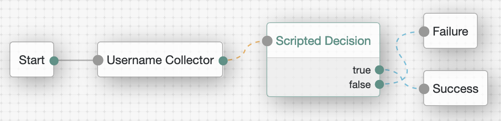

#### <a id="script-type-scripted-decision-node-configuration" name="script-type-scripted-decision-node-configuration"></a>Configuration

[Back to Contents](#contents)

AM serves as an authentication and authorization server, and the recommended authentication flow is using [Authentication Trees](https://backstage.forgerock.com/docs/am/7/authentication-guide/about-authentication-trees.html) whenever possible. Augmenting the authentication context, extending it in arbitrary (but controlled) ways without changing AM code is made possible with the scripted decision nodes.

In a scripted decision node configuration, you need to specify a server-side script to be executed, its possible outcomes, and all of the inputs required by the script and the outputs it is required to produce:

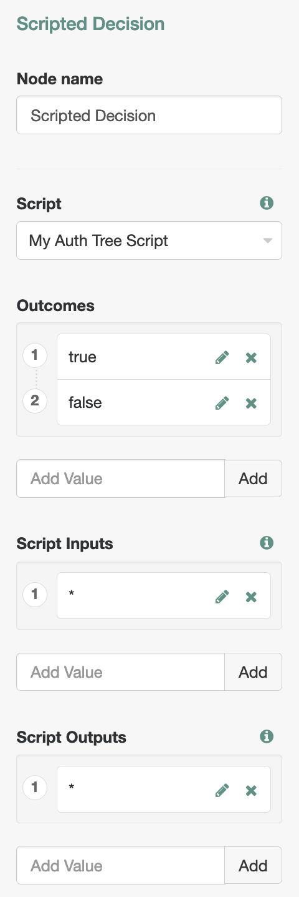

The `*` (wildcard) variable can be referenced in the script configuration to include all available inputs or outputs without verifying their presence in [Shared Tree State](https://backstage.forgerock.com/docs/am/7/auth-nodes/core-action.html#accessing-tree-state)—a special object that holds the current authentication state and allows for data exchange between otherwise stateless nodes in the authentication tree.

> For more information about Scripted Decision Node configuration, see [Authentication Nodes Configuration Reference > Scripted Decision Node](https://backstage.forgerock.com/docs/am/7/authentication-guide/auth-node-configuration-hints.html#auth-node-scripted-decision).

#### <a id="script-type-scripted-decision-node-outcomes" name="script-type-scripted-decision-node-outcomes"></a>Outcomes

[Back to Contents](#contents)

At the end of a script execution, the script can communicate back to its node by providing an outcome, an action to take, and any additional audit data, by populating the following top-level variables:

* <a id="script-type-scripted-decision-node-outcomes-outcome" name="script-type-scripted-decision-node-outcomes-outcome"></a>`outcome`, the variable that contains the result of the script execution and matches one of the outcomes specified in the node configuration.

    [Back to Contents](#contents)

    When the node execution completes, tree evaluation will continue along the path that matches the value of the outcome. For example, the expected outcome could be "true" or "false":

    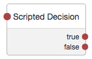

    Then, the script can define its outcome by assigning a _String_ value to the `outcome` variable. For example:

    <br/>

    <details open>
    <summary><strong>JavaScript or Groovy</strong></summary>

    ```javascript
    if ( . . . ) {
      outcome = "true"
    } else {
      outcome = "false"
    }
    ```
    </details>

    <br/>

    Outcomes could be a collection of any other strings; for example: "success", "failure", "error", and "unsure"—if those correspond to respective paths in the authentication tree.

    > Currently, the Authentication Tree Decision Node Script template contains a comment implying that there could be only two possible outcomes:
    >
    > <br/>
    >
    > <details open>
    > <summary><strong>JavaScript</strong></summary>
    >
    > ```javascript
    > /*
    >   - Data made available by nodes that have already executed are available in the sharedState variable.
    >   - The script should set outcome to either "true" or "false".
    >  */
    >
    > outcome = "true";
    > ```
    > </details>
    >
    > <br/>
    >
    > In reality, `outcome` is not limited to the two choices; it can correspond to any variety of authentication paths to continue with, and the string value is arbitrary.

* <a id="script-type-scripted-decision-node-outcomes-action" name="script-type-scripted-decision-node-outcomes-action"></a>`action`, the variable that can be assigned an [Action Interface](https://backstage.forgerock.com/docs/am/7/auth-nodes/core-action.html) object to define the script outcome and/or specify an operation to perform. For example:

    [Back to Contents](#contents)

    <a id="script-type-scripted-decision-node-action-examples" name="script-type-scripted-decision-node-action-examples"></a>

    <br/>

    <details open>
    <summary><strong>JavaScript</strong></summary>

    ```javascript
    var goTo = org.forgerock.openam.auth.node.api.Action.goTo

    action = goTo("true").build() // The outcome is set to "true".
    ```
    </details>

    <br/>

    <details open>
    <summary><strong>JavaScript</strong></summary>

    ```javascript
    var goTo = org.forgerock.openam.auth.node.api.Action.goTo

    action = goTo("true").putSessionProperty("customKey", "customValue").build() // The outcome is set to "true", and a custom session property will be created and populated.
    ```
    </details>

    <br/>

    <details open>
    <summary><strong>JavaScript</strong></summary>

    ```javascript
    var fr = JavaImporter(
        org.forgerock.openam.auth.node.api.Action
    )

    action = fr.Action.goTo("false").withErrorMessage("Friendly error description.").build() // The outcome is set to "false". The error message will be included in the authentication response, and if supported by the UI, the message will be displayed to the end user.
    ```
    </details>

    <br/>

    <details>
    <summary><strong>Groovy</strong></summary>

    ```groovy
    import org.forgerock.openam.auth.node.api.Action

    action = Action.goTo("true").build() // The outcome is set to "true".
    ```
    </details>

    <br/>

    A value set either in `outcome` or `action` is something the node will expect, recognize, and evaluate to decide on the ultimate outcome, with the action value taking precedence. In the following example, setting `outcome` directly won't have any effect, because the outcome specified in `action` will be evaluated and returned first:

    <br/>

    <details open>
    <summary><strong>JavaScript or Groovy</strong></summary>

    ```javascript
    action = Action.goTo("false").build() // Takes effect.

    outcome = "true" // Is not considered.
    ```
    </details>

    <br/>

* <a id="script-type-scripted-decision-node-outcomes-auditentrydetail" name="script-type-scripted-decision-node-outcomes-auditentrydetail"></a>`auditEntryDetail`, the placeholder for additional audit information that the node may provide, as described in [Scripted Decision Node API Functionality > Adding Audit Information](https://backstage.forgerock.com/docs/am/7/authentication-guide/scripting-api-node.html#scripting-api-node-audit-logging).

    [Back to Contents](#contents)

    Although the variable is defined by default in the script top-level scope, it is not initially populated.

#### <a id="script-type-scripted-decision-node-bindings" name="script-type-scripted-decision-node-bindings"></a>Bindings

[Back to Contents](#contents)

The script context is provided via its bindings. The bindings also serve as the information exchange channel between the scripting context and the parent node. In AM 7.0, the following bindings are available in Scripted Decision Node scripts:

* <a id="script-type-scripted-decision-node-bindings-sharedstate" name="script-type-scripted-decision-node-bindings-sharedstate"></a>`sharedState`, the object that holds the state of the authentication tree and allows data exchange between the stateless nodes, as described in [Storing Values in Shared Tree State](https://backstage.forgerock.com/docs/am/7/auth-nodes/core-action.html#accessing-tree-state). The binding is derived from the TreeContext class' [sharedState](https://backstage.forgerock.com/docs/am/7/apidocs/org/forgerock/openam/auth/node/api/TreeContext.html#sharedState) field.

    [Back to Contents](#contents)

    A node may expect some inputs and may be expected to save certain outputs in the `sharedState` object.

    You can see what the object contains by logging out its current content:

    <br/>

    <details open>
    <summary><strong>JavaScript or Groovy</strong></summary>

    ```javascript
    logger.error(sharedState.toString())
    ```

    ```
    ERROR: {realm=/, authLevel=0, username=user.0}
    ```
    </details>

    <br/>

    What you see will depend on what the preceding nodes in the tree have already added to `sharedState`. In the example above, only the [Username Collector](https://backstage.forgerock.com/docs/am/7/authentication-guide/auth-node-configuration-hints.html#auth-node-username-collector) node was used thus far, and predictably, it had captured the username.

    An individual property could then be obtained and/or inspected via the binding's `get(String key)` method:

    <br/>

    <details open>
    <summary><strong>JavaScript or Groovy</strong></summary>

    ```javascript
    var username = sharedState.get("username")
    ```
    </details>

    <br/>

    By using the `sharedState.put(String key, Object value)` method, you can store information that could be used later in the authentication session. Because, you may not be ready to make your scripted decision yet, but your script may have obtained something from an external resource (or prepared some information in another manner) that could be used in more than one way by different nodes down the authentication flow.

    Some of the properties saved in `sharedState` may have general purpose. You can, for example, provide a custom error message for an unsuccessful authentication attempt:

    <br/>

    <details open>
    <summary><strong>JavaScript or Groovy</strong></summary>

    ```javascript
    try {
        var username = getState("username")
    } catch (e) {
        sharedState.put("errorMessage", e.toString())
    }
    ```
    </details>

    <br/>

    > You can store an object in `sharedState`, but for interoperability, you may choose to store its String representation instead. Another example would be saving a stringified JSON.

    If supported by the UI, the value stored under the "errorMessage" key will be displayed to the end user instead of the default login failure message when the authentication eventually fails.

    In the example above, because the `getState` binding is not declared, JavaScript will produce the following message to be displayed on the login screen:

    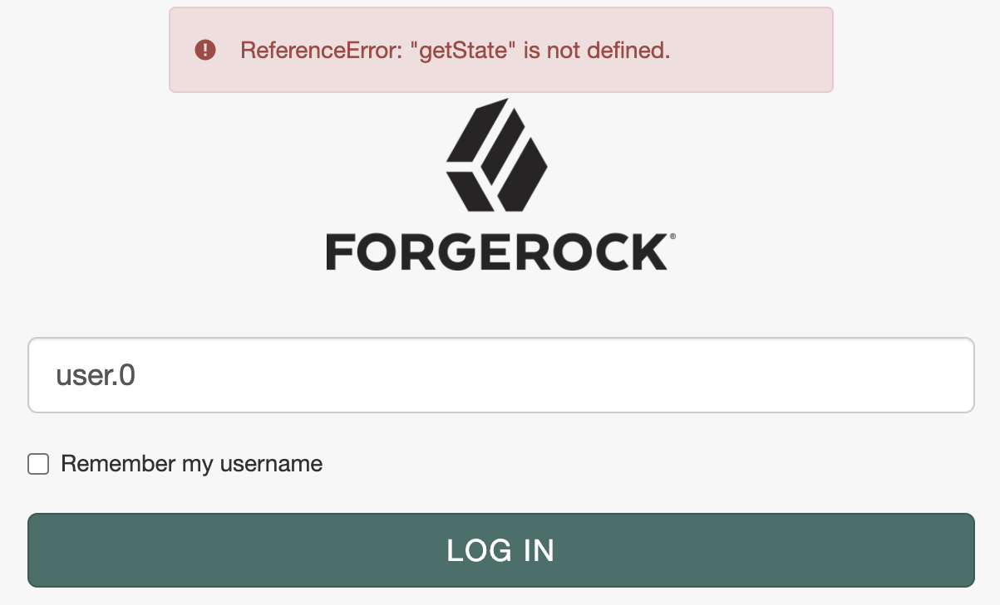

    Which is a part of the failed authentication response returned to the user agent:

    ```json
    {"code":401,"reason":"Unauthorized","message":"ReferenceError: \"getState\" is not defined.","detail":{"failureUrl":""}}
    ```

    Remember, however, that a message provided in `Action.goTo("false").withErrorMessage(String message)` will override the "errorMessage" content.

    Another example of a universally recognized property would be "successUrl". For example:

    <br/>

    <details open>
    <summary><strong>JavaScript or Groovy</strong></summary>

    ```javascript
    sharedState.put("successUrl", "http://openam.example.com:8080/openam/XUI/?authIndexType=service&authIndexValue=scripted&test=successUrl#dashboard/")
    ```
    </details>

    <br/>

    Once again, whether the property is actually used, depends on the UI implementation and whether it considers the authentication response:

    ```json
    {"tokenId":"Pk8vDJCVDz1phdK83JlqWnXB2uc.*AAJTSQACMDEAAlNLABxEQlBkdnRiRk1oMjY4dUh3aXdQcDNLSDVRMUk9AAR0eXBlAANDVFMAAlMxAAA.*","successUrl":"http://openam.example.com:8080/openam/XUI/?authIndexType=service&authIndexValue=scripted&test=successUrl#dashboard/","realm":"/"}
    ```

* <a id="script-type-scripted-decision-node-bindings-transientstate" name="script-type-scripted-decision-node-bindings-transientstate"></a>`transientState`, the object for storing sensitive information that must not leave the server unencrypted and may not need to persist between authentication requests during the authentication session.

    [Back to Contents](#contents)

    This means that the data stored in `transientState` exists only until the next response is sent to the user, _unless_ the secret data is requested later in the authentication tree, _between_ the responses (in a conventional term: "across a callback boundary").

    > `sharedState` exists unconditionally during the lifetime of the authentication session and could be returned to the user in an unencrypted JWT in each response during the authentication flow.
    > <details>
    > <summary>Details</summary>
    > If you choose to save the authentication session state in JWT (under Realms > _Realm Name_ > Authentication > Settings > Trees > Authentication session state management scheme), and set CONFIGURE > Global Services > Session > Client-based Sessions > Encryption Algorithm to “NONE”, your authentication state will be included in an encoded but unencrypted form in every (callback) response to the user agent:
    >
    > ```json
    > {
    >   "state": "valid",
    >    "maxTime": 5,
    >    "maxIdle": 5,
    >    "maxCaching": 3,
    >    "sessionType": "USER",
    >    "lastActivityTime": 1606271524,
    >    "jti": "b05bfee4-cd98-41d4-99d1-6417d073cfc1",
    >    "exp": 1606271824,
    >    "props": {
    >      "treeState": "{\"sharedState\":{\"realm\":\"/\",\"authLevel\":0,\"username\":\"user.0\"},\"secureState\":{},\"currentNodeId\":\"06bc8627-1ff5-44d2-bdc4-7cffeeac7729\",\"sessionProperties\":{},\"sessionHooks\":[],\"webhooks\":[]}",
    >      "AMCtxId": "f66fd450-01ce-4652-b3f6-2894e9a0344a-63080",
    >      "amlbcookie": "01"
    >    }
    > }
    </details>

    <br/>

    If the secret value _is_ required across requests, it will be "promoted" (that is, moved) into the tree's `secureState`, which is a special object that is always encrypted and is not to be accessed directly. Instead, if they were available in the scripting environment, you could use the TreeContext's [getState(String key)](https://backstage.forgerock.com/docs/am/7/apidocs/org/forgerock/openam/auth/node/api/TreeContext.html#getState(java.lang.String)) or [getTransientState(String key)](https://backstage.forgerock.com/docs/am/7/apidocs/org/forgerock/openam/auth/node/api/TreeContext.html#getTransientState(java.lang.String)) public methods, which first checks for the key in `transientState` and then in `secureState`. At the time of this writing, neither of the methods nor a similar functionality is included in the scripting decision node bindings, but something to that effect [may be introduced](https://bugster.forgerock.org/jira/browse/OPENAM-16962) in later iterations of AM.

    To retrieve a key from `transientState` use its `get(String key)` method, and to populate a key use `put(String key, V value)`.

    For example, to get a password saved in `transientState` by the Password Collector node:

    <br/>

    <details open>
    <summary><strong>JavaScript or Groovy</strong></summary>

    ```javascript
    var password = transientState.get("password")
    ```
    </details>

    <br/>

    Or share a value with a node down the authentication tree:

    <br/>

    <details open>
    <summary><strong>JavaScript or Groovy</strong></summary>

    ```javascript
    transientState.put("sensitiveKey", "sensitiveValue")
    ```
    </details>

    <br/>

* <a id="script-type-scripted-decision-node-bindings-callbacks" name="script-type-scripted-decision-node-bindings-callbacks"></a>`callbacks`, the placeholder for a collection of form components and/or page elements to be sent back to the authenticating user, as described in [Supported Callbacks](https://backstage.forgerock.com/docs/am/7/authentication-guide/authn-supported-callbacks.html).

    [Back to Contents](#contents)

    The examples provided in [Scripted Decision Node API Functionality > Using Callbacks](https://backstage.forgerock.com/docs/am/7/authentication-guide/scripting-api-node.html#scripting-api-node-callbacks) highlight the general idea: a node, via its script, can send information to and get input from the user and/or retrieve data about the user agent. When the collected data is submitted back to the server-side script, it could be stored in `sharedState` or used directly by the script.

    You can use interactive callbacks to request input from the user. For example, [PasswordCallback](https://docs.oracle.com/en/java/javase/11/docs/api/java.base/javax/security/auth/callback/PasswordCallback.html) could be used in your scripted decision for capturing a secret value:

    <br/>

    <details open>
    <summary><strong>JavaScript</strong></summary>

    ```javascript
    var fr = JavaImporter(
        org.forgerock.openam.auth.node.api.Action, // 1
        javax.security.auth.callback.PasswordCallback, // 2
        java.lang.String // 3
    )

    if (callbacks.isEmpty()) { // 4
        action = fr.Action.send(
            fr.PasswordCallback("password hint", false) // 5
        ).build()
    } else {
        transientState.put("password", fr.String(callbacks.get(0).getPassword())) // 3, 6

        action = fr.Action.goTo("true").build()
    }

    logger.error("transientState: " + transientState)
    ```

    ```
    ERROR: transientState: {password=1077}
    ```
    </details>

    <br/>

    <details>
    <summary><strong>Groovy</strong></summary>

    ```groovy
    import org.forgerock.openam.auth.node.api.Action // 1
    import javax.security.auth.callback.PasswordCallback // 2

    if (callbacks.isEmpty()) { // 4
        action = Action.send([
            new PasswordCallback("password hint", false) // 5
        ]).build()
    } else {
        transientState.put("password", callbacks.get(0).getPassword().toString()) // 6

        action = Action.goTo("true").build()
    }

    logger.error("transientState: " + transientState)
    ```

    ```
    ERROR: transientState: [password:1077]
    ```
    </details>

    <br/>

    1. Import the API that allows for using the Action Interface and sending callbacks.
    1. Import the callback class(es).
    1. We need this in JavaScript to convert `char[]` returned by `getPassword()` to a String.
    1. Check if any callbacks have been already requested by the node; if not, specify one (or multiple callbacks, separated by comma) that will be sent to the user agent.
    1. When instantiating the callback class, remember to pass in parameters matching its constructor.
    1. When the form input has been populated and submitted to the server side, get the form value and save it in `transientState` or `sharedState` to make it available for the downstream nodes in the tree.

    If your scripted decision depends on multiple rounds of interaction with the user, you have an option to send the same or different callbacks from the same script until all necessary feedback is collected. For example, let's keep sending the password callback back to the user if no input has been provided:

    <br/>

    <details open>
    <summary><strong>JavaScript</strong></summary>

    ```javascript
    var fr = JavaImporter(
        org.forgerock.openam.auth.node.api.Action, // 1
        javax.security.auth.callback.PasswordCallback, // 2
        java.lang.String // 3
    )

    function sendCallbacks() {
        action = fr.Action.send(
            fr.PasswordCallback("password hint", false) // 5
        ).build()
    }

    function processCallbacks() {
        var password = fr.String(callbacks.get(0).getPassword())

        if (password.isEmpty()) { // 7
            var count = parseInt(sharedState.get("count")) || 1 // 8

            if (count > 4) { // 8
                action = fr.Action.goTo("false").withErrorMessage("Something went wrong . . . ").build()

                return
            }

            sharedState.put("count", count + 1)

            sendCallbacks()

            return
        }

        transientState.put("password", password) // 6

        action = fr.Action.goTo("true").build()
    }

    if (callbacks.isEmpty()) { // 4
        sendCallbacks()
    } else {
        processCallbacks()
    }
    ```
    </details>

    <br/>

    <details>
    <summary><strong>Groovy</strong></summary>

    ```groovy
    import org.forgerock.openam.auth.node.api.Action // 1
    import javax.security.auth.callback.PasswordCallback // 2

    def sendCallbacks = {
        action = Action.send(
            new PasswordCallback("password hint", false) // 5
        ).build()
    }

    def processCallbacks = {
        def password = callbacks.get(0).getPassword().toString()

        if (password.isEmpty()) { // 7
            def count = 1

            if (sharedState.get("count")) { // 8
                count = sharedState.get("count").toInteger()
            }

            if (count > 4) { // 8
                action = Action.goTo("false").withErrorMessage("Something went wrong . . . ").build()

                return
            }

            sharedState.put("count", count + 1)

            sendCallbacks()

            return
        }

        transientState.put("password", password) // 6

        action = Action.goTo("true").build()
    }

    if (callbacks.isEmpty()) { // 4
        sendCallbacks()
    } else {
        processCallbacks()
    }
    ```
    </details>

    <br/>

    7. Resend password callback if no input was provided.
    8. Terminate the exercise after four unsuccessful tries.

    Callbacks may also be used to inform the user of something important, or to run arbitrary scripts on the client-side. For example, you may try to obtain the client-side IP (for further analysis) with the help of `ScriptTextOutputCallback` and `HiddenValueCallback`:

    <br/>

    <details open>
    <summary><strong>JavaScript</strong></summary>

    ```javascript
    var fr = JavaImporter(
        org.forgerock.openam.auth.node.api.Action,
        com.sun.identity.authentication.callbacks.HiddenValueCallback,
        com.sun.identity.authentication.callbacks.ScriptTextOutputCallback
    )

    var script = " \n\
    var script = document.createElement('script') // A \n\
    \n\
    script.src = 'https://code.jquery.com/jquery-3.4.1.min.js' // A \n\
    script.onload = function (e) { // B \n\
        $.getJSON('https://api.ipify.org/?format=json', function (json) { \
            document.getElementById('clientScriptOutputData').value = JSON.stringify({ \n\
                ip: json \n\
            }) // C \n\
        }) \
        .always(function () { \n\
            document.getElementById('loginButton_0').click() // D \n\
        }) \n\
    } \n\
    \n\
    document.getElementsByTagName('head')[0].appendChild(script) // A \n\
    \n\
    setTimeout(function () { // E \n\
        document.getElementById('loginButton_0').click() \n\
    }, 4000)" // 1

    if (callbacks.isEmpty()) {
        action = fr.Action.send(
            new fr.HiddenValueCallback("clientScriptOutputData", "false"),
            new fr.ScriptTextOutputCallback(script)
        ).build()
    } else {
        var failure = true

        if (callbacks.get(0).getValue() != "clientScriptOutputData") { // 2
            sharedState.put("clientScriptOutputData", callbacks.get(0).getValue()) // 3

            failure = false
        }

        if (failure) {
            logger.error('Authentication denied.')

            action = fr.Action.goTo("false").build()
        } else {
            logger.message('Authentication allowed.')

            action = fr.Action.goTo("true").build()
        }
    }
    ```
    </details>

    <br/>

    <details>
    <summary><strong>Groovy</strong></summary>

    ```groovy
    import org.forgerock.openam.auth.node.api.Action
    import com.sun.identity.authentication.callbacks.ScriptTextOutputCallback
    import com.sun.identity.authentication.callbacks.HiddenValueCallback

    def script = '''
    var script = document.createElement('script') // A

    script.src = 'https://code.jquery.com/jquery-3.4.1.min.js' // A
    script.onload = function (e) { // B
        $.getJSON('https://api.ipify.org/?format=json', function (json) {
            document.getElementById('clientScriptOutputData').value = JSON.stringify({
                ip: json
            }) // C
        })
        .always(function () {
            document.getElementById('loginButton_0').click() // D
        })
    }

    document.getElementsByTagName('head')[0].appendChild(script) // A

    setTimeout(function () { // E
        document.getElementById('loginButton_0').click()
    }, 4000)
    ''' // 1

    if (callbacks.isEmpty()) {
        action = Action.send([
            new HiddenValueCallback("clientScriptOutputData", "false"),
            new ScriptTextOutputCallback(script)
        ]).build()
    } else {
        def failure = true

        if (callbacks.get(0).getValue() != "clientScriptOutputData") { // 2
            sharedState.put("clientScriptOutputData", callbacks.get(0).getValue()) // 3

            failure = false
        }

        if (failure) {
            logger.error('Authentication denied.')

            action = Action.goTo("false").build()
        } else {
            logger.message('Authentication allowed.')

            action = Action.goTo("true").build()
        }
    }
    ```
    </details>

    <br/>

    1. The client-side portion can be specified directly in the body of the server-side script.

        The client-side scripting environment is defined by the user browser and is not specific to ForgeRock.

        You can use your browser console for _writing_ scripts in the user agent, which will allow for some immediate feedback. Then, you can multiline the script by wrapping it with `'''` in Groovy and with `;` and/or `\n\` in JavaScript.

        > There may be custom nodes proving amenities for editing the client-side portion of the code. For example: [Client Script Auth Tree Node](https://backstage.forgerock.com/marketplace/api/catalog/entries/AWAm-FCxfKvOhw29pnIp).


        The original client-side script in the example above looks like the following:

        <br/>

        <details open>
        <summary>JavaScript, client-side</summary>

        ```javascript
        var script = document.createElement('script') // A

        script.src = 'https://code.jquery.com/jquery-3.4.1.min.js' // A
        script.onload = function (e) { // B
            $.getJSON('https://api.ipify.org/?format=json', function (json) {
                document.getElementById('clientScriptOutputData').value = JSON.stringify({
                    ip: json
                }) // C
            })
            .always(function () {
                document.getElementById("loginButton_0").click() // D
            })
        }

        document.getElementsByTagName('head')[0].appendChild(script) // A

        setTimeout(function () { // E
            document.getElementById('loginButton_0').click()
        }, 4000)
        ```
        </details>

        <br/>

        * A. Create a script element and add to DOM for loading an external library.
        * B. When the library is loaded, make a request to an external source to obtain the client's IP information.
        * C. Save the information, received as a JSON object, as a string in the input constructed with `HiddenValueCallback`.
        * D. When the HTTP call is complete, submit the form.
        * E. If the HTTP request takes more time than the specified timeout, submit the form after a timeout.

            > While developing the server-side script, you can further delay or dismiss automatic submission of the form.

        Unlike Client-side Authentication scripts used in authentication modules, when the callbacks are sent by a Scripted Decision Node script, the following applies:

        * The form is NOT self-submitting, and setting `autoSubmitDelay` won't have any effect.
        * The input for the client-side data needs to be populated directly (unlike authentication chain modules, where the callback input can be referenced via the `output` object).
        * There is no automatically provided `submit()` function.

    2. Check if the client-side data input has been populated before proceeding with the authentication flow.

    3. Store the data under an _arbitrary named_ key in the `sharedState` object—to share it with the rest of the tree.

    As the authentication worries along, the information stored in `transientState` and `sharedState` can be requested by the other nodes. For example:

    <br/>

    <details open>
    <summary><strong>JavaScript</strong></summary>

    ```javascript
    var ip = JSON.parse(sharedState.get("clientScriptOutputData")).ip
    ```
    </details>

    <br/>

    <details>
    <summary><strong>Groovy</strong></summary>

    ```groovy
    import groovy.json.JsonSlurper

    def jsonSlurper = new JsonSlurper()
    def ip = jsonSlurper.parseText(sharedState.get("clientScriptOutputData")).ip
    ```

    > The `groovy.json.JsonSlurper` class is included by default in your AM console under Configure > Global Services > Scripting > Secondary Configurations > AUTHENTICATION TREE DECISION NODE > Secondary Configurations > engineConfiguration > Java class whitelist, but you may need to add `org.apache.groovy.json.internal.LazyMap` to the list as well. Find more information on the subject in [Language > Allowed Java Classes](#script-language-java-allow) of this writing.
    </details>

    <br/>

    Then, you can check the IP data against a list of (dis)allowed locations, save it in the user profile, etc.

    > At the time of this writing, the API used in the example above was returning something like the following:
    >
    > ```json
    > {"ip":"65.113.98.10"}
    > ```

    In a scripted decision node script, you can easily try a particular callback before using it in authentication node development, or employ callbacks to display intermediate debugging information as described in [Debugging > Callbacks](#script-type-scripted-decision-node-debugging-callbacks).

* <a id="script-type-scripted-decision-node-bindings-idrepository" name="script-type-scripted-decision-node-bindings-idrepository"></a>`idRepository`, the object that provides access to the user identity data, as described in [Scripted Decision Node API Functionality > Accessing Profile Data](https://backstage.forgerock.com/docs/am/7/authentication-guide/scripting-api-node.html#scripting-api-node-id-repo).

    [Back to Contents](#contents)

    Attributes available to the `idRepository` object will be defined in AM's [Identity Repository](https://backstage.forgerock.com/docs/am/7/install-guide/prepare-identity-repository.html) setup. You can see them in the AM console under Realms > _Realm Name_ > Identity Stores > _Identity Store Name_ > User Configuration > LDAP User Attributes.

   `idRepository.getAttribute(String username, String attribute)` returns a [java.util.HashSet](https://docs.oracle.com/en/java/javase/11/docs/api/java.base/java/util/HashSet.html).

    `idRepository.setAttribute(String username, String attribute, String[] values)` and `idRepository.addAttribute(String username, String attribute, String value)` will update the corresponding field in the user profile.

    A few examples of accessing and manipulating data accessible via `idRepository`:

    <br/>

    <details open>
    <summary><strong>JavaScript</strong></summary>

    ```javascript
    var username = sharedState.get("username")
    var attribute = "mail"

    idRepository.setAttribute(username, attribute, ["user.0@a.com", "user.0@b.com"]) // Set multiple values; must be an Array.
    logger.error(idRepository.getAttribute(username, attribute))
    // > ERROR: [user.0@b.com, user.0@a.com]

    idRepository.setAttribute(username, attribute, ["user.0@a.com"]) // Set a single value; MUST be an Array.
    logger.error(idRepository.getAttribute(username, attribute))
    // > ERROR: [user.0@a.com]
    ```
    </details>

    <br/>

    <details>
    <summary><strong>Groovy</strong></summary>

    ```groovy

    def username = sharedState.get("username")
    def attribute = "mail"

    idRepository.setAttribute(username, attribute, ["user.0@a.com", "user.0@b.com"] as String[]) // Set multiple values; cast the List as a String array.
    logger.error(idRepository.getAttribute(username, attribute).toString())
    // > ERROR: [user.0@b.com, user.0@a.com]

    idRepository.setAttribute(username, attribute, "user.0@a.com") // Set a single value; COULD be a String.
    logger.error(idRepository.getAttribute(username, attribute).toString())
    // > ERROR: [user.0@a.com]
    ```
    </details>

    <br/>

    <details open>
    <summary><strong>JavaScript or Groovy</strong></summary>

    ```javascript
    var username = sharedState.get("username")
    var attribute = "mail"

    idRepository.addAttribute(username, attribute, "user.0@c.com") // Add a value as a String.
    logger.error(idRepository.getAttribute(username, attribute).toString())
    // > ERROR: [user.0@a.com, user.0@c.com]

    logger.error(idRepository.getAttribute(username, attribute).iterator().next()) // Get the first value.
    // > ERROR: user.0@a.com

    logger.error(idRepository.getAttribute(username, attribute).toArray()[1]) // Get a value at the specified index.
    // > ERROR: user.0@c.com

    logger.error(idRepository.getAttribute(username, "non-existing-attribute").toString())
    // > ERROR: []: If no attribute by this name is found, an empty Set is returned.
    ```
    </details>

    <br/>

    If you need to check whether an attribute is populated prior to requesting its individual values, you can use the `.iterator().hasNext()` method, or convert the returned set `toArray()` and check its length:

    <br/>

    <details open>
    <summary><strong>JavaScript or Groovy</strong></summary>

    ```javascript
    var username = sharedState.get("username")
    var attribute = "mail"

    var value = idRepository.getAttribute(username, attribute)

    logger.error("value: " + value)
    // > ERROR: value: [user.0@a.com, user.0@c.com]

    if (value.iterator().hasNext()) {
        logger.error("Attribute's first value: " + value.iterator().next())
        // > ERROR: Attribute's first value: user.0@a.com
    }

    if (value.toArray().length) {
        logger.error("Attribute's last value:" + value.toArray()[value.toArray().length - 1])
        // > ERROR: Attribute's last value:user.0@c.com
    }
    ```
    </details>

    <br/>

    > For brevity, and to illustrate interchangeability, the same syntax was used in the last two examples. As noted in [Debug Logging](#script-debug-logging), in JavaScript you don't need to convert a non-string argument for the logger methods to String (although, doing so won't hurt either), and the following will work:
    >
    > ```javascript
    > logger.error(idRepository.getAttribute(username, attribute))
    > // > ERROR: [user.0@a.com, user.0@c.com]
    > ```

    The value returned by `idRepository.getAttribute(String username, String attribute)` is a `HashSet`; optionally, you may also be able to employ some of its methods described in the corresponding [Java](https://docs.oracle.com/javase/8/docs/api/java/util/HashSet.html), [Rhino](https://mozilla.github.io/rhino/javadoc/org/mozilla/javascript/Hashtable.html), and [Groovy](http://docs.groovy-lang.org/next/html/documentation/working-with-collections.html#_set_operations) docs. For example, you can use `size()` in JavaScript and Groovy (and `count {}` in Groovy) to check length of the returned value directly, without intermediate conversions:

    <br/>

    <details open>
    <summary><strong>JavaScript or Groovy</strong></summary>

    ```javascript
    var username = sharedState.get("username")
    var attribute = "mail"

    var value = idRepository.getAttribute(username, attribute)

    logger.error("value size: " + value.size())
    // > ERROR: value size: 2
    ```
    </details>

    <br/>

* <a id="script-type-scripted-decision-node-bindings-realm" name="script-type-scripted-decision-node-bindings-realm"></a>`realm`, the _name_ of the realm the user is authenticating to.

    [Back to Contents](#contents)

    For example, the Top Level Realm:

    <br/>

    <details open>
    <summary><strong>JavaScript or Groovy</strong></summary>

    ```javascript
    logger.error(realm)
    // > ERROR: /
    ```
    </details>

    <br/>

* <a id="script-type-scripted-decision-node-bindings-requestheaders" name="script-type-scripted-decision-node-bindings-requestheaders"></a>`requestHeaders`, the object that provides methods for accessing headers in the login request, as described in [Scripted Decision Node API Functionality > Accessing Request Header Data](https://backstage.forgerock.com/docs/am/7/authentication-guide/scripting-api-node.html#scripting-api-node-requestHeaders).

    [Back to Contents](#contents)

* <a id="script-type-scripted-decision-node-bindings-requestparameters" name="script-type-scripted-decision-node-bindings-requestparameters"></a>`requestParameters`, the object that contains the authentication request parameters.

    [Back to Contents](#contents)

    For example, you may be able to check which authentication tree was requested to make your scripted decision in:

    <br/>

    <details open>
    <summary><strong>JavaScript</strong></summary>

    ```javascript
    var service
    var authIndexType = requestParameters.get("authIndexType")

    if (authIndexType && String(authIndexType.get(0)) === "service") { // 1
        service = requestParameters.get("authIndexValue").get(0)
    }
    ```

    1. In JavaScript, the values stored in `requestParameters` have `typeof` object and represent the `java.lang.String` class; hence, you need to convert the parameter value to String in order to use Strict Equality Comparison, as described in [Language > More on Rhino > String Comparison](#script-language-javascript-string-comparison).
    </details>

    <br/>

    <details>
    <summary><strong>Groovy</strong></summary>

    ```groovy

    def service
    def authIndexType = requestParameters.get("authIndexType")

    if (authIndexType && authIndexType.get(0) == "service") {
        service = requestParameters.get("authIndexValue").get(0)
    }
    ```
    </details>

    <br/>

* <a id="script-type-scripted-decision-node-bindings-existingsession" name="script-type-scripted-decision-node-bindings-existingsession"></a>`existingSession` (session upgrade only), the object containing the existing session information, as described in [Scripted Decision Node API Functionality > Accessing Existing Session Data](https://backstage.forgerock.com/docs/am/7/authentication-guide/scripting-api-node.html#scripting-api-node-existingSession).

    [Back to Contents](#contents)

    In order to determine whether the current request is a session upgrade, you can check if the binding is declared:

    <br/>

    <details open>
    <summary><strong>JavaScript</strong></summary>

    ```javascript
    var existingAuthLevel

    if (typeof existingSession !== "undefined") {
        existingAuthLevel = existingSession.get("AuthLevel")
    } else {
        logger.error("Variable existingSession not declared - not a session upgrade.");
    }

    logger.error("Existing Auth Level: " + existingAuthLevel)
    ```

    ```
    ERROR: Variable existingSession not declared - not a session upgrade.

    ERROR: Existing Auth Level: undefined
    ```
    </details>

    <br/>

    <details>
    <summary><strong>Groovy</strong></summary>

    ```groovy
    def existingAuthLevel

    if (binding.hasVariable("existingSession")) { // 1
        existingAuthLevel = existingSession.get("AuthLevel")
    } else {
        logger.error("Variable existingSession not declared - not a session upgrade.")
    }

    logger.error("Existing Auth Level: " + existingAuthLevel)
    ```

    ```
    ERROR: Variable existingSession not declared - not a session upgrade.

    ERROR: Existing Auth Level: null
    ```
    </details>

    <br/>

    You could also use `try/catch` when referencing the `existingSession` variable, which has a benefit of the same syntax in both languages, but is probably not the most efficient way to perform the check. For example:

    <br/>

    <details open>
    <summary><strong>JavaScript or Groovy</strong></summary>

    ```javascript
    var existingAuthLevel

    try { // 1
        existingAuthLevel = existingSession.get("AuthLevel")
    } catch (e) {
        logger.error(e.toString())
    }

    logger.error("Existing Auth Level: " + existingAuthLevel)
    ```

    JavaScript
    ```
    ERROR: ReferenceError: "existingSession" is not defined.

    ERROR: Existing Auth Level: undefined
    ```

    Groovy
    ```
    ERROR: groovy.lang.MissingPropertyException: No such property: existingSession for class: Script262

    ERROR: Existing Auth Level: null
    ```
    </details>

    <br/>

    1. Employing either technique may not work in Groovy with the default scripting engine configuration, and you may need to explicitly allow additional Java classes, which may or may not be an option in your environment. See the [Language > Allowed Java Classes](#script-language-java-allow) and [ForgeRock Identity Cloud > Allowed Java Classes](#fidc-script-java-allow) sections for details.

    The easiest way to test scripts with a reference to `existingSession` is probably navigating to the login screen (while being signed in) with the `ForceAuth=true` [authentication parameter](https://backstage.forgerock.com/docs/am/7/authentication-guide/authn-from-browser.html#authn-from-browser-parameters) added to the query string. For example:

    ```bash
    http://openam.example.com:8080/openam/XUI/?service=ScriptedTree&ForceAuth=true#login
    ```

    ```
    ERROR: Existing Auth Level: 0
    ```

    For more information on the session upgrade subject, see [Sessions Guide > Session Upgrade](https://backstage.forgerock.com/docs/am/7/sessions-guide/session-upgrade.html#session-upgrade).

* <a id="script-type-scripted-decision-node-bindings-logger" name="script-type-scripted-decision-node-bindings-logger"></a>`logger`, the object that provides methods for writing debug messages, as described in [Getting Started with Scripting > Debug Logging](https://backstage.forgerock.com/docs/am/7/scripting-guide/scripting-api-global-logger.html#scripting-api-global-logger) and [earlier in this writing](#script-debug-logging).

    [Back to Contents](#contents)

* <a id="script-type-scripted-decision-node-bindings-httpclient" name="script-type-scripted-decision-node-bindings-httpclient"></a>`httpClient`, the HTTP client object, as described in [Accessing HTTP Services](https://backstage.forgerock.com/docs/am/7/scripting-guide/scripting-api-global-http-client.html#scripting-api-global-http-client) and [earlier in this writing](#script-accessing-http-services).

    [Back to Contents](#contents)
#### <a id="script-type-scripted-decision-node-debugging" name="script-type-scripted-decision-node-debugging"></a>Debugging

[Back to Contents](#contents)

The `logger` object is your best debugging friend, but not the only one:

* <a id="script-type-scripted-decision-node-debugging-callbacks" name="script-type-scripted-decision-node-debugging-callbacks"></a>Callbacks

    [Back to Contents](#contents)

    If you need an immediate feedback without completing the authentication journey, you can display the debugging content with a callback.

    For example, you can use [javax.security.auth.callback.TextOutputCallback](https://docs.oracle.com/en/java/javase/11/docs/api/java.base/javax/security/auth/callback/TextOutputCallback.html). In a simplest case, you'd display the stringified content of an object:

    <br/>

    <details open>
    <summary><strong>JavaScript</strong></summary>

    ```javascript
    var fr = JavaImporter(
        org.forgerock.openam.auth.node.api.Action,
        javax.security.auth.callback.TextOutputCallback
    )

    if (callbacks.isEmpty()) {
        action = fr.Action.send(
            new fr.TextOutputCallback(
                fr.TextOutputCallback.ERROR,
                sharedState
            )
        ).build()
    } else {
        action = fr.Action.goTo("true").build()
    }
    ```

    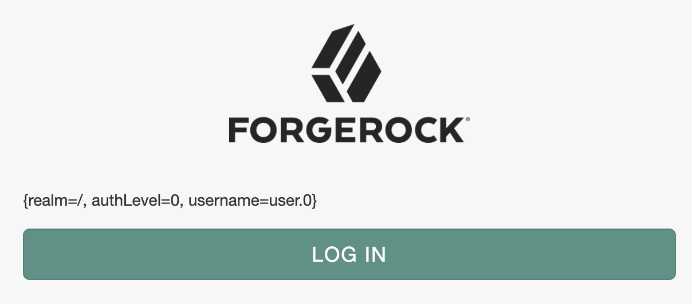
    </details>

    <br/>

    <br/>

    <details>
    <summary><strong>Groovy</strong></summary>

    ```groovy
    import org.forgerock.openam.auth.node.api.Action
    import javax.security.auth.callback.TextOutputCallback

    if (callbacks.isEmpty()) {
        action = Action.send(
            new TextOutputCallback(
                TextOutputCallback.ERROR,
                sharedState.toString()
            )
        ).build()
    } else {
        action = Action.goTo("true").build()
    }
    ```

    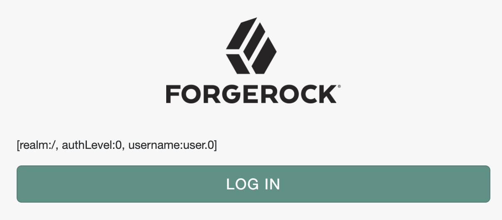
    </details>

    <br/>


    Or, you can output multiple messages:

    <br/>

    <details open>
    <summary><strong>JavaScript</strong></summary>

    ```javascript
    var fr = JavaImporter(
        org.forgerock.openam.auth.node.api.Action,
        javax.security.auth.callback.TextOutputCallback
    )

    var messages = ""

    try {
        var username = nonExistingBinding("username")
    } catch (e) {
        messages += e + " | "
    }

    try {
        var username = sharedState.nonExistingMethod("username")
    } catch (e) {
        messages += e + " | "
    }

    if (messages.length && callbacks.isEmpty()) {
        action = fr.Action.send(
            new fr.TextOutputCallback(
                fr.TextOutputCallback.ERROR,
                messages
            )
        ).build()
    } else {
        action = fr.Action.goTo("true").build()
    }
    ```

    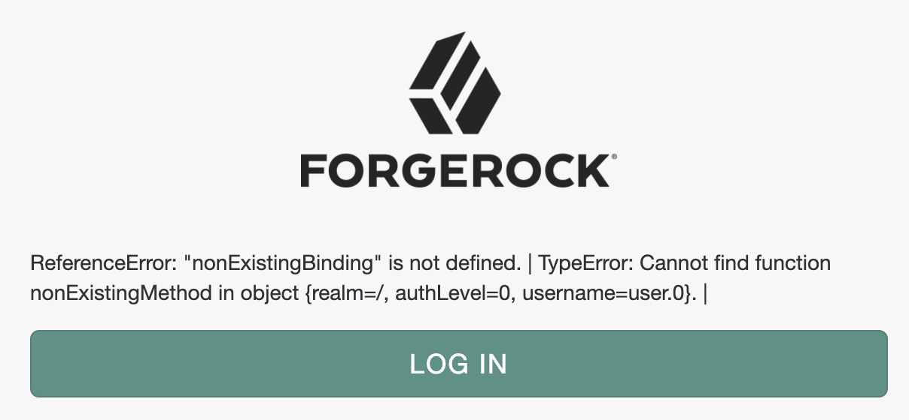
    </details>

    <br/>

    <details>
    <summary><strong>Groovy</strong></summary>

    ```groovy
    import org.forgerock.openam.auth.node.api.Action
    import javax.security.auth.callback.TextOutputCallback

    def messages = ""

    try {
        var username = nonExistingBinding("username")
    } catch (e) {
        messages += e.toString() + " | "
    }

    try {
        var username = sharedState.nonExistingMethod("username")
    } catch (e) {
        messages += e.toString() + " | "
    }

    if (messages.length() && callbacks.isEmpty()) {
        action = Action.send(
            new TextOutputCallback(
                TextOutputCallback.ERROR,
                messages
            )
        ).build()
    } else {
        action = Action.goTo("true").build()
    }
    ```

    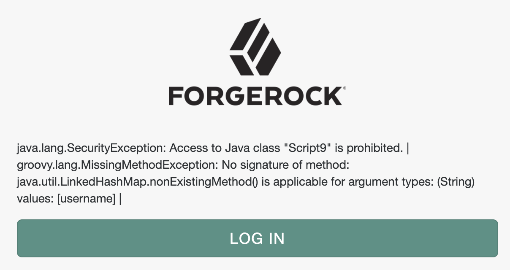
    </details>

    <br/>

    When your debugging content grows, and the messages need to be better separated visually, you can have more control over the browser output with [com.sun.identity.authentication.callbacks.ScriptTextOutputCallback](https://backstage.forgerock.com/docs/am/7/authentication-guide/authn-supported-callbacks.html#backchannel-callbacks). For example, you can alert yourself with the debug messages:

    <br/>

    <details open>
    <summary><strong>JavaScript</strong></summary>

    ```javascript
    var fr = JavaImporter(
        org.forgerock.openam.auth.node.api.Action,
        com.sun.identity.authentication.callbacks.ScriptTextOutputCallback
    )
    var messages = []

    messages.push("sharedState: " + sharedState)

    try {
        var username = nonExistingBinding("username")
    } catch (e) {
        messages.push(e)
    }

    try {
        var username = sharedState.nonExistingMethod("username")
    } catch (e) {
        messages.push(e)
    }

    if (callbacks.isEmpty()) {
        var script = "alert('" + messages.join("\\n\\n") + "')"

        action = fr.Action.send(
            new fr.ScriptTextOutputCallback(
                script
            )
        ).build()
    } else {
        action = fr.Action.goTo("true").build()
    }
    ```

    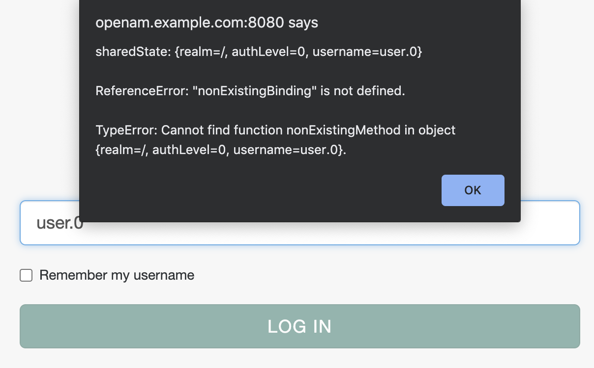
    </details>

    <br/>

    <details>
    <summary><strong>Groovy</strong></summary>

    ```groovy
    import org.forgerock.openam.auth.node.api.Action
    import com.sun.identity.authentication.callbacks.ScriptTextOutputCallback

    var messages = []

    messages.push("sharedState: " + sharedState)

    try {
        var username = nonExistingBinding("username")
    } catch (e) {
        messages.push(e)
    }

    try {
        var username = sharedState.nonExistingMethod("username")
    } catch (e) {
        messages.push(e)
    }

    if (callbacks.isEmpty()) {
        var script = "alert('" + messages.join("\\n\\n") + "')"

        action = Action.send(
            new ScriptTextOutputCallback(
                script
            )
        ).build()
    } else {
        action = fr.Action.goTo("true").build()
    }
    ```

    
    </details>

    <br/>

    You could also leverage the browser console:

    <br/>

    <details open>
    <summary><strong>JavaScript</strong></summary>

    ```javascript
    var fr = JavaImporter(
        org.forgerock.openam.auth.node.api.Action,
        com.sun.identity.authentication.callbacks.ScriptTextOutputCallback
    )
    var messages = []

    messages.push("sharedState: " + sharedState)

    try {
        var username = nonExistingBinding("username")
    } catch (e) {
        messages.push(e)
    }

    try {
        var username = sharedState.nonExistingMethod("username")
    } catch (e) {
        messages.push(e)
    }

    if (callbacks.isEmpty()) {
        var script = "console.log(JSON.parse(JSON.stringify("
        script += JSON.stringify(messages)
        script += ")))"

        action = fr.Action.send(
            new fr.ScriptTextOutputCallback(
                script
            )
        ).build()
    } else {
        action = fr.Action.goTo("true").build()
    }
    ```

    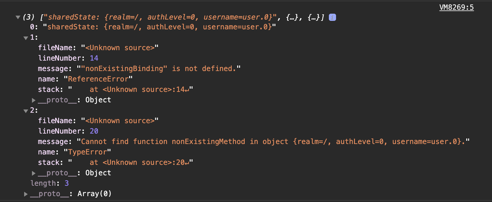
    </details>

    <br/>

    <details>
    <summary><strong>Groovy</strong></summary>

    ```groovy
    import org.forgerock.openam.auth.node.api.Action
    import com.sun.identity.authentication.callbacks.ScriptTextOutputCallback
    import groovy.json.JsonOutput

    var messages = []

    messages.push("sharedState: " + sharedState)

    try {
        var username = nonExistingBinding("username")
    } catch (e) {
        messages.push(e.toString())
    }

    try {
        var username = sharedState.nonExistingMethod("username")
    } catch (e) {
        messages.push(e.toString())
    }

    if (callbacks.isEmpty()) {
        var script = "console.log(JSON.parse(JSON.stringify("
        script += JsonOutput.toJson(messages)
        script += ")))"

        action = Action.send(
            new ScriptTextOutputCallback(
                script
            )
        ).build()
    } else {
        action = fr.Action.goTo("true").build()
    }
    ```

    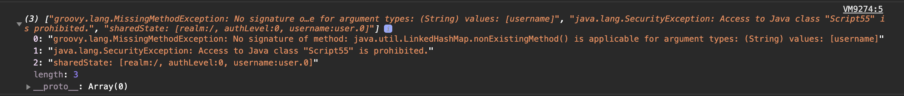
    </details>

    <br/>

* <a id="script-type-scripted-decision-node-debugging-error-message" name="script-type-scripted-decision-node-debugging-error-message"></a>Error Message

    [Back to Contents](#contents)

    As noted before, you can use the [sharedState](#script-type-scripted-decision-node-bindings-sharedstate) "errorMessage" property and the [action](#script-type-scripted-decision-node-outcomes-action) interface to construct a custom error message, which will be sent to back the user agent, and could be displayed by the UI when your tree execution comes to a negatory end. In this message, you can include debugging information.

    The `sharedState` object persists during entire authentication session, across scripted decision nodes in the authentication tree. It has a designated key, "errorMessage", that is respected by the core AM functionality. You can accumulate debugging information under this key:

    <br/>

    <details open>
    <summary><strong>JavaScript or Groovy</strong></summary>

    ```javascript
    try {
        var username = nonExistingBinding("username")
    } catch (e) {
        if (sharedState.get("errorMessage")) {
            sharedState.put("errorMessage", sharedState.get("errorMessage") + " " + e.toString())
        } else {
            sharedState.put("errorMessage", e.toString())
        }
    }
    ```

    ```javascript
    try {
        var username = sharedState.nonExistingMethod("username")
        logger.error('username: ' + username)
    } catch (e) {
        logger.error('sharedState.get("errorMessage"): ' + sharedState.get("errorMessage"))
        if (sharedState.get("errorMessage")) {
            sharedState.put("errorMessage", sharedState.get("errorMessage") + " " + e.toString())
        } else {
            sharedState.put("errorMessage", e.toString())
        }
    }
    ```
    </details>

    <br/>

    If you eventually fail the authentication, taking the tree to the Failure node, the content of the "errorMessage" key will be included in the authentication response sent to the user agent:

    ```json
    {"code":401,"reason":"Unauthorized","message":"ReferenceError: \"nonExistingBinding\" is not defined. TypeError: Cannot find function nonExistingMethod in object {realm=/, authLevel=0, username=user.0, errorMessage=ReferenceError: \"nonExistingBinding\" is not defined.}.","detail":{"failureUrl":""}}
    ```

    If you need to terminate the tree with a specific message, you can override the one stored in `sharedState` using the [Action Interface](https://backstage.forgerock.com/docs/am/7/auth-nodes/core-action.html) and its `withErrorMessage(String message)` method:

    <br/>

    <details open>
    <summary><strong>JavaScript or Groovy</strong></summary>

    ```javascript
    action = org.forgerock.openam.auth.node.api.Action.goTo("false").withErrorMessage("A terrible error occurred!").build()
    ```
    </details>

    <br/>

    Which will again result in the error message being included in the authentication response:

    ```json
    {"code":401,"reason":"Unauthorized","message":"A terrible error occurred!","detail":{"failureUrl":""}}
    ```

    This can be combined with a `try/catch`:

    <br/>

    <details open>
    <summary><strong>JavaScript or Groovy</strong></summary>

    ```javascript
    var password

    try {
        password = secrets.getGenericSecret("scripted.node.secret.id").getAsUtf8()

        output true
    } catch(e) {
        action = Action.goTo("false").withErrorMessage(e.toString()).build()
    }
    ```

    The new `secrets` binding was introduced in [ForgeRock Identity Cloud scripting environment](#fidc-environment) and will become available in the future versions of AM. If you use your code interchangeably and try to access `secrets` in AM 7.0, the variable may not be defined, and the above will result in an error message being included in the authentication response. For example, an error constructed in JavaScript:

    ```json
    {"code":401,"reason":"Unauthorized","message":"ReferenceError: \"secrets\" is not defined.","detail":{"failureUrl":""}}
    ```

    If respected by the UI, this message will be displayed to the end user instead of the default one.

### <a id="script-type-oauth2-access-token-modification" name="script-type-oauth2-access-token-modification"></a>OAuth2 Access Token Modification

[Back to Contents](#contents)

You select an OAuth2 Access Token Modification script for all clients in a realm in the AM console under Realms > _Realm Name_ > Services > OAuth2 Provider > Core > OAuth2 Access Token Modification Script. What may not be completely obvious is that _currently_, all the scripts are shared between the realms as well.

> You can verify this by navigating to a script definition and observe changes made in one realm appearing in another. Also, the script ID is going to be the same. For example:
>
> http://openam.example.com:8080/openam/ui-admin/#realms/%2F/scripts/edit/d22f9a0c-426a-4466-b95e-d0f125b0d5fa
>
> http://openam.example.com:8080/openam/ui-admin/#realms/%2FTest/scripts/edit/d22f9a0c-426a-4466-b95e-d0f125b0d5fa

This means that if you want to apply a different access token modification in a (sub)realm, you'll need to create a separate script of the OAuth2 Access Token Modification type for doing so.

Application of this script type is described in [AM 7 > OAuth 2.0 Guide > Modifying the Content of Access Tokens](https://backstage.forgerock.com/docs/am/7/oauth2-guide/modifying-access-tokens-scripts.html).

> Presently, there is additional API functionality to be introduced for the OAuth 2.0 Access Token Modification type, which is described in the [early access version](https://ea.forgerock.com/docs/am/oauth2-guide/modifying-access-tokens-scripts.html#scripting-api-oauth2) of the doc.

#### <a id="script-type-oauth2-access-token-modification-bindings" name="script-type-oauth2-access-token-modification-bindings"></a>Bindings

[Back to Contents](#contents)

There are following bindings provided in the OAuth2 Access Token Modification type:

* <a id="script-type-oauth2-access-token-modification-bindings-access-token" name="script-type-oauth2-access-token-modification-bindings-access-token"></a>`accessToken`, an interface to the issued access token information.

    [Back to Contents](#contents)

    The Public API Javadoc links provided in the [Guide](https://backstage.forgerock.com/docs/am/7/oauth2-guide/modifying-access-tokens-scripts.html) are important source of additional information. By examining the [Access Token](https://backstage.forgerock.com/docs/am/7/apidocs/org/forgerock/oauth2/core/AccessToken.html) interface, you can see methods that you may be able to use in your scripts, including the inherited ones. For example, after setting an access token custom field as the Guide describes, you can get its value by using the `getCustomFields()` method:

    <br/>

    <details open>
    <summary><strong>JavaScript or Groovy</strong></summary>

    ```javascript
    var grantType = accessToken.getGrantType()
    var resourceType = "user"

    if (grantType == "client_credentials") {
        resourceType = "client"
    } else if (grantType == "urn:ietf:params:oauth:grant-type:device_code") {
        resourceType = "device"
    }

    accessToken.setField("resourceType", resourceType)

    logger.error("access token custom fields: " + accessToken.getCustomFields())
    logger.error("access token resource type: " + accessToken.getCustomFields().get("resourceType"))
    ```

    ```
    ERROR: access token custom fields: {resourceType=client}

    ERROR: access token resource type: client
    ```
    </details>

    <br/>

    Introspection results for the issued access token will look similar to the following:

    ```json
    {
        "active": true,
        "scope": "profile",
        "realm": "/",
        "client_id": "node-openid-client",
        "user_id": "node-openid-client",
        "token_type": "Bearer",
        "exp": 1607652206,
        "sub": "node-openid-client",
        "iss": "http://openam.example.com:8080/openam/oauth2",
        "authGrantId": "j_el6hUyQ34n8wsjlFonc9TwNIo",
        "auditTrackingId": "121b1cdc-bd42-47ff-987d-bbcb2a3ba7ab-30052",
        "resourceType": "client"
    }
    ```
* <a id="script-type-oauth2-access-token-modification-bindings-scopes" name="script-type-oauth2-access-token-modification-bindings-scopes"></a>`scopes`, the requested scopes in the form of [java.util.HashSet](https://docs.oracle.com/en/java/javase/11/docs/api/java.base/java/util/HashSet.html).

    [Back to Contents](#contents)

    Examples:

    <br/>

    <details open>
    <summary><strong>JavaScript or Groovy</strong></summary>

    ```javascript
    logger.error("access token grant type: " + accessToken.getGrantType())
    logger.error("scopes: " + scopes)
    logger.error("scopes length: " + scopes.size())
    logger.error("first scope: " + scopes.toArray()[0])
    ```

    Possible output:

    ```
    ERROR: accessToken grant type: authorization_code

    ERROR: scopes: [openid, profile]

    ERROR: size: 2

    ERROR: first scope: openid
    ```

    ```
    ERROR: accessToken grant type: refresh_token

    ERROR: scopes: [profile]

    ERROR: size: 1

    ERROR: first scope: profile
    ```
    </details>

    <br/>

    <details open>
    <summary><strong>JavaScript</strong></summary>

    ```javascript
    scopes.toArray().forEach(function (scope) {
      logger.error(scope)
    })
    ```

    ```
    ERROR: openid

    ERROR: profile
    ```
    </details>

    <br/>

    <details>
    <summary><strong>Groovy</strong></summary>

    ```groovy
    scopes.each {
      scope ->
      logger.error(scope)
    }
    ```

    ```
    ERROR: openid

    ERROR: profile
    ```
    </details>

    <br/>

* <a id="script-type-oauth2-access-token-modification-bindings-identity" name="script-type-oauth2-access-token-modification-bindings-identity"></a>`identity`, a reference to the authorization subject provided as an instance of the [com.sun.identity.idm.AMIdentity](https://backstage.forgerock.com/docs/am/7/apidocs/com/sun/identity/idm/AMIdentity.html) class.

    [Back to Contents](#contents)

    You can get individual attributes from the subject's identity and use them in your script. The values for each attribute are returned as a [java.util.HashSet](https://docs.oracle.com/en/java/javase/11/docs/api/java.base/java/util/HashSet.html):

    <br/>

    <details open>
    <summary><strong>JavaScript or Groovy</strong></summary>

    ```javascript
    logger.error("identity mail: " + identity.getAttribute("mail"))
    ```

    ```
    ERROR: identity mail: [user.0@a.com, user.0@c.com]
    ```
    </details>

    <br/>

    If you have access to the scripting engine configuration and [can allow](#script-language-java-allow) the `com.iplanet.am.sdk.AMHashMap` class, getting all identity attributes is an option:

    <br/>

    <details open>
    <summary><strong>JavaScript or Groovy</strong></summary>

    ```javascript
    logger.error("identity: " + identity.getAttributes())
    ```

    ```
    ERROR: identity: [modifyTimestamp:[20201210015027Z], _username:[user.0], inetuserstatus:[Active], givenName:[User], createTimestamp:[20201014213634Z], iplanet-am-user-success-url:[https://mail.google.com, https://google.com], uid:[user.0], iplanet-am-user-auth-config:[[Empty]], userPassword:[{PBKDF2-HMAC-SHA256}10:dsvp8tdJ/2NdyehyfwC03x9LYrLbAuvFb+t+saBmwWKJ75CLtA7IyY2x/Y02xdSh], employeeNumber:[0], _id:[user.0], sn:[0], telephoneNumber:[999-999-9999], dn:[uid=user.0,ou=people,ou=identities], cn:[User 0], mail:[user.0@a.com, user.0@c.com], objectClass:[top, inetuser, kbaInfoContainer, person, inetOrgPerson, organizationalPerson, iplanet-am-user-service]]
    ```
    </details>

    <br/>

    Presenting a Map in a more readable format in JavaScript will require another Java class to be allowed, `com.sun.identity.common.CaseInsensitiveHashSet`. Then, you will be able to loop over the identity object key set:

    <br/>

    <details open>
    <summary><strong>JavaScript</strong></summary>

    ```javascript
    var identityAttributesLog = ["Identity Attributes:"]

    identity.getAttributes().keySet().toArray().forEach(function (key) {
      identityAttributesLog.push(key + ": " + identity.getAttribute(key))
    })

    logger.error(identityAttributesLog.join("\n"))
    ```

    ```
    ERROR: Identity Attributes:
    [CONTINUED]modifyTimestamp: [20201210015027Z]
    [CONTINUED]_username: [user.0]
    [CONTINUED]inetuserstatus: [Active]
    [CONTINUED]givenName: [User]
    [CONTINUED]createTimestamp: [20201014213634Z]
    [CONTINUED]iplanet-am-user-success-url: [https://mail.google.com, https://google.com]
    [CONTINUED]uid: [user.0]
    [CONTINUED]iplanet-am-user-auth-config: [[Empty]]
    [CONTINUED]userPassword: [{PBKDF2-HMAC-SHA256}10:dsvp8tdJ/2NdyehyfwC03x9LYrLbAuvFb+t+saBmwWKJ75CLtA7IyY2x/Y02xdSh]
    [CONTINUED]employeeNumber: [0]
    [CONTINUED]_id: [user.0]
    [CONTINUED]sn: [0]
    [CONTINUED]telephoneNumber: [999-999-9999]
    [CONTINUED]dn: [uid=user.0,ou=people,ou=identities]
    [CONTINUED]cn: [User 0]
    [CONTINUED]mail: [user.0@a.com, user.0@c.com]
    [CONTINUED]objectClass: [top, inetuser, kbaInfoContainer, person, inetOrgPerson, organizationalPerson, iplanet-am-user-service]
    ```
    </details>

    <br/>

    <details>
    <summary><strong>Groovy</strong></summary>

    ```groovy
    var identityAttributesLog = "Identity Attributes:\n"

    identity.getAttributes().each {
      key, value ->
      identityAttributesLog += key + ": " + value + "\n"
    }

    logger.error(identityAttributesLog)
    ```

    ```
    ERROR: Identity Attributes:
    [CONTINUED]modifyTimestamp: [20201210015027Z]
    [CONTINUED]_username: [user.0]
    [CONTINUED]inetuserstatus: [Active]
    [CONTINUED]givenName: [User]
    [CONTINUED]createTimestamp: [20201014213634Z]
    [CONTINUED]iplanet-am-user-success-url: [https://mail.google.com, https://google.com]
    [CONTINUED]uid: [user.0]
    [CONTINUED]iplanet-am-user-auth-config: [[Empty]]
    [CONTINUED]userPassword: [{PBKDF2-HMAC-SHA256}10:dsvp8tdJ/2NdyehyfwC03x9LYrLbAuvFb+t+saBmwWKJ75CLtA7IyY2x/Y02xdSh]
    [CONTINUED]employeeNumber: [0]
    [CONTINUED]_id: [user.0]
    [CONTINUED]sn: [0]
    [CONTINUED]telephoneNumber: [999-999-9999]
    [CONTINUED]dn: [uid=user.0,ou=people,ou=identities]
    [CONTINUED]cn: [User 0]
    [CONTINUED]mail: [user.0@a.com, user.0@c.com]
    [CONTINUED]objectClass: [top, inetuser, kbaInfoContainer, person, inetOrgPerson, organizationalPerson, iplanet-am-user-service]
    [CONTINUED]
    ```
    </details>

    <br/>

    The identity content will depend on the authorization subject. Thus, different individual attributes could be requested depending on the authorization grant, and the same attributes could be populated differently. For example:

    <details open>
    <summary><strong>JavaScript or Groovy</strong></summary>

    ```javascript
    logger.error("grant type: " + accessToken.getGrantType())

    logger.error("identity mail: " + identity.getAttribute("mail"))
    logger.error("identity userpassword: " + identity.getAttribute("userpassword"))
    logger.error("identity com.forgerock.openam.oauth2provider.clientType: " + identity.getAttribute("com.forgerock.openam.oauth2provider.clientType"))
    ```

    ```
    ERROR: grant type: refresh_token

    ERROR: identity mail: [user.0@a.com, user.0@c.com]

    ERROR: identity userpassword: [{PBKDF2-HMAC-SHA256}10:dsvp8tdJ/2NdyehyfwC03x9LYrLbAuvFb+t+saBmwWKJ75CLtA7IyY2x/Y02xdSh]

    ERROR: identity com.forgerock.openam.oauth2provider.clientType: []
    ```

    ```
    ERROR: grant type: client_credentials

    ERROR: identity mail: []

    ERROR: identity userpassword: [password]

    ERROR: identity com.forgerock.openam.oauth2provider.clientType: [Confidential]
    ```
    </details>

    <br/>

* <a id="script-type-oauth2-access-token-modification-bindings-logger" name="script-type-oauth2-access-token-modification-bindings-logger"></a>`logger`, the object that provides methods for writing debug messages, as described in [Getting Started with Scripting > Debug Logging](https://backstage.forgerock.com/docs/am/7/scripting-guide/scripting-api-global-logger.html#scripting-api-global-logger) and [earlier in this writing](#script-debug-logging).

    [Back to Contents](#contents)

* <a id="script-type-oauth2-access-token-modification-bindings-httpclient" name="script-type-oauth2-access-token-modification-bindings-httpclient"></a>`httpClient`, the HTTP client object, as described in [Accessing HTTP Services](https://backstage.forgerock.com/docs/am/7/scripting-guide/scripting-api-global-http-client.html#scripting-api-global-http-client) and [earlier in this writing](#script-accessing-http-services).

    [Back to Contents](#contents)

* <a id="script-type-oauth2-access-token-modification-bindings-session" name="script-type-oauth2-access-token-modification-bindings-session"></a>`session` (only if session cookie is present), a reference to the end user session.

    [Back to Contents](#contents)

    While the `session` variable is always defined, it is not assigned any value if there is no session cookie attached to the request. Typically, this is the case if a non-interactive authorization grant is used—such as Refresh Token, Client Credentials, or Resource Owner Password Credentials. At the same time, currently, an OAuth2 Access Token Modification script is selected on the realm level, and is shared among all OAuth 2.0 client applications in the realm. The clients may authorize themselves using different grants. Therefore, referencing the user session in a script via the `session` binding may not be a valid approach in all cases. To handle this situation you can add a condition, for example:

    <br/>

    <details open>
    <summary><strong>JavaScript or Groovy</strong></summary>

    ```javascript
    if (session) {
        logger.error("AuthLevel: " + session.getProperty("AuthLevel"))
    } else {
        logger.error("No session")
    }
    ```

    For another example, after checking for session information availability, you could set a custom claim with a value from a custom session property:

    ```javascript
    if (session && session.getProperty("customKey")) {
        accessToken.setField("customClaim", session.getProperty("customKey"))
    } else {
        logger.error("No session")
    }
    ```

    Then, the access token resulting from an interactive authorization grant will contain the custom claim field:

    ```json
    "access_token": {
        "active": true,
        "scope": "openid profile",
        "realm": "/",
        "client_id": "node-openid-client",
        "user_id": "user.0",
        "token_type": "Bearer",
        "exp": 1607652206,
        "sub": "user.0",
        "iss": "http://openam.example.com:8080/openam/oauth2",
        "auth_level": 0,
        "authGrantId": "_WQ-GVqB6OZWb8sYnWT7d5R9TFg",
        "auditTrackingId": "121b1cdc-bd42-47ff-987d-bbcb2a3ba7ab-1692",
        "customClaim": "customValue"
    }
    ```

    OAuth2 Access Token Modification script does not currently change the refresh token content, [nor do custom claims based on dynamic data persist automatically](https://bugster.forgerock.org/jira/browse/OPENAM-15340). This means that if you use a non-interactive authorization grant to renew access tokens with no session cookie attached to the authorization request, you would need to save the dynamically obtained custom claim information in a persistent scope; for example, in the user profile during authentication (as described in [Scripted Decision Node > Bindings > idRepository](#script-type-scripted-decision-node-bindings-idrepository)). Then, you will be able to pull the saved info from the user identity:

    ```javascript
    accessToken.setField("customClaim", identity.getAttribute("customKey"))
    ```
    </details>

    <br/>

## <a id="fidc-environment" name="fidc-environment"></a>ForgeRock Identity Cloud (Identity Cloud)

[Back to Contents](#contents)

Due to its cloud based, multi-tenant nature, the Identity Cloud environment introduces its own specifics to the scripting provisions in AM 7.

### <a id="fidc-script-debug-logging" name="fidc-script-debug-logging"></a>Debug Logging

[Back to Contents](#contents)

[Identity Cloud Docs > Your Tenant > View Audit Logs](https://backstage.forgerock.com/docs/idcloud/latest/paas/tenant/audit-logs.html) outlines general idea on how logs produced in Identity Cloud could be viewed over its REST API.

At the time of this writing, the list of available log sources consists of the following:

```bash
$ export ORIGIN=https://your-tenant-host.forgeblocks.com
$ export API_KEY_ID=your-api-key-id
$ export API_KEY_SECRET=your-api-key-secret
```

```bash
$ curl -X GET \
  -H "x-api-key: $API_KEY_ID" \
  -H "x-api-secret: $API_KEY_SECRET" \
  "$your_tenant_ORIGIN/monitoring/logs/sources"

{"result":["am-access","am-activity","am-authentication","am-config","am-core","am-everything","ctsstore","ctsstore-access","ctsstore-config-audit","ctsstore-upgrade","idm-access","idm-activity","idm-authentication","idm-config","idm-core","idm-everything","idm-sync","userstore","userstore-access","userstore-config-audit","userstore-ldif-importer","userstore-upgrade"],"resultCount":22,"pagedResultsCookie":null,"totalPagedResultsPolicy":"NONE","totalPagedResults":1,"remainingPagedResults":0}
```

After you obtained the list of sources, select one that is the closest to what you are seeking. Currently, `am-core` is the best source for getting logs produced by AM scripts, but this may change in the future. For example, a designated script-specific category may be introduced.

As shown in Identity Cloud docs, the logs come in a form of JSON, with each log containing the "payload" key populated with a String or an Object. An example of two logs:

```json
{
    "result": [
        {
            "payload": "10.40.68.18 - - [06/Nov/2020:23:20:42 +0000] \"GET /am/isAlive.jsp HTTP/1.0\" 200 112 1ms\n",
            "timestamp": "2020-11-06T23:20:44.095224402Z",
            "type": "text/plain"
        },
        {
          "payload": {
            "context": "default",
            "level": "ERROR",
            "logger": "scripts.AUTHENTICATION_TREE_DECISION_NODE.bc0c6654-b10e-44d1-9ea3-712940fbea67",
            "mdc": {
              "transactionId": "372127e5-7d3b-4379-8db8-2213e2a3337a-1010"
            },
            "message": "sharedState: {realm=/alpha, authLevel=0, username=user.0}",
            "thread": "ScriptEvaluator-5",
            "timestamp": "2020-11-06T23:20:49.222Z",
            "transactionId": "372127e5-7d3b-4379-8db8-2213e2a3337a-1010"
          },
          "timestamp": "2020-11-06T23:20:49.222889214Z",
          "type": "application/json"
        },
    ],
    "resultCount": "<integer>",
    "pagedResultsCookie": "<string>",
    "totalPagedResultsPolicy": "<string>",
    "totalPagedResults": "<integer>",
    "remainingPagedResults": "<integer>"
}
```

You can [tail logs](https://backstage.forgerock.com/docs/idcloud/latest/paas/tenant/audit-logs.html#tailing_logs) from the selected source, and employ a script to automate the process of requesting, filtering, and outputting the logged content.

[This Identity Cloud logging tool for Node.js](https://github.com/lapinek/fidc-logs) can be used to print out the logs as stringified JSON in the terminal. Its core module can be shared between different scripts customized for particular tenant and source. For example:

```bash
$ node tail.am-core.js
```

```json
. . .
"10.138.0.42 - - [13/Jan/2021:20:01:40 +0000] \"GET /am/isAlive.jsp HTTP/1.1\" 200 112 1ms\n"
"10.40.49.236 - - [13/Jan/2021:20:01:40 +0000] \"GET /am/isAlive.jsp HTTP/1.0\" 200 112 0ms\n"
{"context":"default","level":"WARN","logger":"com.sun.identity.idm.IdUtils","mdc":{"transactionId":"0d3c7dac-d4e8-4cdd-b651-f5ff6659113d-566"},"message":"Error searching for user identity IdUtils.getIdentity: No user found for idm-provisioning","thread":"http-nio-8080-exec-4","timestamp":"2021-01-13T20:01:50.336Z","transactionId":"0d3c7dac-d4e8-4cdd-b651-f5ff6659113d-566"}
{"context":"default","level":"ERROR","logger":"scripts.OAUTH2_ACCESS_TOKEN_MODIFICATION.d22f9a0c-426a-4466-b95e-d0f125b0d5fa","mdc":{"transactionId":"0d3c7dac-d4e8-4cdd-b651-f5ff6659113d-566"},"message":"OAuth2 Access Token Modification Script","thread":"ScriptEvaluator-1","timestamp":"2021-01-13T20:01:50.339Z","transactionId":"0d3c7dac-d4e8-4cdd-b651-f5ff6659113d-566"}
. . .
```

The output produced by the script may be further processed with command-line tools of your choice.

For example, you can filter the output and change its presentation with [jq](https://stedolan.github.io/jq/tutorial/). The following command will filter the logs content by presence of the "exception" key, or by checking if the nested "logger" property is populated with a script reference; then, it will limit the presentation to "logger", "message", "timestamp", and "exception" keys:

```bash
$ node tail.am-core.js | jq '. | select(objects) | select(has("exception") or (.logger | test("scripts."))) | {logger: .logger, message: .message, timestamp: .timestamp, exception: .exception}'
```

```json
. . .
{
  "logger": "scripts.AUTHENTICATION_TREE_DECISION_NODE.bbf4feef-2bfe-46b7-824f-f632f7de426f",
  "message": "value: [userName:user.0]",
  "timestamp": "2021-01-14T00:07:38.809Z",
  "exception": null
}
{
  "logger": "org.forgerock.openam.core.rest.authn.trees.AuthTrees",
  "message": "Exception in processing the tree",
  "timestamp": "2021-01-14T00:07:38.815Z",
  "exception": "org.forgerock.openam.auth.node.api.NodeProcessException: Script must set 'outcome' to a string.\n\tat org.forgerock.openam.auth.nodes.ScriptedDecisionNode.process(ScriptedDecisionNode.java:237)\n\t . . . "
}
. . .
```

Alternatively, you can modify the scripts themselves for tailoring the logs data prior to printing it out.

It is easy to do by modifying [the default function](https://github.com/lapinek/fidc-logs#customizing-output) that processes and outputs the content received from the tail endpoint, and by providing your custom version as an argument when loading the module. This flexibility is demonstrated in [the examples](https://github.com/lapinek/fidc-logs/blob/main/tail.idm-core.js#L40-L58) included in the repository.

Yet another option is making changes in the main module, [tail.js](https://github.com/lapinek/fidc-logs/blob/main/tail.js). This way, commonly used logs processing techniques could be shared between different tenant and source-specific callers (although the same could be achieved by reusing a custom function discussed in the previous paragraph). Changing the main module has been implemented in the following repository, which also maintains a list of the Identity Cloud log categories that could be used for filtering out some unwanted log "noise":

[https://github.com/vscheuber/fidc-debug-tools](https://github.com/vscheuber/fidc-debug-tools)

> The Node.js JavaScript referenced above was inspired by a Ruby script, courtesy of Beau Croteau and Volker Scheuber:
>
> <details>
> <summary><strong>Ruby</strong></summary>
>
> ```ruby
> # Specify the full base URL of the FIDC service.
> host="https://your-tenant.forgeblocks.com"
>
> # Specify the log API key and secret
> api_key_id="aaa2...219"
> api_key_secret="56ce...1ada1"
>
> # Available sources are listed below. Uncomment the source you want to use. For development and debugging use "am-core" and "idm-core" respectively:
> # source="am-access"
> # source="am-activity"
> # source="am-authentication"
> # source="am-config"
> source="am-core"
> # source="am-everything"
> # source="ctsstore"
> # source="ctsstore-access"
> # source="ctsstore-config-audit"
> # source="ctsstore-upgrade"
> # source="idm-access"
> # source="idm-activity"
> # source="idm-authentication"
> # source="idm-config"
> # source="idm-core"
> # source="idm-everything"
> # source="idm-sync"
> # source="userstore"
> # source="userstore-access"
> # source="userstore-config-audit"
> # source="userstore-ldif-importer"
> # source="userstore-upgrade"
>
> require 'pp'
> require 'json'
>
> prc=""
> while(true) do
>   o=`curl -s --get --header 'x-api-key: #{api_key_id}' #{prc} --header 'x-api-secret: #{api_key_secret}' --data 'source=#{source}' "#{host}/monitoring/logs/tail"`
>   obj=JSON.parse(o)
>   obj["result"].each{|r|
>     pp r["payload"]
>   }
>   prc="--data '_pagedResultsCookie=#{obj["pagedResultsCookie"]}'"
>   sleep 10
> end
> ```
>
> To prepare the output content for the tool, `print` the payload and use `to_json` to make it a stringified JSON:
>
> ```ruby
>     # pp r["payload"]
>     print r["payload"].to_json
> ```
> </details>
>
> <br>

<br/>

<!-- > A script can be made executable by adding `#!/usr/bin/env ruby` at the top and allowing for execution:
>
> ```bash
> $ chmod +x ./tail.rb
>``` -->

Unfortunately, without filtering, the current log sources in Identity Cloud output overwhelming amount of data with only some of it providing meaningful feedback for debugging purposes. Hopefully, more specific log categories will become supported in the near future so that no additional programming skills will be required for developing scripts against the identity cloud environment.

In addition, the response from the Identity Cloud monitoring endpoint is often far from immediate.

As an alternative, to receive a quick feedback from your authentication journey, you can use debugging techniques outlined in details for the scripted decision type:

* [Displaying debugging information with the help of callbacks](#script-type-scripted-decision-node-debugging-callbacks)
* [Including debugging information in the custom error message](#script-type-scripted-decision-node-debugging-error-message)

For example, to show an object content on the client side in a scripted decision, you can use [javax.security.auth.callback.TextOutputCallback](https://docs.oracle.com/en/java/javase/11/docs/api/java.base/javax/security/auth/callback/TextOutputCallback.html):

<br/>

<details open>
<summary><strong>JavaScript</strong></summary>

```javascript
var fr = JavaImporter(
    org.forgerock.openam.auth.node.api.Action,
    javax.security.auth.callback.TextOutputCallback
)

var messages = "Debugger"
messages = messages.concat(" | sharedState: ",  sharedState.toString())

if (callbacks.isEmpty()) {
    action = fr.Action.send(
        new fr.TextOutputCallback(
            fr.TextOutputCallback.ERROR,
            messages
        )
    ).build()
} else {
    action = fr.Action.goTo("true").build()
}
```
</details>

<br/>

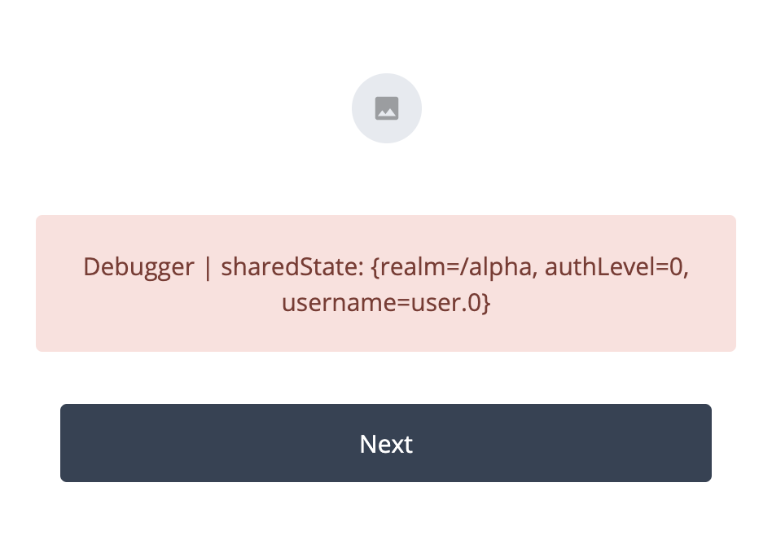

### <a id="fidc-script-java-allow" name="fidc-script-java-allow"></a>Allowed Java Classes

[Back to Contents](#contents)

Despite the fact that some of the AM default scripts are shipped in Groovy, the use of Groovy is not supported and therefore, discouraged in Identity Cloud.

Making changes to the scripting [Engine Configuration](https://backstage.forgerock.com/docs/am/7/reference/global-services-configuration.html#scripting-secondary-configuration-instance) is not an option in Identity Cloud at this time. Which means you cannot change class-name patterns allowed to be invoked by the script types.

While this may be less of a prominent issue in the JavaScript environment, some basic functionality in Groovy cannot be enabled as a result.

For example, the `OAuth2 Access Token Modification Script` default script template comes in Groovy with the following code:

<br/>

<details open>
<summary><strong>Groovy</strong></summary>

```groovy
/*
. . .

def result = new JsonSlurper().parseText(response.entity.string)

. . .
*/
```
</details>

<br/>

Which causes no issues while commented out, but if uncommented it currently results in:

```
"Access to Java class \"org.apache.groovy.json.internal.LazyMap\" is prohibited."
```

Every reference to allowed and disallowed Java classes in this article applies here, with the additional detail that at the moment, you will not be able to change the default scripting configuration. This means, for example, that in JavaScript, you will not be able to check what Java class an object represents (by inspecting the `class` property, as described in [Bindings](#script-bindings)). Similarly, in JavaScript, you cannot currently iterate over the content of `sharedState` and other HashMap objects by getting a list of their keys, as shown in the [Language > Allowed Java Classes](#script-language-java-allow) examples. At the same time, since Groovy is not supported in Identity Cloud, you might not be willing to invest too much effort in developing Groovy scripts. Some of this issues could be resolved in the future with changes in the Identity Cloud scripting engine configuration and/or in how it is controlled.

### <a id="fidc-script-type-scripted-decision-node-bindings-idrepository" name="fidc-script-type-scripted-decision-node-bindings-idrepository"></a>Accessing Profile Data

[Back to Contents](#contents)

An Identity Cloud tenant is deployed in platform mode with an identity repository shared between AM and ForgeRock Identity Management (IDM).

The Identity Store configuration in AM is not exposed in Identity Cloud; hence, it may not be obvious that the user search attribute is not `uid`. This means that, in the scripted decision context, you cannot pass username into methods of the `idRepository` object. Instead, you need to identify users with their IDM object ID, which corresponds to the `_id` attribute value.

In an environment integrated with IDM, as in the case of Identity Cloud, you can utilize [Identify Existing User Node](https://backstage.forgerock.com/docs/am/7/authentication-guide/auth-node-configuration-hints.html#auth-node-identify-existing-user) for looking up a user by an attribute, according to the `Identity Object` you had chosen for your authentication journey.

For example, you can place `Identify Existing User` after the Username Collector node, and look up the user with their `username` checked against the IDM's `userName` attribute:

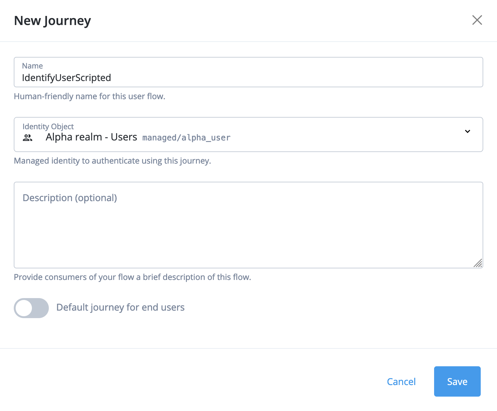

<br/>
<br/>

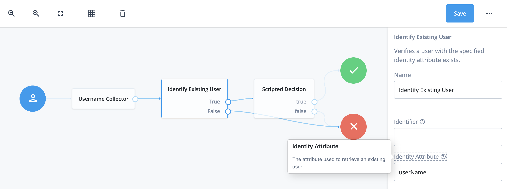

Doing so will save the `_id` property in the `sharedState` object (if the user is found), and let you use its value as the user identifier in the `idRepository` methods:

<br/>

<details open>
<summary><strong>JavaScript or Groovy</strong></summary>

```javascript
logger.error("sharedState: " + sharedState)

var username = sharedState.get("_id")
var attribute = "mail"

logger.error(idRepository.getAttribute(username, attribute).toString())
```

If you use `jq` to filter and format stringified JSON from the logs, as described in [ForgeRock Identity Cloud > Debug Logging](#fidc-script-debug-logging), the output will look similar to the following:

```
$ node tail.am-core.js | jq '. | select(objects) | select(has("exception") or (.logger | test("scripts."))) | {logger: .logger, message: .message, timestamp: .timestamp, exception: .exception}'
```

```json
{
  "logger": "scripts.AUTHENTICATION_TREE_DECISION_NODE.bbf4feef-2bfe-46b7-824f-f632f7de426f",
  "message": "sharedState: {realm=/alpha, authLevel=0, username=user.0, _id=d7eed43d-ab2c-40be-874d-92571aa17107}",
  "timestamp": "2020-11-29T19:34:39.882Z",
  "exception": null
}
{
  "logger": "scripts.AUTHENTICATION_TREE_DECISION_NODE.bbf4feef-2bfe-46b7-824f-f632f7de426f",
  "message": "[user.0@e.com]",
  "timestamp": "2020-11-29T19:34:39.884Z",
  "exception": null
}
```
</details>

<br/>

Adding an `Identifier` to the `Identify Existing User` configuration will put `objectAttributes` property into the `sharedState` object, and populate it with the specified attribute, which may be required by other IDM nodes in platform mode:

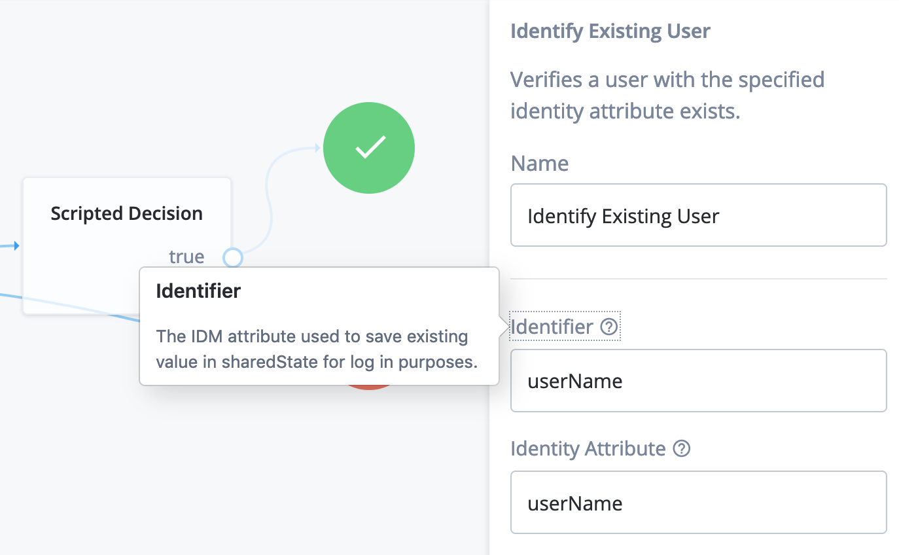

```json
{
  "logger": "scripts.AUTHENTICATION_TREE_DECISION_NODE.bbf4feef-2bfe-46b7-824f-f632f7de426f",
  "message": "sharedState: {realm=/alpha, authLevel=0, username=user.0, _id=d7eed43d-ab2c-40be-874d-92571aa17107, objectAttributes={userName=user.0}}",
  "timestamp": "2020-11-29T20:00:56.252Z",
  "exception": null
}
```

The attribute value by which the `Identify Existing User` node finds the user can come from another interactive node such as `Attribute Collector`. For example, you can identify the user by their email:

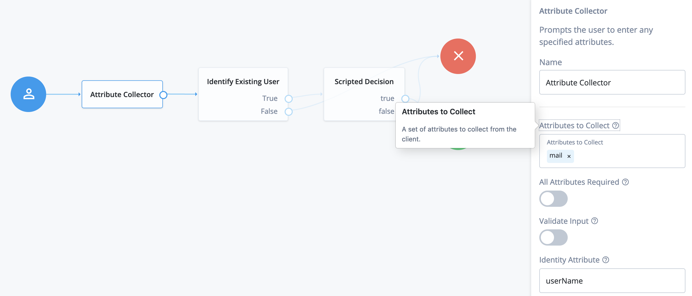

In this case, `Identify Attribute` in the `Identify Existing User` node is set to `mail`:

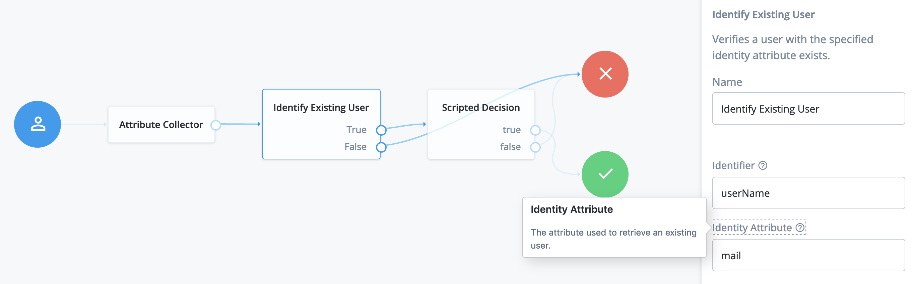

If the user is found, their `_id` will be added to the shared state:

```json
{
  "logger": "scripts.AUTHENTICATION_TREE_DECISION_NODE.42f7ebf7-1a71-4ec8-8984-c91bc0f7c3fd",
  "message": "sharedState: {realm=/alpha, authLevel=0, objectAttributes={mail=user.0@e.com, userName=user.0}, _id=d7eed43d-ab2c-40be-874d-92571aa17107, username=user.0}",
  "timestamp": "2021-01-19T08:05:10.835Z",
  "exception": null
}
```

You can also specify user identifier programmatically.

For example, consider scenario where your user ID comes as an authentication request parameter, and the corresponding identity field is a custom attribute:

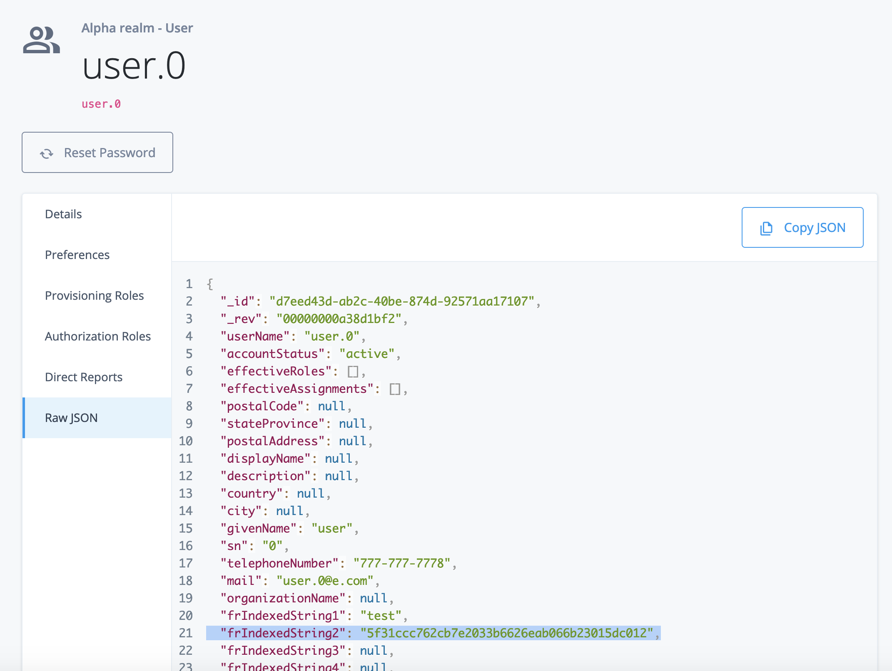

<br/>
<br/>

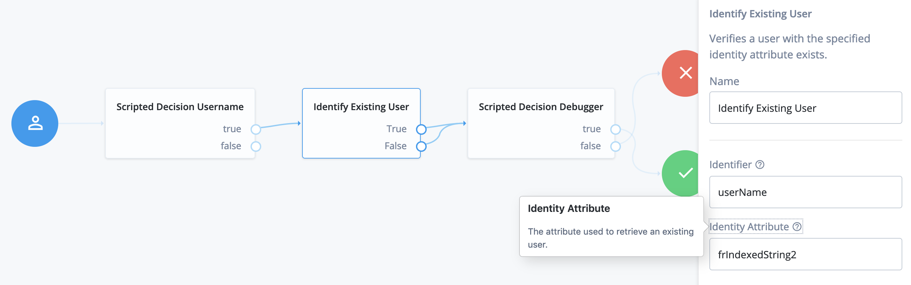

<br/>
<br/>

<details open>
<summary><strong>JavaScript in Scripted Decision Username</strong></summary>

```javascript
var idParameter = requestParameters.get("id")

if (idParameter && !idParameter.isEmpty()) {
    sharedState.put("username", idParameter.get(0))
}

outcome = "true"
```

<br>

<details open>
<summary><strong>JavaScript in Scripted Decision Debugger</strong></summary>

```javascript
logger.error("sharedState: " + sharedState)

outcome = "true"
```

<br>

When you request this authentication journey with the correct `id` parameter, and use it to populate the "username" key in `sharedState`, the Identify Existing User node will be able to find the corresponding identity record:

`https://openam-dx-kl02.forgeblocks.com/am/XUI/?realm=/alpha&service=ScriptedIdentifyUser&id=5f31ccc762cb7e2033b6626eab066b23015dc012#/`

```json
{
  "logger": "scripts.AUTHENTICATION_TREE_DECISION_NODE.42f7ebf7-1a71-4ec8-8984-c91bc0f7c3fd",
  "message": "sharedState: {realm=/alpha, authLevel=0, username=user.0, _id=d7eed43d-ab2c-40be-874d-92571aa17107, objectAttributes={userName=user.0}}",
  "timestamp": "2020-12-20T03:34:43.842Z",
  "exception": null
}
```

***

Another consequence of the Identity Store configuration not being exposed in the AM console is that you cannot verify which attributes in the identity store are accessible from the scripts. In addition, attribute naming in AM and IDM is inconsistent, so the former cannot be derived from the latter. This is a [known issue](https://backstage.forgerock.com/docs/idcloud/latest/paas/known-issues/fraas-4585.html), which provides a convenient lookup table in its Workaround section as a temporary remedy.

> You can see IDM attributes for a realm in the Platform Admin under:
> * Native Consoles > Identity Management > CONFIGURE > Managed Objects > _MANAGED OBJECT_
> * Identities > Manage > _Realm Name_ - Users > _userName_ > Details
> * Identities > Manage > _Realm Name_ - Users > _userName_ > Raw JSON

For example, to get `frIndexedString1` value, labeled as `Generic Indexed String 1` in the UI, in an OAuth2 Access Token Modification script, you would refer to the corresponding AM attribute as `fr-attr-istr1`:

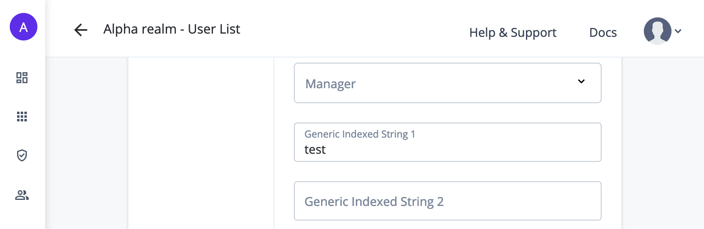

<br/>

<details open>
<summary><strong>JavaScript or Groovy</strong></summary>

```javascript
if (identity.getAttribute("fr-attr-istr1").toArray().length) {
    logger.error("frIndexedString1: " + identity.getAttribute("fr-attr-istr1").toArray()[0]);
}
```

```json
{
  "logger": "scripts.OAUTH2_ACCESS_TOKEN_MODIFICATION.d22f9a0c-426a-4466-b95e-d0f125b0d5fa",
  "message": "frIndexedString1: test",
  "timestamp": "2020-12-01T20:08:00.468Z",
  "exception": null
}
```
</details>

<br/>

### <a id="fidc-script-extended" name="fidc-script-extended"></a>Extended Functionality

[Back to Contents](#contents)

There is an additional binding introduced in Identity Cloud Scripted Decision Node scripts for secure use of secrets:

* `secrets`, credentials to be used in a script, but specified outside of the script itself, as currently described in the _early access_ [Scripted Decision Node API Functionality > Accessing Credentials and Secrets](https://ea.forgerock.com/docs/am/authentication-guide/scripting-api-node.html#scripting-api-authn-secrets).

## <a id="conclusion" name="conclusion"></a>Conclusion

[Back to Contents](#contents)

We went over some common scripting scenarios in AM 7. While not being a definitive guide, this writing extends the currently available official docs, and hopefully provides a developer with sufficient framework to start extending AM functionality with scripts.
