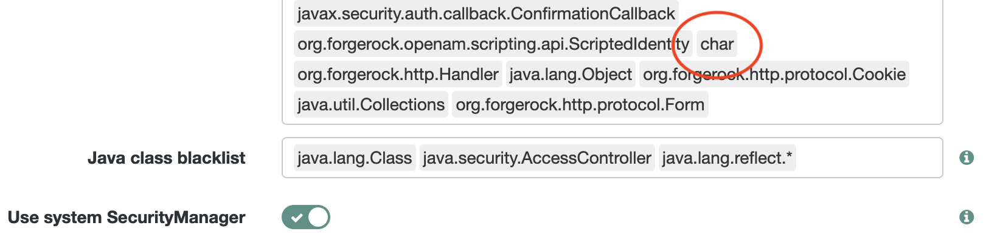
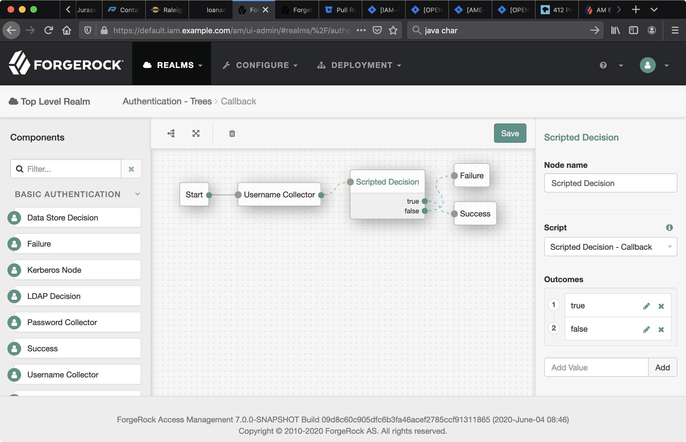

# Testing [Supported Callbacks](https://backstage.forgerock.com/docs/am/6.5/dev-guide/#supported-callbacks) with [Scripted Decision Node](https://backstage.forgerock.com/docs/am/6.5/authentication-guide/index.html#auth-node-scripted-decision)

## PasswordCallback

1. Create a script of type `Decision node script for authentication trees`:

    ```groovy
    import org.forgerock.openam.auth.node.api.*;
    import javax.security.auth.callback.PasswordCallback;

    if (callbacks.isEmpty()) {
        action = Action.send([
            new PasswordCallback("password", false) // A
        ]).build();
    } else {
        // logger.error(callbacks[0].getPassword().toString()); // B

        action = Action.goTo("true").build();
    }
    ```

    A - You need to pass in parameters matching your callback constructor. You may be able to derive them from examples or AM source code—for example, at `/path/to/am/openam-auth-trees/auth-nodes/src/main/java/org/forgerock/openam/auth/nodes/PasswordCollectorNode.java`.

    B - For this line to work, you will need to allow `char` type in Configure > Global Services > Scripting > Secondary Configurations > AUTHENTICATION_TREE_DECISION_NODE > Secondary Configurations > engineConfiguration > Java class whitelist. For example:

    

2. Create a tree that incorporates a Scripted Decision node with the newly created script. For example:

    

3. Try to sign in at `/am/XUI/#/service/Callback/`.

4. In an unlikely event of something going wrong, watch AM logs. For example, in ForgeOps you can follow the AM's container Stdout:

    ```bash
    kubectl logs --follow am-xxxx-xxxxx
    ```

