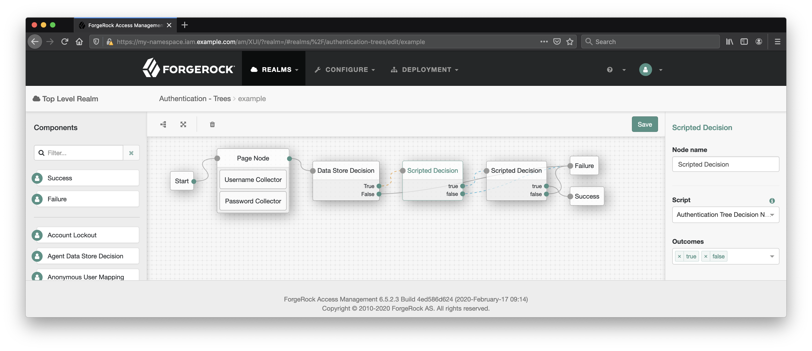

# <a id="top"></a>Examples

## <a id="contents"></a> Contents

* [AM](#examples-am)
    * [Authentication Chain Example](#examples-am-chain)
    * [Authentication Tree Example](#examples-am-tree)

## <a id="examples-am"></a> AM

1. <a id="examples-am-chain"></a> AM > Authentication Chain Example

    [Back to Contents](#contents)

    NOTES:

    * All server-side scripts have access to [AM 6.5.2.3 Public API](https://backstage.forgerock.com/docs/am/6.5/apidocs/index.html) and can use provided by [Global Scripting API Functionality](https://backstage.forgerock.com/docs/am/6.5/dev-guide/#scripting-api-global) HTTP services and debug logging.
    * Custom scripts can be employed in the [Scripted Authentication Module](https://backstage.forgerock.com/docs/am/6.5/authentication-guide/index.html#scripted-module-conf-hints). The module can take a pair of scripts of the following types:
    * `Client-side Authentication` (optional):
        * Everything you know and love about JavaScript in the browser environment is applicable here and is not specific to Forgerock in terms of run time environment—such as compatibility, debugging options, etc. No server-side Java functionality is available.
        * There will be automatically rendered _self-submitting_ form on the page where the script runs. The form data is POSTed back to AM and the value of an input in the form, populated by the client-side script,  will become available to the server side.
        * For asynchronous JavaScript, you will need to delay auto-submission of the form, and submit it manually when the asynchronous call is completed.
    * `Server-side Authentication`:
        * [Authentication API Functionality](https://backstage.forgerock.com/docs/am/6.5/dev-guide/#scripting-api-authn) describes how to access:
            * The client-side script data.
            * The request data.
            * The identity's profile.
            * The authentication state object, `authState`. The value assigned to this object determines outcome of a scripted authentication module. The outcome can set to `SUCCESS` or `FAILURE` constants.

    [Using Server-side Authentication Scripts in Authentication Modules](https://backstage.forgerock.com/docs/am/6.5/authentication-guide/index.html#sec-scripted-auth-module) and [Device ID (Match) Authentication Module](https://backstage.forgerock.com/docs/am/6.5/authentication-guide/index.html#device-id-match-hints) examples provide detailed instructions for setting up a scripted authentication module.

    The scripts can be created and managed in AM console under Realms > _Realm Name_ > Scripts.

    A script of the `Client-side Authentication` type that loads an external library, makes a call to an external service, and obtains the client's IP might look like the following:

    ```javascript
    var script = document.createElement('script'); // 1

    script.src = 'https://code.jquery.com/jquery-3.4.1.min.js'; // 1
    script.onload = function (e) { // 2
        $.getJSON('https://ipgeolocation.com/?json=1', function (json) {
            output.value = JSON.stringify({
                ip: json
            }); // 3
        })
        .always(function () {
            submit(); // 4
        });
    }

    document.getElementsByTagName('head')[0].appendChild(script); // 1

    autoSubmitDelay = 4000; // 5
    ```

    Legend:

    1. Create a script element and add to DOM for loading an external library.
    2. When the library is loaded, make a request to an external resource to obtain the client's IP information.
    3. Save the information, received as a JSON object, as a string in the automatically provided input.
    4. When the HTTP call is complete, submit the form.
    5. Allow the form to auto submit if the HTTP request takes more time to complete than the specified timeout.

    Specific for Scripted Authentication Module points of consideration:

    * The form is self-submitting.
    * The input for the client-side data can be referenced via the `output` object.
    * The form can be submitted with the automatically provided `submit()` function.

    > If you'd like to inspect the page content, you can further delay submission of the form or stop JavaScript execution with `alert()`.

    The corresponding server-side script, used in the same authentication module, can [Access Client-Side Script Output Data](https://backstage.forgerock.com/docs/am/6.5/dev-guide/#scripting-api-authn-client-data) via a String object named `clientScriptOutputData`.

    A script of the `Server-side Authentication` type, written in _JavaScript_ might look like the following:

    ```javascript
    var failure = true; // 1

    var ip = JSON.parse(clientScriptOutputData).ip; // 2

    failure = idRepository.getAttribute(username, 'postalAddress').toArray()[0].indexOf(ip.postal) === -1 // 3

    var request = new org.forgerock.http.protocol.Request(); // 4
    request.setUri("https://jsonplaceholder.typicode.com/users");
    request.setMethod("GET");

    var response = httpClient.send(request).get(); // 5
    var users = JSON.parse(response.getEntity());

    failure = failure || users.some(function (user) { // 6
        return (
            user.username === username ||
            user.email === idRepository.getAttribute(username, "mail").toArray()[0] // 3
        );
    });

    if (failure) {
        logger.error('Authentication denied.');

        authState = FAILED; // 7
    } else {
        logger.message('Authentication allowed.');

        authState = SUCCESS; // 7
    }
    ```

    Legend:

    1. Set expectations low and only allow for the success outcome if everything checks out.
    2. Parse the data submitted from the client-side.
    3. Compare the identity's profile postal address with the zip code data obtained from the client side.

        The `idRepository` object is a part of the [Authentication API Functionality](https://backstage.forgerock.com/docs/am/6.5/dev-guide/#scripting-api-authn) available for scripts in authentication modules. Using its methods, we can access the identity attributes.

        We assume that in this authentication process `username` is set in an earlier authentication module; for example, the `Data Store` type module.

        The `getAttribute` method returns a Java `HashSet`; we convert it to a string prior to the comparison.

    4. Use the `org.forgerock.http.protocol` package for configuring an HTTP request. Use the _full path_ to a Java class (or a static method) in server-side _JavaScript_.
    5. Use the `httpClient` object provided by [Global Scripting API Functionality](https://backstage.forgerock.com/docs/am/6.5/dev-guide/#scripting-api-global) for making an outbound HTTP request.
    6. Check the user's email against a "blacklist" received from an external resource.
    7. Depending on the result that the script produced, set the [Authentication State](https://backstage.forgerock.com/docs/am/6.5/dev-guide/#scripting-api-authn-state) value to define the outcome of this module.

    > The client IP information could be used in [Scripting a Policy Condition](https://backstage.forgerock.com/docs/am/6.5/authorization-guide/index.html#sec-scripted-policy-condition)—as demonstrated in the `Scripted Policy Condition` script included in the default AM configuration.

2. <a id="examples-am-tree"></a>Authentication Tree Example

    [Back to Contents](#contents)

    NOTES:

    * All server-side scripts can use [Global Scripting API Functionality](https://backstage.forgerock.com/docs/am/6.5/dev-guide/#scripting-api-global) for using HTTP services and debug logging.
    * A custom script of the `Decision node script for authentication trees` type can be used in a [Scripted Decision Node](https://backstage.forgerock.com/docs/am/6.5/authentication-guide/index.html#auth-node-scripted-decision).
    * `outcome` of a Scripted Decision Node could be any string. The tree layout determines the authentication path.
    * [Scripted Decision Node API Functionality](https://backstage.forgerock.com/docs/am/6.5/dev-guide/#scripting-api-node) and [The Action Interface](https://backstage.forgerock.com/docs/am/6.5/auth-nodes/index.html#core-action) allow for:
        * [Storing Values in Shared Tree State](https://backstage.forgerock.com/docs/am/6.5/auth-nodes/index.html#accessing-tree-state).
        * [Accessing an Identity's Profile](https://backstage.forgerock.com/docs/am/6.5/auth-nodes/index.html#accessing-user-profile).
        * Interacting with the client side via [Creating and Managing Callbacks](https://backstage.forgerock.com/docs/am/6.5/auth-nodes/index.html#accessing-user-profile) and sending them to the user with the `send()` method.

            A Scripted Decision Node, the one of the `Decision node script for authentication trees` type, does not provide a convenient wrapper for a client-side script. You need to use [Supported Callbacks](https://backstage.forgerock.com/docs/am/6.5/dev-guide/#supported-callbacks) to insert the script and receive the client-side data.
        * Exiting the node with the `goTo()` method.
        * [Accessing Request Header Data](https://backstage.forgerock.com/docs/am/6.5/dev-guide/#scripting-api-node-requestHeaders).
        * [Accessing Existing Session Data](https://backstage.forgerock.com/docs/am/6.5/dev-guide/#scripting-api-node-existingSession).

    In our example, following the "single task per node" philosophy, there will be some client-side data obtained and preserved by one node, and processed and analyzed in the next one.

    The authentication tree might look like the following:

    

    ### The First Scripted Decision Node

    The Action Interface, the callbacks, and other functionality can be provided by the Java API. It is easier to consume with a Groovy script, so we will take a look at a Groovy example first:

    ```groovy
    /*
    - Data made available by nodes that have already executed
        are available in the sharedState variable.
    - The script should set outcome to either "true" or "false".
    */

    import org.forgerock.openam.auth.node.api.*; // 1
    import com.sun.identity.authentication.callbacks.ScriptTextOutputCallback;
    import com.sun.identity.authentication.callbacks.HiddenValueCallback;

    def script = ''' // 2
    var script = document.createElement('script'); // A

    script.src = 'https://code.jquery.com/jquery-3.4.1.min.js'; // A
    script.onload = function (e) { // B
        $.getJSON('https://ipgeolocation.com/?json=1', function (json) {
            document.getElementById('clientScriptOutputData').value = JSON.stringify({
                ip: json
            }); // C
        })
        .always(function () {
            document.getElementById("loginButton_0").click(); // D
        });
    }

    document.getElementsByTagName('head')[0].appendChild(script); // A

    setTimeout(function () { // E
        document.getElementById("loginButton_0").click();
    }, 4000);
    '''

    if (callbacks.isEmpty()) { // 3
        action = Action.send([
            new HiddenValueCallback("clientScriptOutputData", "false"),
            new ScriptTextOutputCallback(script)
        ]).build();
    } else {
        def failure = true;

        if (callbacks[0].getValue() != "clientScriptOutputData") { // 4
            sharedState.put("clientScriptOutputData", callbacks[0].getValue());

            failure = false;
        }

        if (failure) { // 5
            logger.error('Authentication denied.');

            action = Action.goTo("false").build();
        } else {
            logger.message('Authentication allowed.');

            action = Action.goTo("true").build();
        }
    }
    ```

    Legend:

    1. Import the API that allows for using the Action Interface and executing callbacks.
    2. The client-side portion can be defined directly in the body of `Decision node script for authentication trees` script. Provide a multiline definition of the client-side script to be executed in the user's browser:

        ```javascript
        var script = document.createElement('script'); // A

        script.src = 'https://code.jquery.com/jquery-3.4.1.min.js'; // A
        script.onload = function (e) { // B
            $.getJSON('https://ipgeolocation.com/?json=1', function (json) {
                document.getElementById('clientScriptOutputData').value = JSON.stringify({
                    ip: json
                }); // C
            })
            .always(function () {
                document.getElementById("loginButton_0").click(); // D
            });
        }

        document.getElementsByTagName('head')[0].appendChild(script); // A

        setTimeout(function () { // E
            document.getElementById("loginButton_0").click();
        }, 4000);
        ```

        Client-side Script Legend:

        * A. Create a script element and add to DOM for loading an external library.
        * B. When the library is loaded, make a request to an external source to obtain the client's IP information.
        * C. Save the information, received as a JSON object, as a string in the input constructed with `HiddenValueCallback`.
        * D. When the HTTP call is complete, submit the form.
        * E. If the HTTP request takes more time than the specified timeout, submit the form after a timeout.

        Specific for Scripted Decision Node points of considerations:

        * The form is NOT self-submitting.
        * The input for the client-side data needs to be referenced directly (unlike authentication chain modules where the callback input can be references via the `output` object).
        * There is no automatically provided `submit()` function.

        > If you'd like to inspect the page content, you can further delay submission of the form or stop JavaScript execution with `alert()`.

    3. Check if any callbacks have been already requested by the node; if not, specify the two for inserting a script into the user's browser and receiving a submitted form value from the client side. The callbacks will be sent to the user's browser.

    4. When the callbacks have been requested, and the form input has been populated and submitted to the server side, access the form value and save it under the `clientScriptOutputData` (an arbitrary name) key in the shared state object.

        As authentication in a tree worries along, the nodes may capture information and save it in special objects named [sharedState and transientState](https://backstage.forgerock.com/docs/am/6.5/auth-nodes/index.html#accessing-tree-state). This shared state is available for the next node in the tree.

        It has been a success; indicate it by setting the failure status to false.

    5. Move to the next node with the outcome being set according to the failure status.

    > In future versions of AM, there may already be predefined nodes to perform certain client-side operations.
    >
    > In the marketplace, there is an authentication node for AM version 6.5 that provides an input for specifying a client-side script, the [Client Script Auth Tree Node](https://backstage.forgerock.com/marketplace/api/catalog/entries/AWAm-FCxfKvOhw29pnIp).

    #### The Second Scripted Decision Node

    The next node in the tree will retrieve the client-side data by querying the shared state. A Groovy example:

    ```groovy
    /*
    - Data made available by nodes that have already executed are available in the sharedState variable.
    - The script should set outcome to either "true" or "false".
    */

    import org.forgerock.http.protocol.*; // 1
    import org.forgerock.openam.auth.node.api.*; // 2
    import com.sun.identity.idm.IdUtils; // 3
    import groovy.json.JsonSlurper; // 4

    def jsonSlurper = new JsonSlurper();
    def failure = true;
    def id = IdUtils.getIdentity(sharedState.get("username"), sharedState.get("realm")); // 5
    def ip = jsonSlurper.parseText(sharedState.get("clientScriptOutputData")).ip; // 6

    failure = id.getAttribute("postalAddress").toArray()[0].indexOf(ip.postal) == -1; // 7

    def request = new Request(); // 8
    request.setUri("https://jsonplaceholder.typicode.com/users");
    request.setMethod("GET");

    def response = httpClient.send(request).get(); // 9
    def users = jsonSlurper.parseText(response.getEntity().toString());

    failure = failure || users.find() { // 10
        it.username == sharedState.get("username") ||
        it.email == id.getAttribute("mail").toArray()[0];
    };

    if (failure) { // 11
        action = Action.goTo("false").build();
    } else {
        action = Action.goTo("true").build();
    }
    ```

    1. Import the `org.forgerock.http.protocol` package for configuring the `httpClient` object.
    2. Import the API that enables the Action Interface.
    3. Import the `IdUtils` static class for accessing the identity's profile.
    4. Import the `jsonSlurper` class for parsing the stringified JSON received from the client side script.
    5. Assuming the identity has been verified in a previous node, refer to the identity by its username (obtained from the shared state).
    6. Parse the client data.
    7. Define the outcome by matching an attribute value from the client data and the one associated with the identity.
    8. Prepare a network request as described in [Accessing HTTP Services](https://backstage.forgerock.com/docs/am/6.5/dev-guide/#scripting-api-global-http-client) in the Development Guide.
    9. Receive and parse the response.
    10. Decide the outcome of the node depending on whether or not the user can be found in the online resource, which represents a "blacklist".
    11. Proceed to the next node using the `goTo()` Action interface method.

    > The client IP information could be used in [Scripting a Policy Condition](https://backstage.forgerock.com/docs/am/6.5/authorization-guide/index.html#sec-scripted-policy-condition)—as demonstrated in the `Scripted Policy Condition` script included in the default AM configuration.

    A JavaScript equivalent of the above script might look like the following:

    ```javascript
    var goTo = org.forgerock.openam.auth.node.api.Action.goTo; // Assign a static method to a variable.
    var getIdentity = com.sun.identity.idm.IdUtils.getIdentity;

    var failure = false;
    var id = getIdentity(sharedState.get("username"), sharedState.get("realm"));
    var ip = JSON.parse(sharedState.get("clientScriptOutputData")).ip;

    failure = id.getAttribute("postalAddress").toArray()[0].indexOf(ip.postal) === -1;

    var request = new org.forgerock.http.protocol.Request();
    request.setUri("https://jsonplaceholder.typicode.com/users");
    request.setMethod("GET");

    var response = httpClient.send(request).get();
    var users = JSON.parse(response.getEntity());

    failure = failure || users.some(function (user) {
        return (
            user.username === sharedState.get("username") ||
            user.email === id.getAttribute("mail").toArray()[0]
        );
    });

    if (failure) {
        action = goTo("false").build();
    } else {
        action = goTo("true").build();
    }
    ```
