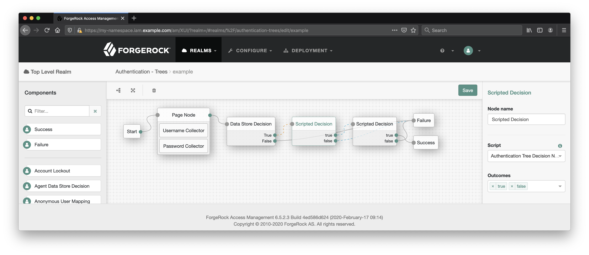
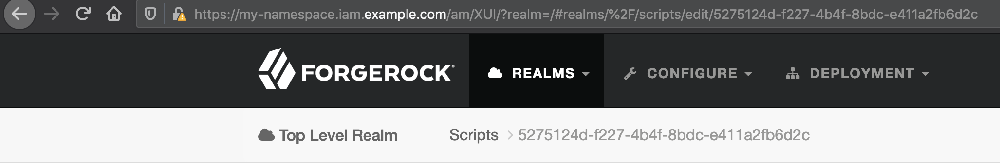
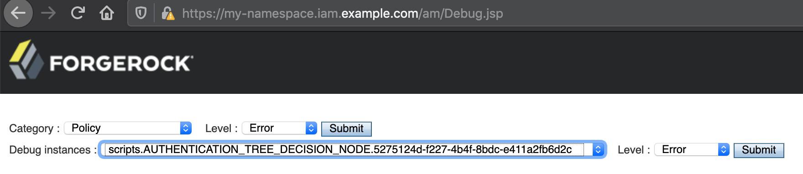
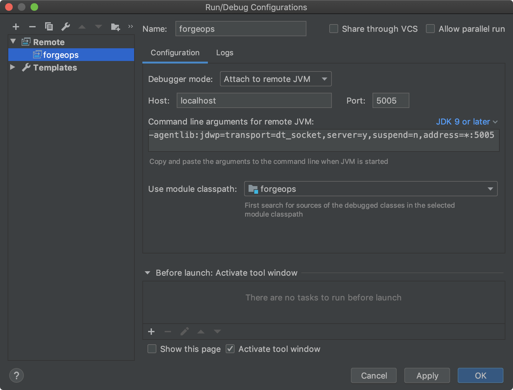
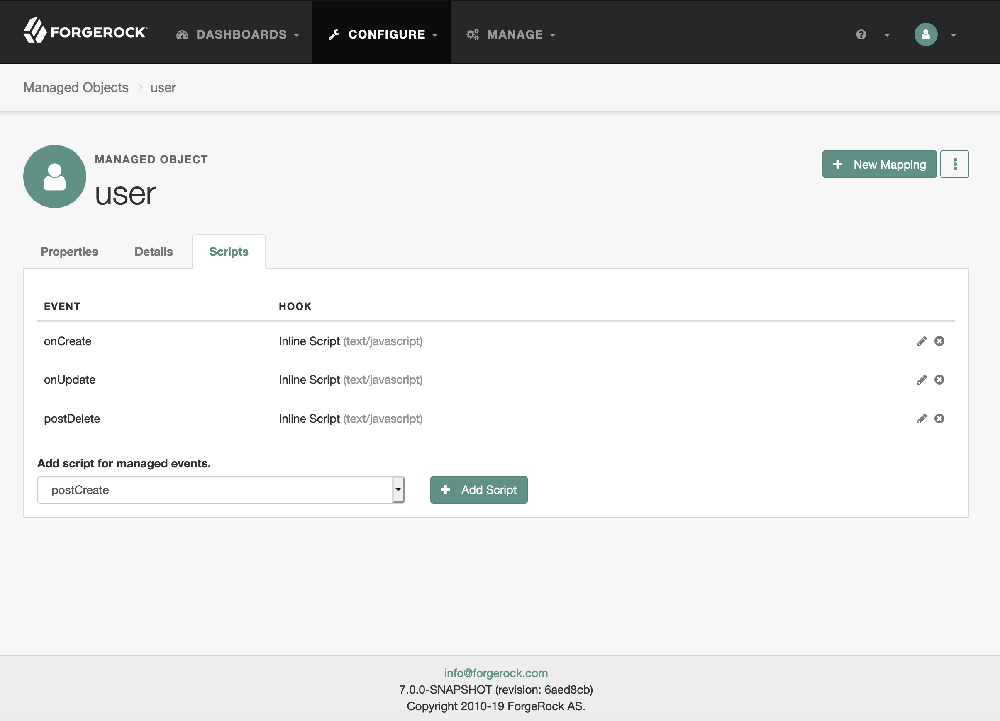
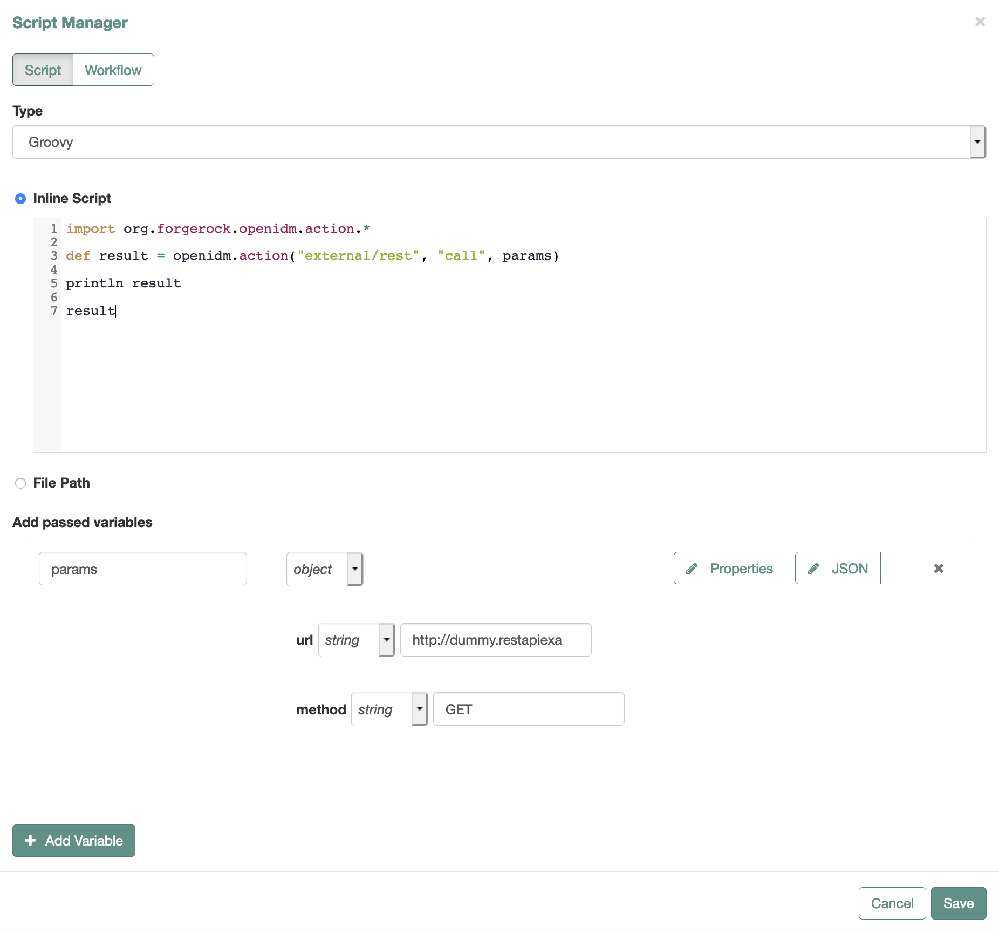

# <a id="top"></a>Dynamic Scripting in ForgeRock Platform

Three of ForgeRock Identity Platform products, [Access Management](https://www.forgerock.com/platform/access-management) (AM), [Identity Management](https://www.forgerock.com/platform/identity-management) (IDM), and [Identity Gateway](https://www.forgerock.com/platform/identity-gateway) (IG), allow to extend their functionality with dynamically applied, context-specific scripts written in JavaScript and Groovy and evaluated during the run time.

Scripting is broadly used in the products and broadly covered across [ForgeRock Product Documentation](https://backstage.forgerock.com/docs/). There are many articles describing scripting environment and application, often in a context of particular task and supplied with examples. Other places in the documentation cover functionality that is not directly related to scripting, but can be employed by scripts.

This writing aims at a quick introduction to scripting across the Platform—via comparing the scripting environments, references to the official documentation, and an example of scripting in each of the three products.

## Contents

* [Conclusion](#conclusion)
* [Summary](#summary)
* [An Example of Scripting in ForgeRock Components](#example)
    * [AM](#example-am)
    * [IDM](#example-idm)
    * [IG](#example-ig)
* [References](#references)

## <a id="conclusion"></a>Conclusion

[Back to the Top](#top)

The scripting objectives and implementation are driven by the product's functionality and the environment it provides. Hence, the scripts' location, configuration, security, the data and methods a script can use, and the way the scripts are managed are specific to a product.

There are certain similarities as well: the choice of scripting languages, ability to access the underlying Java functionality and the context data, logging methods, access to the request object, and ability to make back-channel HTTP requests—all converge into a similar experience at certain level. The script configuration and content for all three products could be represented as JSON and saved in the file system.

The ability of scripts to communicate with external network resources is a powerful tool. The current security measures do not seem to apply restrictions to endpoints a script may access, which may represent an additional concern about the script's overall security if the administrative UI/API protections can be breached. However, because the same administrative privileges that allow manage scripts will likely allow to change other configuration, the network restriction policies may need to be implemented outside of the product configuration.

Scripts add flexibility to the ForgeRock Identity Platform. While a script might not be performing at the same level as a native/standard implementation, the scripts can be used to substitute functionality that is not yet present in the current version of the software or is specific to a certain deployment.

## <a id="summary"></a>Summary

[Back to the Top](#top)

This section is a short overview of different scripting aspects in the three products. The [References](#references) section contains links to the docs organized in a similar way.

* <a id="summary-application-and-environment"></a>Application and Environment

    Scripting application is augmenting or extending native functionality of a product. The extension points could be events associated with an object or a procedure; for example, an update event on a managed object in IDM. Or, the scripts could represent an essential part of a procedure, necessary for its successful completion; for example, scripts employed in AM authentication flows.

    Scripts' environment could be described as access to methods and data. This may depend on the context the script is running in: the product and the particular procedure the script is extending. Even within the same product, the context may vary as the product components implement different functionality and expose different APIs.

    ### AM

    Scripting application in AM could be summarized into the following categories:

    * Authentication

        * Modules and Chains
            * Client-side
            * Server-side
        * Trees
            * Client-side
            * Server-side

    * Authorization

        * Scripting Policy Condition
        * Access Token Modification

    * Federation

        * OIDC Claims Handling

    #### <a id="am-scripting-client-side"></a>AM > Client-Side Scripts

    AM may be used for authentication in the front channel. This can be assisted with custom client-side scripts written in JavaScript and executed in the user agent.

    The use case for a client-side script is collecting information about the user agent's properties and its environment: [Geolocation](https://developer.mozilla.org/en-US/docs/Web/API/Navigator/geolocation), IP, and whatever else that could be collected with a custom script running in a browser. Thus, the script needs to be written in JavaScript compatible with the browser, has access to the browser properties, and can make requests to external network resources _from the browser_. It could be used, for example, for detecting the client's IP.

    The data collected by a client-side script can be submitted to the server side and become available for the server components involved in the same authentication procedure.

    Scriptable access to the browser environment seems to be a unique feature of authentication procedures in AM, in comparison to the other script applications in the three products.

    #### <a id="am-scripting-server-side"></a>AM > Server-Side Scripts

    The decision making process on user identification and access management can be aided with the server-side scripts. The server-side scripts can be written in Groovy or JavaScript running on Rhino.

    [Global Scripting API Functionality](https://backstage.forgerock.com/docs/am/6.5/dev-guide/#scripting-api-global) describes objects universally available for server-side scripts in AM. It also covers logging options, which is the only means of debugging server-side scripts in AM.

    [OpenAM Server Only 6.5.2.3 Documentation](https://backstage.forgerock.com/docs/am/6.5/apidocs/index.html) describes the single default source of Java functionality available for the server-side scripts, although some features may only make sense in certain contexts.

    > For example, the `org.forgerock.openam.auth.node.api.Action` class, representing [The Action Interface](https://backstage.forgerock.com/docs/am/6.5/auth-nodes/index.html#core-action), is applicable only in the context of authentication nodes and trees, but it is not usable in authentication modules.

    All server-side scripts have access to the following functionality:

    * [Accessing HTTP Services](https://backstage.forgerock.com/docs/am/6.5/dev-guide/#scripting-api-global-http-client) with the client object, httpClient, and the `org.forgerock.http.protocol` package.

        From scripts, AM makes synchronous, blocking network requests with the HTTP client object that are blocking until the script returns or times out according to the Server-side Script Timeout setting, which could be in the AM console under Configure > Global Services > Scripting > Secondary Configurations > AUTHENTICATION_SERVER_SIDE > Secondary Configurations > EngineConfiguration.

    * [Debug Logging](https://backstage.forgerock.com/docs/am/6.5/dev-guide/#scripting-api-global-logger) with the `logger` object methods.

    Although via different methods and objects, the server-side scripts are also capable of:

    * Accessing request data.

        Limited to request headers in authentication nodes.

    * Accessing profile data, when `username` is available.

        This means read, add, and update access to the AM identity attributes.

    * Accessing existing session data.

    * Authentication scripts have access to authentication state in chains and shared and transient state in trees.

    * Authorization scripts have access to authorization state, which includes passed in data, and can set authorization response attributes.

    You can find details on APIs available to server-side scripts in AM in the docs, under [Developing with Scripts](https://backstage.forgerock.com/docs/am/6.5/dev-guide/#chap-dev-scripts) and [Scripting a Policy Condition](https://backstage.forgerock.com/docs/am/6.5/authorization-guide/index.html#sec-scripted-policy-condition).

    In addition, scripts included in the default AM configuration, accessible in the administrative console under Realms > _Realm Name_ > Scripts, can server as a great source of example scripting for all script types:

    * Client-side Authentication
    * Server-side Authentication
    * Decision node script for authentication trees
    * OAuth2 Access Token Modification
    * OIDC Claims
    * Policy Condition

    #### <a id="am-trees-and-chains"></a>AM > Server-side Scripts in Authentication Chains and Authentication Trees

    The server-side authentication functionality can accept data collected by the client-side scripts, but the way the data is sent and received depends on the type of the authentication flow.

    AM supports two types of authentication: with [Authentication Modules and Chains](https://backstage.forgerock.com/docs/am/6.5/authentication-guide/index.html#about-authentication-modules-and-chains) and with [Authentication Nodes and Trees](https://backstage.forgerock.com/docs/am/6.5/authentication-guide/index.html#sec-about-authentication-trees).

    A scriptable authentication module can use a pair of client-side and server-side scripts. Data collected with the client-side script can be used to populate the `output` input in automatically provided form. The form can be submitted to the server, automatically or by using provided `submit()` method. Then, the string value of the `output` input becomes available to the server-side script as a well-known variable, `clientScriptOutputData`.

    A scriptable authentication node in a tree can run arbitrary JavaScript on the client-side and receive data back by using interactive features named [callbacks](https://backstage.forgerock.com/docs/am/6.5/dev-guide/#scripting-api-node-callbacks), as described in [Sending and Executing JavaScript in a Callback](https://backstage.forgerock.com/docs/am/6.5/auth-nodes/index.html#client-side-javascript) in Authentication Node Development Guide.

    ### IDM

    Scripts in IDM provide functionality to the [Managed Object Triggers](https://backstage.forgerock.com/docs/idm/6.5/integrators-guide/index.html#managed-object-triggers).

    The router service provides the uniform interface to all IDM objects, as described in IDM's  Integrator's Guide under [Router Service Reference](https://backstage.forgerock.com/docs/idm/6.5/integrators-guide/index.html#appendix-router).

* <a id="summary-managing-scripts"></a>Managing Scripts

    ### AM

    The [Managing Scripts](https://backstage.forgerock.com/docs/am/6.5/dev-guide/#manage-scripts) chapter shows how the scripts can be managed via REST and command line interfaces. These may represent the most efficient way to manage scripts in automated environments; for example, in production deployments.

    At the same time, AM console provides an easy to use visual interface for managing scripts and applying them to authentication and authorization events.

    ### IDM

    In IDM, the scripts can be managed directly in separate files and referenced from the configuration. The configuration can be itself managed directly in the file system.

    ### IG

    ### Configuration File Syntax in IDM and IG

    * IDM

        ```json
        {
            "type" : "javascript|groovy",
            "source|file" : "code|URI",
            "globals" : {}
        }
        ```

    * IG

        ```json
        {
            "name": "name",
            "type": "ScriptableFilter|ScriptableHandler|ScriptableThrottlingPolicy|ScriptableAccessTokenResolver|OAuth2ResourceServerFilter",
            "config": {
                "type": "application/x-groovy",
                "file": "SimpleFormLogin.groovy",
                "args": {}
            }
        }
        ```

* Languages

    All three components support server-side scripting in Groovy.

    For supporting server-side JavaScript, AM and IDM use [Rhino](https://developer.mozilla.org/en-US/docs/Mozilla/Projects/Rhino)—the scripting engine that has access to the Java environment provided by the products.

    > At the time of this writing, the 6.5 version of AM use Rhino version 1.7R4 and IDM was using version 1.7.12_1. Both products use Groovy version 2.5.7.

    AM allows for client-side scripts, which run in the browser environment and have to comply with it.

    IDM does not support custom client-side JavaScript.

    IG does not currently support JavaScript in any form.

* Security

    * Across products, administrative access is required for script management.

    1. AM

        * Java Class Whitelist
        * Java Class Blacklist

    1. IDM

        * No script specific security?

    1. IG

        * No script specific security?

* Debugging

## Summary Table for Server-Side Scripts

| Script Feature | IDM | IG | AM |
|-|-|-|-|
| Type/Language | `text/javascript`, `groovy` | `application/x-groovy` | JavaScript  (Rhino), JavaScript (browser), Groovy<br>Depends on script's `context` type (labeled `Script Type` in AM Console) |
| Configuration | Part of a configuration file (JSON) | Part of a configuration file (JSON) | Defined in AM console and saved in encoded form in a configuration file in the `amster` pod file system (`/opt/amster/config/realms/root/Scripts`) |
| Managing | File, JSON configuration, Script Manager | File, JSON configuration, Studio (may not be available in ForgeOps) | AM Console, REST, `ssoadm` command |
| Validation | REST | | AM Console, REST |
| Multiline Source | `\n` | Array (of strings) | UI editor |
| Arguments | The `globals` namespace | `args` key | Direct editing |
| Access to | `openidm` functions, request, context, managed object, resource information, operation results | request, context, etc., [Properties, Available Objects, and Imported Classes](https://backstage.forgerock.com/docs/ig/6.5/reference/index.html#script-conf) | Depends on context |
| Other Context Differences | | |
| Extras | | Capture Decorator | |
| Security | | | Security Settings Component: Java Class White/Black Lists, System (JVM) SecurityManager|
| Debugging | Debugger can be attached | | [Debug Logging](https://backstage.forgerock.com/docs/am/6/dev-guide/#scripting-api-global-logger) |
| Particularities | | | User-created scripts are realm-specific |
| HTTP Request | | | `org.forgerock.http.protocol`, Synchronous [Accessing HTTP Services](https://backstage.forgerock.com/docs/am/6/dev-guide/#scripting-api-global-http-client)|
| Exported Scripts Location | | | `/path/to/forgeops/docker/6.5/amster/config/realms/root/Scripts` |

## <a id="example"></a>An Example of Scripting in ForgeRock Products

[Back to the Top](#top)

To compare scripting environments provided by ForgeRock components, we will create a script that will make an HTTP call to an online service and receive a response in the form of JSON, which the script could evaluate against other data accessible in the script's environment.

<!-- >> If you use server-side scripts to access an API over encrypted connection, you will make sure the scripting engine's Java trusts the underlying SSL/TLS certificate. -->

This is just one possible scripting application in ForgeRock products, but it will expose scripts' management, configuration, environment, and debugging options in the three products.

## <a id="example-am"></a>AM

[Back to the Top](#top)

AM provides authentication and authorization services, and custom scripts can be used to augment the default functionality.

### <a id="am-scripting-a-chain"></a>AM > Scripting Authentication Chain Example

To outline basic principles of scripting authentication chains in AM, we offer an example of extending authentication with a pair of simple client-side and server-side scripts.

> You can find links to official examples in the [References](#references) section of this writing, including detailed instructions on how to set up an authentication chain.

Sign in as an AM administrator, for example amadmin.

1. Client-side Script

    The script will load an external library and make an HTTP request in order to get the client's IP information.

    1. Navigate to Realms > _Realm Name_ > Scripts

        You will see number of predefined scripts, some of which can serve as templates for the new ones. In particular, Scripted Module - Server Side example script will be the starting point for any added script of the Server-side Authentication type.

    1. Select + New Script

        In the New Script dialog, populate the inputs:

        * Name:  _Your Scripted Module Client Side Script_
        * Script Type: Client-side Authentication

        Select the Create button.

    1. In the next dialog, with the new script properties, populate the inputs:

        * Language: JavaScript (disabled)

            The language for a client-side script is always JavaScript, for the script run time environment is going to be a browser.

        * <a id="client-side-script"></a>Script:

            ```javascript
            var script = document.createElement('script'); // 1

            script.src = 'https://code.jquery.com/jquery-3.4.1.min.js';
            script.onload = function (e) { // 2
                $.getJSON('https://ipgeolocation.com/?json=1', function (json) {
                    output.value = JSON.stringify({
                        ip: json
                    }); // 3

                    submit(); // 4
                });
            }

            document.getElementsByTagName('head')[0].appendChild(script); // 1

            autoSubmitDelay = 4000; // 5
            ```

            1. Script element is created and added to the page in the browser for loading an external library.

            2. When the script is loaded, it will make a request to an external source to obtain the client's IP information.

            3. The information, received as a JSON object, is then saved as a string in the `output` input of the form automatically provided on the client side.

                The expected result returned from the call is a JSON containing client IP data. The data might look like the following:

                ```json
                {
                    "ip": "73.67.228.195",
                    "city": "Portland",
                    "region": "Oregon",
                    "country": "United States",
                    "coords": "45.547200,-122.641700",
                    "asn": "AS7922, Comcast Cable Communications, LLC",
                    "postal": "97212",
                    "timezone": "America/Los_Angeles"
                }
                ```

                When the form is auto-submitted, the posted value becomes available for the server-side scripts as the `clientScriptOutputData` variable, as described in [Accessing Client-Side Script Output Data](https://backstage.forgerock.com/docs/am/6.5/dev-guide/#scripting-api-authn-client-data).

            4. When the HTTP call is complete the form can be submitted.

            5. If the HTTP request takes too much time to complete, the form will be automatically submitted after the specified timeout—via a conventional setting that takes milliseconds.

            Select the Save Changes button.

    1. You can return to the script and change its definition by navigating to Realms > _Realm Name_ > Scripts >  _Your Scripted Module Client Side Script_

1. Server-side Script

    The `Scripted Module - Client Side` script, included in AM configuration by default, serves as a starting template for all new scripts of type Server-side Authentication. In our example, we will replace its content with functionality that relies on the results delivered from our client-side script.

    1. Navigate back to Realms > _Realm Name_ > Scripts

    1. Select + New Script

        In the New Script dialog, populate the inputs:

        * Name:  _Your Scripted Module Server Side Script_
        * Script Type: Server-side Authentication

        Select the Create button.

    1. In the following dialog, populate the Language and the Script inputs:

        * Language: JavaScript

            For a Server-side script, you will be given a choice of language: JavaScript or Groovy. The JavaScript version might look like the following:

        * Script:

            ```javascript
            var failure = true; // 1

            try {
                var ip = JSON.parse(clientScriptOutputData).ip; // 2
                var postalAddress = idRepository.getAttribute(username, 'postalAddress'); // 3

                failure = postalAddress.toArray()[0].indexOf(ip.postal) === -1 // 4
            } catch (e) {
                logger.error(e.name + ': ' + e.message + ' Line Number: ' + e.lineNumber);
            }

            if (failure) { // 1
                logger.error('Authentication denied.');

                authState = FAILED; // 5
            } else {
                logger.message('Authentication allowed.');

                authState = SUCCESS; // 5
            }
            ```

            1. We set expectations low and only allow for the success if everything checks out.

            2. The data submitted from the client-side script is stringified JSON. It is used to create a JavaScript object so that its individual properties can be easily accessed.

            3. The `idRepository` object is a part of the APIs available for scripts used in authentication modules. Using its methods, we can access the user's postal address as it exists in the identity managed in AM.

                We assume that in this authentication process the user identity is checked with the `DataStore` authentication module and the login name of the user is available via the `username` variable. With this, an attribute can be requested from the corresponding identity.

                As described in [Authentication API Functionality](https://backstage.forgerock.com/docs/am/6.5/dev-guide/#scripting-api-authn), the functional part of the script have access to number of APIs and data objects.

                In addition, the [Global Scripting API Functionality](https://backstage.forgerock.com/docs/am/6.5/dev-guide/#scripting-api-global) allows for making HTTP requests to external resources, which is illustrated in the `Scripted Module - Server Side` and `Scripted Policy Condition` server-side scripts included in the default AM installation.

            4. The user's postal address is compared with the zip code obtained from the online service.

                The value received from the `getAttribute` method is a Java `HashSet`; we convert it to String and try to find the current client's zip code in the string.

                In this example, finding the current zip code in the user's address means success, but it could also be determined by checking the client's IP against a white list, etc.

            5. Depending on results that the script produces, the authentication state is set to define the outcome of authentication.

1. Authentication Module and Chain

    1. Navigate back to Realms > _Realm Name_ > Authentication > Modules.

    1. Select + Add Module.

        In the New Module dialog, populate the inputs:

        * Name:  _Your Scripted Module_
        * Script Type: Scripted Module

        Select the Create button.

    1. In the following dialog, populate the inputs:

        * Client-side Script: Enabled
        * Client-side Script: _Your Scripted Module Client Side Script_
        * Server-side Script:  _Your Scripted Module Server Side Script_
        * Authentication Level: 1 (default)

    1. Navigate back to Realms > _Realm Name_ > Authentication > Chains.

    1. Select + Add Chain.

    1. In the Add Chain dialog, populate the Name input:

        * Name: _Your Chain_

        Select the Create button.

    1. In the following dialog, select + Add Module.

    1. In the popup window, populate the inputs:

        * Select Module: DataStore
        * Select Criteria: Required

        Select the OK button.

    1. In the Edit Chain screen, select + Add Module.

    1. In the popup window, populate the inputs:

        * Select Module: _Your Scripted Module_
        * Select Criteria: Required

        Select the OK button.

    1. In the Edit Chain screen, select the Save Changes button.

    > If you are unsure how to use scripts in an authentication chain, [Using Server-side Authentication Scripts in Authentication Modules](https://backstage.forgerock.com/docs/am/6.5/authentication-guide/index.html#sec-scripted-auth-module) provides detailed coverage for employing scripts in an authentication chain.

1. Data preparations

    To make a positive comparison with the data delivered from the client-side script, you will need to add matching values to AM identity with which you try to sign in. Out of the box, there should be `postalAddress` attribute associated with an identity, which can be updated in version 6.5 of AM via Realms > _Realm Name_ > Identities > _Identity_ in the administrative console.

    > If you'd like to use custom identity attributes, their management is covered in [Setting Up Identity Stores](https://backstage.forgerock.com/docs/am/6.5/maintenance-guide/index.html#chap-maint-datastores).

1. Debugging

    AM does not provide an option for connecting a debugger. However, Global Scripting API Functionality facilitates [Debug Logging](https://backstage.forgerock.com/docs/am/6.5/dev-guide/#scripting-api-global-logger), which you can set as described in this Setup and Maintenance Guide chapter.

    Debug logging for scripting service and individual scripts could be configured as described in the Development Guide at [Debug Logging](https://backstage.forgerock.com/docs/am/6.5/dev-guide/#scripting-api-global-logger).

    > AM server debugging configuration can be found in the administrative console under CONFIGURE > SERVER DEFAULTS > General > Debugging. The Debug Directory setting specifies location of the log files. Managing server-wide debugging settings is described in the Setup and Maintenance Guide under [Debug Logging](https://backstage.forgerock.com/docs/am/6.5/maintenance-guide/index.html#sec-maint-debug-logging).

    For example, for the server-side scripts defined in AM console that are a part of an authentication chain, like the one we created, you could navigate to the `your-am-instance/Debug.jsp` page, select "amScript" for Debug instances and "Message" for Level. Then, whenever in your script you use `logger.message` method, the output will be saved in the logs, along with any warnings and errors.

    Then, to access the logs, you can navigate to `your-am-instance-debugging-directory` in Terminal and `tail -f` the log file of interest; in this case the `Authentication` file.

    Alternatively, during development, you could use the `logger.error` method without changing the default debugging configuration, for the "Error" level is always on.

    > JavaScript `console.log` and Rhino's `print` are not implemented for server-side scripts. The client-side JavaScript can output logs into the browser's console as usual.

### <a id="am-scripting-a-tree"></a>AM > Scripting Authentication Tree Example

As authentication worries along, nodes in a tree may capture information and save it in a special object named SharedState that will be available for the next node in the tree.

1. Scripted Decision Node

    An equivalent of the client-side script used as an example above, can be implemented in an authentication tree with the [Scripted Decision Node](https://backstage.forgerock.com/docs/am/6.5/authentication-guide/index.html#auth-node-scripted-decision).

    This node accepts a script of the "Decision node script for authentication trees" type. A Groovy implementation of such a script might look like the following:

    ```groovy
    /*
    - Data made available by nodes that have already executed
        are available in the sharedState variable.
    - The script should set outcome to either "true" or "false".
    */

    import org.forgerock.openam.auth.node.api.*; // 1
    import com.sun.identity.authentication.callbacks.ScriptTextOutputCallback;
    import com.sun.identity.authentication.callbacks.HiddenValueCallback;

    def script = ''' // 2
    var script = document.createElement('script');

    script.src = 'https://code.jquery.com/jquery-3.4.1.min.js';
    script.onload = function (e) {
        $.getJSON('https://ipgeolocation.com/?json=1', function (json) {
            document.getElementById('output').value = JSON.stringify(json);

            document.getElementById("loginButton_0").click();
        });
    }

    document.getElementsByTagName('head')[0].appendChild(script);

    setTimeout(function () {
        document.getElementById("loginButton_0").click()
    }, 4000);
    '''

    if (callbacks.isEmpty()) { // 3
        action = Action.send([
            new HiddenValueCallback("output", "false"),
            new ScriptTextOutputCallback(script)
        ]).build();
    } else { // 4
        def failure = true;

        if (callbacks[0].getValue() != "output") {
            sharedState.put("clientScriptOutputData", callbacks[0].getValue());

            failure = false;
        }

        if (failure) { // 5
            action = Action.goTo("false").build();
        } else {
            action = Action.goTo("true").build();
        }
    }
    ```

    1. Enables [The Action Interface](https://backstage.forgerock.com/docs/am/6.5/auth-nodes/index.html#core-action) and executing callbacks. The two callbacks used here allow for inserting a script in the user's browser and receiving a submitted form value from the client side, as described in [Supported Callbacks](https://backstage.forgerock.com/docs/am/6.5/dev-guide/#supported-callbacks) in Development Guide.

    2. A multiline representation of the script to be executed in the user's browser.

        The script is very similar to [the one we used in authentication chain](#client-side-script), except the form post is initiated by direct reference to the submit button.

    3. We check if any callbacks have been requested by the node and if not, we specify the two for inserting the client-side script and receiving the form data. The callbacks are sent to the user's browser.

    4. When the callbacks have been requested and the form input has been populated and submitted to the server side, we access the form value and save it in `clientScriptOutputData` key in the shared state object—making it available for the next node in the tree. It is a success, and we indicate it by setting the failure status to false.

    5. Moving to the next node with the outcome set according to the failure status.

    The next node in the tree will be able to retrieve the IP information by querying the shared state. A Groovy example:

    ```groovy
    /*
    - Data made available by nodes that have already executed are available in the sharedState variable.
    - The script should set outcome to either "true" or "false".
    */

    import org.forgerock.openam.auth.node.api.*; // 1
    import com.sun.identity.idm.IdUtils; // 2
    import groovy.json.JsonSlurper; // 3

    def id = IdUtils.getIdentity(sharedState.get("username"), sharedState.get("realm")); // 2

    def ip = new JsonSlurper().parseText(sharedState.get("clientScriptOutputData")); // 3

    def failure = id.getAttribute("postalAddress").toArray()[0].indexOf(ip.postal) == -1; // 4

    def request = new org.forgerock.http.protocol.Request(); // 5
    request.setUri("https://jsonplaceholder.typicode.com/users/");
    request.setMethod("GET");

    def response = httpClient.send(request).get(); // 6
    def users = new JsonSlurper().parseText(response.getEntity().toString());

    failure = failure || users.find() { // 7
        it.username == sharedState.get("username") ||
        it.email == id.getAttribute("mail").toArray()[0]; // etc.
    };

    if (failure) { // 8
        action = Action.goTo("false").build();
    } else {
        action = Action.goTo("true").build();
    }
    ```

    1. Enable [The Action Interface](https://backstage.forgerock.com/docs/am/6.5/auth-nodes/index.html#core-action).

    2. Access AM identity attributes.

    3. Parse the stringified JSON received from the client-script and preserved in the shared state.

    4. Define the outcome by matching an attribute from the client data and one from the AM user's identity.

    5. Prepare a network request as described in [Accessing HTTP Services](https://backstage.forgerock.com/docs/am/6.5/dev-guide/#scripting-api-global-http-client) in the Development Guide.

    6. Receive and parse the response.

    7. Decide the outcome on whether or not the user can be found in the online resource, which represents some kind of "black list".

        > The client IP could also be used in [Scripted a Policy Condition](https://backstage.forgerock.com/docs/am/6.5/authorization-guide/index.html#sec-scripted-policy-condition) as demonstrated for the default policy condition script included in AM installation.

    8. Proceed to the next node.

    Or, a JavaScript equivalent:

    ```javascript
    var goTo = org.forgerock.openam.auth.node.api.Action.goTo; // 1
    var getIdentity = com.sun.identity.idm.IdUtils.getIdentity; // 2

    var id = getIdentity(sharedState.get("username"), sharedState.get("realm")); // 2

    var ip = JSON.parse(sharedState.get("clientScriptOutputData")); // 3

    var failure = id.getAttribute("postalAddress").toArray()[0].indexOf(ip.postal) == -1; // 4

    var request = new org.forgerock.http.protocol.Request(); // 5
    request.setUri("https://jsonplaceholder.typicode.com/users/");
    request.setMethod("GET");

    var response = httpClient.send(request).get(); // 6
    var users = JSON.parse(response.getEntity());

    failure = failure || users.some(function (user) { // 7
        return (
            user.username === sharedState.get("username") ||
            user.email === id.getAttribute("mail").toArray()[0] // etc.
        );
    });

    if (failure) { // 8
        action = goTo("false").build();
    } else {
        action = goTo("true").build();
    }
    ```

    The authentication tree might look like the following:

    

    Following the "single task per node" philosophy, processing client-side data is split into two steps, but as an alternative it could be done in the same Scripted Decision node.

    In future versions of AM, there may already be predefined nodes to perform certain client-side operations. There is also a marketplace authentication node for version 6.5 that allows to run custom JavaScript in the user's browser: [Client Script Auth Tree Node](https://backstage.forgerock.com/marketplace/api/catalog/entries/AWAm-FCxfKvOhw29pnIp).

1. Debugging

    The Debug instances input on `your-am-instance/Debug.jsp` page will list the Decision Node scripts in the following format:

    scripts.AUTHENTICATION_TREE_DECISION_NODE._script-id_

    The script ID part correspond to the Realms > _Realm Name_ > Scripts > _script-id_ in AM console on a script details page. For example:

    

   

    When a script associated with the Scripted Decision node outputs logs (at the allowed level set with `Debug.jsp`), the script specific log file is created under `your-am-instance-debugging-directory`. For example:

    ```bash
    $ cd ~/openam/am/debug$
    $ ls
    Authentication  CoreSystem  IdRepo  scripts.AUTHENTICATION_TREE_DECISION_NODE.fe4a7e3e-aa1d-4d2d-82ad-4830d0c98adc
    ```

    ```bash
    $ tail -f scripts.AUTHENTICATION_TREE_DECISION_NODE.fe4a7e3e-aa1d-4d2d-82ad-4830d0c98adc
    scripts.AUTHENTICATION_TREE_DECISION_NODE.fe4a7e3e-aa1d-4d2d-82ad-4830d0c98adc:04/26/2020 07:34:02:654 PM GMT: Thread[ScriptEvaluator-5,5,main]: TransactionId[88093018-65c0-4987-b7af-ef1429ac1c04-46398]
    ERROR: Helpful error description.
    ```

    If an error occurs that is not handled within the script itself, it may be reported in the Authentication log. For example, it you try to employ a Java package that is not white listed in the scripting engine settings, the "Access to Java class . . . is prohibited." error will appear in the Authentication log.

    > In the example above, parsing JSON with `groovy.json.JsonSlurper` (in the Groovy version of the script) would require the `groovy.json.internal.LazyMap` class to be allowed in the scripting engine setting. For getting identity with the `IdUtils` method, `com.sun.identity.idm.AMIdentity` would have to be white listed.

    You can specify allowed and dis-allowed Java classes in AM administrative console at Realms > _Realm Name_ > Configure > Global Services > Scripting > Secondary Configurations > AUTHENTICATION_TREE_DECISION_NODE > Secondary Configurations > EngineConfiguration > Java class whitelist/Java class blacklist.

## <a id="example-idm"></a>IDM

[Back to the Top](#top)

Basic information about scripting in IDM can be found in its Integrator's Guide, in the [Extending IDM Functionality By Using Scripts](https://backstage.forgerock.com/docs/idm/6.5/integrators-guide/#chap-scripting) chapter, and in other sections of IDM documentation referenced from there.

Scripts in IDM could be associated with its endpoints or events connected to managed objects.

As the docs state, the custom scripts could be written in JavaScript or Groovy. In this writing, we will create both versions of an example script to run against the default environment defined in the `/path/to/idm/conf/script.json` file (under the IDM installation in the running container); for example, in `/opt/openidm/conf/script.json`. If a corresponding file is defined in the staging area, in `/path/to/forgeops/docker/7.0/idm/conf/script.json` in the described here example, this file will be copied to the container when it is deployed.

### <a id="idm-scripts-location"></a>IDM > The Scripts' Location

The script content can be defined either inline in a configuration file (that is, a file under the `/path/to/idm/conf` directory), or in a separate script file. For the purposes of this example, we will use the latter option, as it provides a comfortable environment for writing multiline scripts and additional options for debugging.

> Depending on your deployment strategy, defining scripts in files may not be supported, but it is an option in the described here environment which will allow us to demonstrate general principles for scripting in IDM.

The locations that IDM is aware of and will read a script file from are defined in the `sources` key in the  `script.json` file:

```json
    "sources" : {
        "default" : {
            "directory" : "&{idm.install.dir}/bin/defaults/script"
        },
        "install" : {
            "directory" : "&{idm.install.dir}"
        },
        "project" : {
            "directory" : "&{idm.instance.dir}"
        },
        "project-script" : {
            "directory" : "&{idm.instance.dir}/script"
        }
    }
```

We will place the example scripts in the location denoted as `"&{idm.instance.dir}/script"`, which corresponds to `/path/to/idm/script` in the running IDM container and `/path/to/forgeops/docker/6.5/idm/script` in the staging area. You can navigate there and create `example.js` file with the following content:

```javascript
(function () {
    var result = openidm.action("external/rest", "call", params)

    return result
 }())
 ```

An equivalent in `Groovy` might look like the following:

```groovy
import org.forgerock.openidm.action.*

// final params = params as Map

def result = openidm.action("external/rest", "call", params)

println result

return result
```

Both scripts expect `params` argument; we will provide it as a JSON at the time the script is called:

```JSON
params = {
    "url": "http://jsonplaceholder.typicode.com/users/1",
    "method": "GET"
}
```

In order to make an HTTP request, the script used `action` method of the `openidm` Java object. You can find more about scripts environment and available for scripts functionality in the IDM docs, in its [Scripting Reference](https://backstage.forgerock.com/docs/idm/6.5/integrators-guide/#appendix-scripting). In particular, the `action` method is described in the [openidm.action(resource, actionName, content, params, fields)](https://backstage.forgerock.com/docs/idm/6.5/integrators-guide/#function-action) section.

The updated scripts will be copied promptly, but the time it takes for ForgeRock component to pick up the change will be affected by the configuration settings in the `script.json` file:

```json
    "ECMAScript" : {

        "javascript.recompile.minimumInterval" : 60000
    },
    "Groovy" : {

        "groovy.recompile.minimumInterval" : 60000

    }
```

You can change the minimum interval setting (in milliseconds) before you deploy or redeploy the sample.

***

#### <a id="idm-evaluating"></a>IDM > Evaluating Scripts

You can try out your script by validating it, as described in the [IDM Docs](https://backstage.forgerock.com/docs/idm/6.5/integrators-guide/#script-endpoint). In order to be able to access the `/script` endpoint you will need to authorize your client for making request to the IDM `/script` endpoint. In ForgeOps, you would need to provide an access token from `amadmin` user. The token will need to be associated with the `openid` scope.

For this example, we will describe how you can create `scripts` OAuth 2.0 client in [ForgeRock Access Management](https://www.forgerock.com/platform/access-management) (AM), which can be performed with the following cURL command:

```bash
curl -k 'https://default.iam.example.com/am/json/realms/root/realm-config/agents/OAuth2Client/scripts' \
-X PUT \
-d '{
    "clientType": "Public",
    "redirectionUris": ["http://localhost:9999"],
    "scopes": ["openid"],
    "responseTypes": ["code"],
    "tokenEndpointAuthMethod": "client_secret_post",
    "isConsentImplied": true,
    "postLogoutRedirectUri": ["http://localhost:9999"]
    }' \
-H 'Content-Type: application/json' \
-H 'Accept: application/json' \
-H 'Cookie: iPlanetDirectoryPro='$(curl -k 'https://default.iam.example.com/am/json/realms/root/authenticate' \
    -X POST \
    -H 'X-OpenAM-Username:amadmin' \
    -H 'X-OpenAM-Password:password' \
    | sed -e 's/^.*"tokenId":"\([^"]*\)".*$/\1/' \
)
```

With the client in place, you can make an authorization request and obtain the access token. For example:

```bash
authz_code=$(curl -k -s -w "%{redirect_url}" 'https://default.iam.example.com/am/oauth2/authorize?response_type=code&client_id=scripts&redirect_uri=http://localhost:9999&scope=openid' \
-H 'Cookie: iPlanetDirectoryPro='$(curl -k -s 'https://default.iam.example.com/am/json/realms/root/authenticate' \
    -X POST \
    -H 'X-OpenAM-Username:amadmin' \
    -H 'X-OpenAM-Password:password' \
    | sed -e 's/^.*"tokenId":"\([^"]*\)".*$/\1/') \
| sed 's/^.*?code=\([^&]*\).*$/\1/') \
&& access_token=$(curl -k 'https://default.iam.example.com/am/oauth2/access_token' \
-X POST \
-d 'client_id=scripts&redirect_uri=http://localhost:9999&grant_type=authorization_code&code='$authz_code \
-H 'Content-Type: application/x-www-form-urlencoded' \
| sed 's/^.*"access_token":"\([^"]*\)".*$/\1/') \
&& echo $access_token
```

Then, you can validate the script by making a request to the `/script` end point and including the access token received from the authorization. You can provide script parameters under the "globals" namespace. For example:

```bash
curl -k -X POST \
'https://default.iam.example.com/openidm/script?_action=eval' \
-H 'Authorization: Bearer '$access_token \
-H 'Cache-Control: no-cache' \
-H 'Content-Type: application/json' \
-d '{
    "type": "javascript",
    "file": "example.js",
    "globals": {
        "params": {
            "url": "http://jsonplaceholder.typicode.com/users/1",
            "method": "GET"
        }
    }
}'
```

If the API call made from the script has been successful, you should see a JSON content returned which might look like the following:

```bash
{"status":"success","data":[{"id":"1","employee_name":"Tiger Nixon","employee_salary":"320800","employee_age":"61","profile_image":""}, . . . ,"code":200}
```

To evaluate the Groovy script you will need to change the "type" and teh "file" values in the cURL request data:

```bash
curl -k -X POST \
'https://default.iam.example.com/openidm/script?_action=eval' \
-H 'Authorization: Bearer '$access_token \
-H 'Cache-Control: no-cache' \
-H 'Content-Type: application/json' \
-d '{
    "type": "groovy",
    "file": "example.groovy",
    "globals": {
        "params": {
            "url": "http://jsonplaceholder.typicode.com/users/1",
            "method": "GET"
        }
    }
}'
```

***

#### <a id="idm-debugging"></a>IDM > Debugging

While working on a script file you may have an option to use a debugger. We will provide an example of the debugging process based on a popular IDE for developing in Java and Groovy, [IntelliJ IDEA](https://www.jetbrains.com/idea/). You can check out details on setting debugging environment in [IntelliJ's docs](https://www.jetbrains.com/help/idea/creating-and-editing-run-debug-configurations.html), but the general steps are outlined below:

1. Open your ForgeOps clone in IntelliJ.

1. Select "Run" > "Edit Configurations...".

    1. Select "Add New Configuration" ("+") and select "Remote" in the list of predefined templates.

        1. In "Configuration" tab, provide or verify the defaults for the following settings:

            1. Debugger mode: Attach to remote JVM
            1. Host: localhost
            1. Port: 5005
            1. Command line arguments for remote JVM (for JDK 9 or later): -agentlib:jdwp=transport=dt_socket,server=y,suspend=n,address=*:5005
            1. Use module classpath: forgeops

        1. Provide "Name" for your new configuration; for example, "forgeops".

        1. Select "Apply" or "OK".

            


1. In your staging area, under the IDM component directory, in Dockerfile (for example, in `/path/to/forgeops/docker/7.0/idm/Dockerfile`) change the environment variable `JAVA_OPTS` according to the debugging settings in the IDM project itself—as described in the [Starting in Debug Mode](https://backstage.forgerock.com/docs/idm/6.5/integrators-guide/#starting-in-debug-mode) section of the IDM Integrator's Guide. For example, in `/path/to/idm/openidm-runtime/src/main/resources/startup.sh` you may find:

    ```java
    if [ "$JPDA" = "jpda" ] ; then
    if [ -z "$JPDA_TRANSPORT" ]; then
        JPDA_TRANSPORT="dt_socket"
    fi
    if [ -z "$JPDA_ADDRESS" ]; then
        JPDA_ADDRESS="5005"
    fi
    if [ -z "$JPDA_SUSPEND" ]; then
        JPDA_SUSPEND="n"
    fi
    if [ -z "$JPDA_OPTS" ]; then
        JPDA_OPTS="-Djava.compiler=NONE -Xnoagent -Xdebug -Xrunjdwp:transport=$JPDA_TRANSPORT,address=$JPDA_ADDRESS,server=y,suspend=$JPDA_SUSPEND"
    fi
    OPENIDM_OPTS="$OPENIDM_OPTS $JPDA_OPTS"
    fi
    ```

    The resulting line in your Dockerfile might look like this:

    ```docker
    ENV JAVA_OPTS "-Djava.compiler=NONE -Xnoagent -Xdebug -Xrunjdwp:transport=dt_socket,address=5005,server=y,suspend=n -server -XX:MaxRAMPercentage=75"
    ```

    Make sure that the port you use in IntelliJ and in the Dockerfile are the same.

1. Run the following command in your terminal against your ForgeOps deployment:

    ```bash
    kubectl port-forward idm-pod-name 5005:5005
    ```

    > You can see the pod names by running:
    > ```bash
    > kubectl get pods
    > ```

1. In IntelliJ, open a Groovy script located in your staging area that you'd like to debug; in our example, in `docker/7.0/idm/script/example.groovy`.

    Debugging a script in your staging area, with auto-sync or auto-deploy on, assures that you are debugging the same content as the one that is running in the container.

    In IntelliJ, you can now set breaking points in the script, start debugging, and then evaluate the script by making authorized request to the IDM `/script` endpoint. IntelliJ should react on messages coming from localhost:5005 and follow the code in your file.

***

#### Inline Scripts in Configuration Files

As described in the [Calling a Script From a Configuration File](https://backstage.forgerock.com/docs/idm/6.5/integrators-guide/#script-call) section of the IDM docs, script content can be provided directly in the code of an event handler in IDM. For example, you can invoke the inline equivalent of the groovy script when a managed object is updated in IDM by adding the following filter in `/path/to/staging/area/idm/conf/router.json`:

```json
{
    "filters" : [

        {
            "pattern" : "^(managed|system|internal)($|(/.+))",
            "onRequest" : {
                "type" : "groovy",
                "source" : "import org.forgerock.openidm.action.*\n\ndef result = openidm.action(\"external/rest\", \"call\", params)\n\nprintln result\n\nresult",
                "globals" : {
                    "params" : {
                        "url" : "http://jsonplaceholder.typicode.com/users/1",
                        "method" : "GET"
                    }
                }
            },
            "methods" : [
                "patch"
            ]
        },

    ]
}
```

In IDM, multiline scripts can be presented in the configuration files' JSON by concatenating the lines with the new line symbol, `\n`. To produce a visible effect for this script in the deployment logs, you can add `\nprint result` before the return statement, as shown in the example above.

When you change `router.json`, don't forget to build and deploy your sample, if this is not done automatically.

#### Inline Scripts in IDM Admin

Some configuration options can be associated with scripts in the IDM Admin UI.

To experience it first hand, you could, for example, sign in at `https://default.iam.example.com/admin`, navigate to CONFIGURE > MANAGED OBJECTS > USER, and select the Scripts tab. Here, you'll be provided with a choice of modifying one of the existing scripts or creating a new one:



Select Edit or Add Script button for an event associated with User object and populate the provided in Script Manager window input area with the content from a script file you've created earlier. Don't forget the parameters the script is expecting to receive. And make sure you selected the correct script engine from the Type dropdown. For example:



Select Save.

Now, if you trigger the event you associated your script with, for example update a user attribute (triggering `onUpdate`) or open a user record in the admin (triggering `onRead`), you may observe in the IDM pod logs the printed results of the network call (if it succeeded).

## <a id="example-ig"></a>IG

[Back to the Top](#top)

Scripts in IG may be associated with one of the [scriptable object types](https://backstage.forgerock.com/docs/ig/6.5/reference/index.html#script-conf).

Similar to IDM, IG allows to specify script content either inline in a configuration file or in a designated script file. In either case, only the `application/x-groovy` MIME type is supported. Similar to IDM, IG scripts accept parameters provided as the `args` key in the script configuration. For example, the following [ScriptableFilter](https://backstage.forgerock.com/docs/ig/6.5/reference/index.html#ScriptableFilter) definition may be a part of a [Chain Handler](https://backstage.forgerock.com/docs/ig/6.5/reference/index.html#Chain) and use `example.groovy` script to process the request:

```json
{

     "handler": {
        "type": "Chain",
        "config": {
            "filters": [

                {
                    "name": "ScriptableFilter",
                    "type": "ScriptableFilter",
                    "config": {
                        "args": {
                            "url": "http://jsonplaceholder.typicode.com/users/1",
                            "method": "GET"
                        },
                        "type": "application/x-groovy",
                        "file": "example.groovy"
                    }
                },

            ],
            "handler": "someHandler"
        }
}
```

The script itself, functionally very similar to the one we used in IDM, might look like the following:

```groovy
def call = new Request()
call.setUri(url)
call.setMethod(method)

http.send(call)
.thenOnResult { response ->
    def result = response.entity.json

    println result

    response.close()
}
.thenAsync({
    next.handle(context, request)
} as AsyncFunction)
```

For making the dummy API call, the script is using an [HTTP Client](https://backstage.forgerock.com/docs/ig/6.5/apidocs/org/forgerock/http/Client.html) represented by the `http` object, one of the available objects described in [Scripts Configuration](https://backstage.forgerock.com/docs/ig/6.5/reference/index.html#script-conf) in IG docs. We use `thenOnResult` notification (and you can compliment it with `thenOnException`) because in this example we do not use the results of the dummy request, except printing them in the IG pod's logs for demonstration purposes. Once that Promise is complete, `thenAsync` calls the next filter or handler in the chain by returning `next.handle(context, request)`. You can find more details on using IG's non-blocking APIs in scripts in [this Knowledge Base article](https://backstage.forgerock.com/knowledge/kb/article/a77687377).

A multiline script can be defined in a configuration file as an array of strings. Then, an equivalent of the above script might look like the following:

```json
[
    {" . . . "},
    {
        "name": "ScriptableFilter",
        "type": "ScriptableFilter",
        "config": {
            "args": {
                "url": "http://jsonplaceholder.typicode.com/users/1",
                "method": "GET"
            },
            "type": "application/x-groovy",
            "source": [
                "def call = new Request();",
                "call.setUri(url);",
                "call.setMethod(method);",

                "http.send(call)",
                ".thenOnResult { response ->",
                    "def result = response.entity.json;",

                    "println result;",

                    "response.close();",
                "}",
                ".thenAsync({",
                    "next.handle(context, request);",
                "} as AsyncFunction);"
            ]
        }
    },
    {" . . . "}
]
```

## <a id="references"></a>References

[Back to the Top](#top)

* [AM](#references-am)
* [IDM](#references-idm)
* [IG](#references-ig)

### <a id="references-am"></a>AM

[Back to References](#references)

* Introduction

    * [Developing with Scripts](https://backstage.forgerock.com/docs/am/6.5/dev-guide/#chap-dev-scripts). Development Guide.

        The contexts to which scripts can be applied, the ways of managing and configuring scripts in AM, and the APIs, objects, and data available for scripts at runtime.

    * [Scripting Reference](https://backstage.forgerock.com/docs/am/6.5/dev-guide/#global-scripting). Development Guide.

        The scripting engine configuration.

    * [Customizing Authentication](https://backstage.forgerock.com/docs/am/6.5/authentication-guide/index.html#chap-authn-customization). Authentication and Single Sign-On Guide.

        Customizing authentication trees and chains.

* Languages

    * [JavaScript](https://developer.mozilla.org/en-US/docs/Web/JavaScript). MDN web docs.

    * [Rhino](https://developer.mozilla.org/en-US/docs/Mozilla/Projects/Rhino). MDN web docs.

    * [Apache Groovy Documentation](https://www.groovy-lang.org/documentation.html). The Apache Groovy programming language.

* Management

    * [Managing Scripts](https://backstage.forgerock.com/docs/am/6.5/dev-guide/#manage-scripts). Development Guide.
        * Administrative Console (UI)
        * REST API
        * `ssoadm` Command (command line)

* Security

    * [Security](https://backstage.forgerock.com/docs/am/6.5/dev-guide/#script-engine-security)

* Debugging

    * [Debug Logging](https://backstage.forgerock.com/docs/am/6.5/maintenance-guide/index.html#sec-maint-debug-logging). Setup and Maintenance Guide.

* Application and Environment

    * [Global Scripting API Functionality](https://backstage.forgerock.com/docs/am/6.5/dev-guide/#scripting-api-global). Development Guide.

    * [AM 6.5.2.3 Public API Javadoc](https://backstage.forgerock.com/docs/am/6.5/apidocs/index.html). OpenAM Server Only 6.5.2.3 Documentation.

        Describes available Java interfaces.
    * Authentication

        * Chains

            * [Authentication API Functionality](https://backstage.forgerock.com/docs/am/6.5/dev-guide/#scripting-api-authn). Development Guide.

                The functionality available for scripted authentication modules.

            * [Scripted Authentication Module Properties](https://backstage.forgerock.com/docs/am/6.5/authentication-guide/index.html#authn-scripted). Authentication and Single Sign-On Guide.

            * [Using Server-side Authentication Scripts in Authentication Modules](https://backstage.forgerock.com/docs/am/6.5/authentication-guide/index.html#sec-scripted-auth-module). Authentication and Single Sign-On Guide.

        * Trees

            * [Scripted Decision Node API Functionality](https://backstage.forgerock.com/docs/am/6.5/dev-guide/#scripting-api-node). Development Guide.

                Client-side and Server-side scripting in Authentication Trees.

            * [Scripted Decision Node](https://backstage.forgerock.com/docs/am/6.5/authentication-guide/index.html#auth-node-scripted-decision). Authentication and Single Sign-On Guide.

            * [Using Callbacks](https://backstage.forgerock.com/docs/am/6.5/dev-guide/#scripting-api-node-callbacks). Development Guide.

            * [Supported Callbacks](https://backstage.forgerock.com/docs/am/6.5/dev-guide/#supported-callbacks). Development Guide.

            * [The Node Class](https://backstage.forgerock.com/docs/am/6.5/auth-nodes/index.html#core-class) and [The Action Interface](https://backstage.forgerock.com/docs/am/6.5/auth-nodes/index.html#core-action). Authentication Node Development Guide.

        * [OpenID Connect 1.0 Claims API Functionality](https://backstage.forgerock.com/docs/am/6.5/dev-guide/#scripting-api-oidc). Development Guide.

    * Authorization
        * [Authorization API Functionality](https://backstage.forgerock.com/docs/am/6.5/dev-guide/#scripting-api-policy). Development Guide.
        * Access Token Modification
        * [Scripting a Policy Condition](https://backstage.forgerock.com/docs/am/6.5/authorization-guide/index.html#sec-scripted-policy-condition). Authorization Guide.

* Examples

    * [Device ID (Match) Authentication Module](https://backstage.forgerock.com/docs/am/6.5/authentication-guide/index.html#device-id-match-hints), [Device ID (Save) Module](https://backstage.forgerock.com/docs/am/6.5/authentication-guide/index.html#device-id-save-hints). Authentication and Single Sign-On Guide.

        The default AM configuration includes a functional set of client-side and server-side scripts, the Device Id (Match) scripts, to work together as a part of an authentication module, which is the elementary unit of an authentication chain.

    * [Using Server-side Authentication Scripts in Authentication Modules](https://backstage.forgerock.com/docs/am/6.5/authentication-guide/index.html#sec-scripted-auth-module). Authentication and Single Sign-On Guide.

        Describes in details how to set up and try a scripted authentication module and an authentication chain using this module.

        Instructions for setting up the Device Id (Match) module, the rest of the [Configuring Authentication Chains and Modules](https://backstage.forgerock.com/docs/am/6.5/authentication-guide/index.html#configure-authn-chains-modules) chapter, and this example can serve as a reference for setting up a custom authentication chain.

    * [Sending and Executing JavaScript in a Callback](https://backstage.forgerock.com/docs/am/6.5/auth-nodes/index.html#client-side-javascript).  Authentication Node Development Guide.

### <a id="references-idm"></a>IDM

[Back to References](#references)

* Introduction

    * [Extending IDM Functionality By Using Scripts](https://backstage.forgerock.com/docs/idm/6.5/integrators-guide/#chap-scripting). Integrator's Guide.

    * [Setting the Script Configuration](https://backstage.forgerock.com/docs/idm/6.5/integrators-guide/#script-config). Integrator's Guide.

    * [Calling a Script From a Configuration File](https://backstage.forgerock.com/docs/idm/6.5/integrators-guide/#script-call). Integrator's Guide.

        Describes how a script could be used in different IDM contexts.

    * [Scripting Reference](https://backstage.forgerock.com/docs/idm/6.5/integrators-guide/#appendix-scripting). Integrator's Guide.

    * [FAQ: Scripts in IDM/OpenIDM](https://backstage.forgerock.com/knowledge/kb/article/a29088283). Knowledge Base.

* Languages

    * [Rhino](https://developer.mozilla.org/en-US/docs/Mozilla/Projects/Rhino). MDN web docs.

    * [Apache Groovy Documentation](https://www.groovy-lang.org/documentation.html). The Apache Groovy programming language.

* Management

    * [Managing Authentication, Authorization and Role-Based Access Control](https://backstage.forgerock.com/docs/idm/6.5/integrators-guide/index.html#chap-auth). Integrator's Guide.

    * Administrative UI
    * REST
    * File System

* Security

    * No scripting-specific security

* Environment

* Debugging

* Application and Environment

    * [Configuring HTTP Clients](https://backstage.forgerock.com/docs/idm/6.5/integrators-guide/index.html#http-client-config). Integrator's Guide.

    * [Accessing Data Objects By Using Scripts](https://backstage.forgerock.com/docs/idm/6.5/integrators-guide/index.html#data-scripts). Integrator's Guide.

    * [Scripting Reference](https://backstage.forgerock.com/docs/idm/6.5/integrators-guide/index.html#appendix-scripting). Integrator's Guide.

    * [Router Reference](https://backstage.forgerock.com/docs/idm/6.5/integrators-guide/index.html#appendix-router). Integrator's Guide.

    * [OpenICF Framework 1.5.6.0 Documentation](https://backstage.forgerock.com/docs/idm/6.5/apidocs/).

    * Mapping (sync.json)
    * Event hooks (managed.json)

        Managed Object Event Handlers

    * Custom Endpoints/Actions
    * Authentication / Authorization / Policy

    * [Writing Scripted Connectors With the Groovy Connector Toolkit](https://backstage.forgerock.com/docs/idm/6.5/connector-dev-guide/index.html#chap-groovy-connectors). Connector Developer's Guide.

        Scripting with Groovy in the ForgeRock Open Connector Framework and ICF Connectors.

    * Workflow
    * Script evaluation
    * Custom OSGi bundles

* Examples

    * [How do I write to a file using JavaScript on a custom endpoint in IDM/OpenIDM (All versions)?](https://backstage.forgerock.com/knowledge/kb/article/a88622670). Knowledge Base.

    *

### <a id="references-ig"></a>IG

[Back to References](#references)

* Introduction

    * [Extending IG](https://backstage.forgerock.com/docs/ig/6.5/gateway-guide/index.html#chap-extending). Gateway Guide.

    * [Scripts](https://backstage.forgerock.com/docs/ig/6.5/reference/index.html#Scripts). Configuration Reference.

        Usage, configuration, syntax, and environment.

* Languages

    * [Apache Groovy Documentation](https://www.groovy-lang.org/documentation.html). The Apache Groovy programming language.

* Management

* Security

* Environment

    * [Scripts](https://backstage.forgerock.com/docs/ig/6.5/reference/index.html#Scripts). Configuration Reference.

    * [Identity Gateway 6.5.2 API](https://backstage.forgerock.com/docs/ig/6.5/apidocs/)

        Java interfaces.

* Debugging

* Application

    * [ScriptableFilter](https://backstage.forgerock.com/docs/ig/6.5/reference/index.html#ScriptableFilter). Configuration Reference.

        Customize flow of requests and responses.

    * [ScriptableHandler](https://backstage.forgerock.com/docs/ig/6.5/reference/index.html#ScriptableHandler). Configuration Reference.

        Customize creation of responses.

    * [ScriptableThrottlingPolicy](https://backstage.forgerock.com/docs/ig/6.5/reference/index.html#ScriptableThrottlingPolicy). Configuration Reference.

        Customize throttling rates.

    * [ScriptableAccessTokenResolver](https://backstage.forgerock.com/docs/ig/6.5/reference/index.html#ScriptableAccessTokenResolver). Configuration Reference.

         Customize resolution and validation of OAuth 2.0 access tokens.

    * `ScriptableResourceAccess` in [OAuth2ResourceServerFilter](https://backstage.forgerock.com/docs/ig/6.5/reference/index.html#OAuth2ResourceServerFilter). Configuration Reference.

        Customize the list of OAuth 2.0 scopes required in an OAuth 2.0 access_token.

